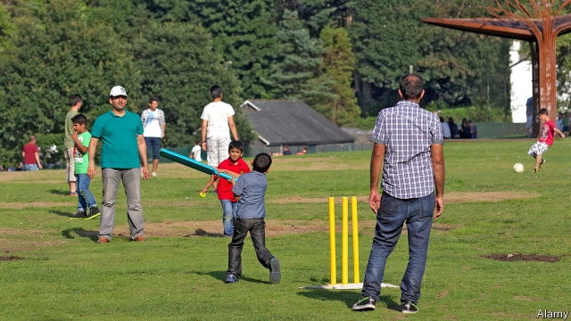

###### Subcontinental slip

# Asians are Britain’s biggest cricket fans. Why do so few go professional? 

##### They make up nearly a third of club players, but just 4% of first-class county players 

 

> May 23rd 2019 

THE BOYS are a little rusty, their limbs stiff from the fallow winter period. Still, the sun is shining on the lush green of Thatcham Town Cricket Club, white picket fences marking its edges, baby-blue picnic tables scattered outside the clubhouse, the newish red ball flying through the air (and into the hands of a waiting fielder, alas). It is a picture-book scene of olde England. 

But a glance at the scorecard reveals something more modern about the match. Five of the 22 players have some connection to the Indian subcontinent. Despite making up just over 5% of the population, South Asians account for 30% of recreational cricket players in England and Wales, and just under 30% of club players. According to Sport England, which funds and promotes sports, 2.6% of British Asians claim to have played cricket at least twice in the past month, compared with 0.5% of white Britons. Steve Abraham, the captain of the visiting Boyne Hill team, who has played with his club for 44 years, reports a gradual increase in Asians on his side—“especially amongst the colts”, or the kids’ teams. 

South Asians also make up a disproportionate part of the cricket economy. The England and Wales Cricket Board (ECB) reckons they contribute 18% of the £685m ($870m) spent annually on playing, following and attending the game. Asian fans, both from Britain and overseas, have bought 31% of the 800,000 tickets so far sold for the Cricket World Cup, which starts at the Oval, in south London, on May 30th. Fully 40% of tickets for the last big tournament in Britain, the 2017 Champions Trophy, were bought by South Asians. 

Yet considering the huge number of recreational players, Asians are underrepresented in professional cricket, dropping to just 4% of first-class county players. Absent high-profile international tournaments, only 3% of cricket tickets are bought by South Asians. The reasons for this are many, including parental emphasis on other careers, a lack of Asian coaches, drinking culture and fewer facilities in the urban areas where Asians tend to live, says Kevin Hylton of Leeds Beckett University, who has researched the subject for the ECB. 

A year ago the ECB published an “Engaging South Asian Communities Action Plan”, with targets for the following six years. These include building more facilities, promoting shorter formats of the game more likely to appeal to youngsters and encouraging more female coaches. The board is ahead of schedule on pitch-building, says Vikram Banerjee, its head of strategy. The most high-profile effort is the Hundred, a new cricket league starting next summer, which will feature city- rather than county-based teams, include foreign big-hitters and use a new format of 100 balls a side. 

The moves have been a long time coming—the ECB commissioned research from Mr Hylton as far back as 2015. “We want this to be done properly,” says Mr Banerjee. “It is core business…If one-third of our cricketers are from South Asian backgrounds then this is who we are.” 

