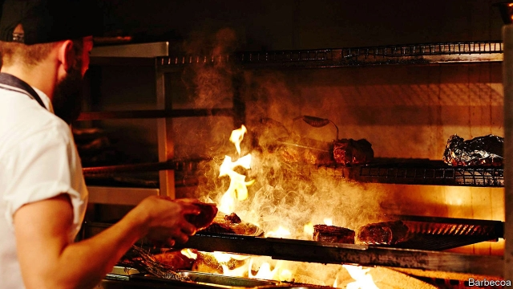

###### Steel v spaghetti

# Bail out British Steel? Why not Jamie Oliver’s restaurants too? 

##### As two big employers go bust, only one provokes calls for a government lifeline 

 

> May 23rd 2019 

BRITAIN’S ONCE-MASSIVE steel industry has ousted away. In 1970 the country was the world’s fourth-largest producer, behind only America, Japan and West Germany. Since then it has tumbled down the global rankings. Production has fallen by two-thirds. And it is about to get even lower. On May 22nd British Steel, the country’s second-largest producer, collapsed, after rescue talks between the government and the company’s owner broke down. Some 5,000 jobs in Scunthorpe and Teesside are at risk. 

Many thought the government should have done more to save the firm. The Labour Party argued that British Steel should be taken into public ownership. Even the right-wing Daily Mail appeared sympathetic to the idea of a bail-out. It was odd, then, that there were no calls to save another employer that had gone bust only the day before. The collapse of a chain of 25 mainly Italian restaurants run by Jamie Oliver, a celebrity chef, has imperilled 1,000 jobs around the country. No one has called for the government to step in to save the chain. If helping steelmakers is a good idea, why not restaurateurs too? 

The British government used to throw money at big firms whenever they wobbled. In 1971 it nationalised Rolls-Royce, an engine manufacturer. Three years later it bailed out British Leyland, a carmaker. From Margaret Thatcher on, governments took a lighter-touch approach, with the big exception of the crisis of 2008-09, when Gordon Brown spent £140bn ($182bn) bailing out the banks in an attempt to stop the financial system from collapsing. More recently the Tories have shown no mercy to big firms such as SSI, whose Redcar steelworks shut down in 2015, and Carillion, an outsourcer that went under last year. 

British Steel’s woes have led some to argue that Britain should rediscover interventionism. One argument for a bail-out is that a thriving steel industry is the basis for a healthy manufacturing sector. Yet it is not clear why Britain needs to produce its own steel, since there is a perfectly good global market in the commodity. 

Another is that the company’s collapse will affect its suppliers and customers, and drive up the welfare bill. IPPR, a think-tank, suggests that in addition to the jobs lost directly, a further 7,000 workers in the supply chain are in jeopardy. Yet it is hard to see why this should not apply to Mr Oliver’s restaurants, too. Laid-off waiters will claim welfare payments. Food suppliers will lose a big client. If these were sensible grounds for a bail-out, any failing company would be entitled to one. 

There may be no serious case for bailing out British Steel. There is a good case, however, for helping the workers affected by its closure. Mr Oliver’s unfortunate staff will probably find new jobs quickly. The chain’s outlets are mainly in bustling cities with plenty of other opportunities. Across the country, vacancies in hospitality are higher than in any other sector. The prospects for British Steel’s workers look much worse. They are concentrated in a small area (Scunthorpe’s population is around 80,000). The steelworks’ closure will whack the local economy, making it harder still to find new work. After the closure of its own steelworks, Redcar suffered a local depression. Employment slumped, particularly among men. Even today median wages remain lower than in 2015. 

That calls for the state to supply extra education and training in areas affected by the closure of British Steel. The government’s preferred programme to do this, its “rapid response service”, has a tiny budget. It was deployed in Redcar, to no great effect. Nationalising British Steel is no more sensible an idea than taking over Mr Oliver’s restaurants. But a large portion of help is needed for the steelworkers, subito. 

