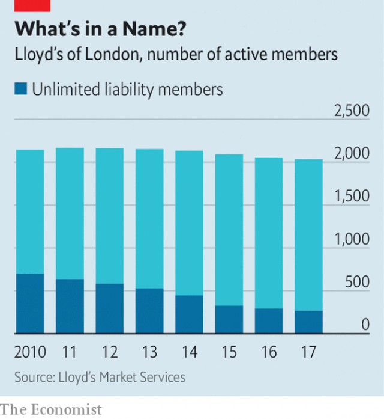

###### Name dropping

# Britain’s poshest investors are being hit by hurricane losses at Lloyd’s 

##### “Names” face two years of negative returns and are fading as a supplier of capital to the 330-year old insurance market 

 

> May 23rd 2019 

VISITORS TO Lloyd’s of London are shown its Lutine bell, salvaged in 1857 from a French frigate of that name, as well as marine loss-books recording shipwrecks of a century ago alongside recent calamities (the latest is Grande America, a container vessel sunk in the Bay of Biscay by a fire on March 12th). But now the tour also takes in something less quaint—a suite of trendily furnished rooms called Lloyd’s Lab, where executives are devising ways for the 330-year-old insurance market to innovate. 

Led by a newish boss, John Neal, Lloyd’s has proposed to refresh old practices. As recently as last year, for example, brokers and underwriters were still using paper to trade. Nor are paper records the only tradition facing change. Since the market’s beginnings, wealthy British individuals have insured risks from their own pockets. The number of Names, as they are known, peaked at 34,218 in 1989. After the trauma of the asbestosis crisis soon afterwards, which bankrupted many, their number slumped. Today only around 2,000 are left and the ranks are thinning (see chart). 

Many are men in their 60s and 70s, so a favourite theme of recent events put on for Names has been how to get the next generation interested. Being an individual Lloyd’s investor is still a discreet affair, with membership offered by word of mouth or sometimes inherited. “My mother was a Name but kept it quiet for fear the butcher would charge her more,” recalls one Lloyd’s backer. The chief lure is that the system allows money to be used twice. To insure £1m ($1.3m) worth, say, a Name needs to commit about 55% in assets as “funds at Lloyd’s”, but can continue receiving interest or dividends on it. There are tax advantages to boot. 

 

Yet the attraction may fade. Names had a great run for years after 2001 (when 9/11 and other events caused a big loss), pulling in an average annual return of roughly 10% on the amount they insured, and 20% on funds at Lloyd’s. But the global insurance industry has suffered record natural-catastrophe losses, of $229bn, in the past two years, after a sequence of hurricanes and other disasters. Lloyd’s has taken its share. The British market’s net result was a loss of £2bn in 2017 and half that in 2018. 

That in turn depletes Names. According to figures from Lloyd’s made public last week and analysed by firms that advise members, the insurance market’s return as a percentage of premiums written is expected to be -10.4% for 2017 and -3.8% for 2018, or -20.8% and -7.6% on funds at Lloyd’s (investors will perform slightly better or worse depending on their choice of syndicates, which write the policies). Another disappointment is that premiums have not risen as much as hoped to compensate for losses—a double whammy of adverse conditions, as one Name puts it. 

It is not as if anybody will have to sell their homes, says Michael Deeny, who helped foundering Names take legal action in the early 1990s. The losses are nowhere near big enough for that, and in any case, only 240 or so Names have unlimited liability, or are on the hook down to the last cufflink, as the saying goes. But for some, 2017 and 2018 will wipe out past years’ reserves of profit, so they will need to “reload” with fresh cash or stop underwriting. 

The decision will be a test of which Names are truly loaded as opposed to merely well off, insiders say. It is mostly the smaller Names, putting up around £1m or so, whose commitment to Lloyd’s might waver. For such investors the cost of setting up limited-liability firms and “Namecos” to limit risk, plus a plethora of fees, are particularly burdensome. Some Names, in addition, have been spooked by the frequency of natural catastrophes of late. Many are asking whether climate change means the recent run of disasters might become typical—and if so, what Lloyd’s is doing to avoid more losses. 

If lots of smaller investors end up leaving, that will accelerate a shift that is under way in the mix of Names. These days new members tend to be richer than Names used to be and slightly less posh, says James Sparrow, a founder of Alpha Insurance Analysts, one of the main members’ advisory firms. New money is coming from successful entrepreneurs, he says. 

Lloyd’s welcomes them as warmly as it did the titled nobs of yore. The market appreciates Names because having diverse sources of capital in addition to backing from companies (which have flooded in over the past two decades) is seen as a good thing by credit-rating agencies. Even so, not many new members are joining. Lloyd’s relies far less on money from Names than it used to. The share of underwriting capacity that they supply recently fell below a tenth for the first time. The hope is that Mr Neal will simplify the complex, expensive process of joining and leaving the market, which could help attract new blood. As things stand, Names are starting to look like part of the relics. 

