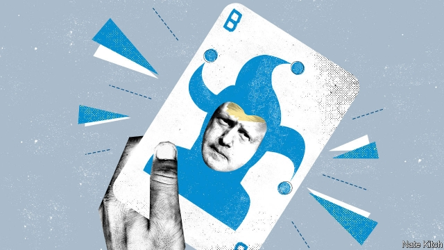

###### Bagehot

# Choosing Boris Johnson as prime minister would be a dangerous gamble 

##### Before making their bet, Conservatives should ask themselves three big questions 

 

> May 23rd 2019 

THE CONSERVATIVE PARTY has a long history of making big bets on mavericks whenever it thinks its back is against the wall. Before they won the party leadership, three of the greatest Tory prime ministers were cordially loathed by their party. Margaret Thatcher was regarded as a polarising ideologue who lacked the ability to connect with voters or command Parliament. Winston Churchill was a boozy bloviator and serial bungler, launching the Dardanelles campaign and clinging to the gold standard. Benjamin Disraeli was a flashy outsider who had no achievements to his name other than undermining Robert Peel over the Corn Laws. The Tories punted on all three and won big. 

It looks as if the party is about to gamble again, on Boris Johnson. The former foreign secretary is the overwhelming favourite among party members, who elect the leader. His only obstacle is persuading enough of his fellow Conservative MPs to put him on the shortlist of two. So far they have been sceptical. The charge sheet against Mr Johnson is a long one: a chaotic private life, a habit of bending facts, a lack of focus and discipline, and being what Sir Max Hastings, a former editor of the Conservative house journal, the Daily Telegraph, calls a “gold-plated egomaniac”. 

But the party is in a full-blown panic. It is likely to come a poor fourth in this week’s European election, thanks to the rise of Nigel Farage’s Brexit Party and the implosion of Theresa May’s premiership. If the split on the right continues, it will put Labour’s far-left Jeremy Corbyn in Downing Street. What’s more, for all Mr Johnson’s faults, he is a genuine political star, one of a handful of politicians who are known internationally by their first name (if not always for the right reasons). Because of his leading role in Brexit he no longer has the ability to reach out to the cosmopolitan liberals who gave him two terms as mayor of London. But he nevertheless has a rare ability to light up a room. Mrs May was a grand immiserator who made everybody around her feel rotten. Mr Johnson is a booming cheerleader who makes people feel good about themselves. Who better to reclaim wavering Tories from Mr Farage’s Brexit army? And who better to lead the charge against Mr Corbyn’s Leninist-Lennonist troops? 

More thoughtful Conservatives wonder if Mr Johnson might be the ideal vehicle for absorbing and civilising the populist furies that threaten to take the country to a dark place. The Tories have an admirable record of co-opting social movements that destroyed similar parties in other countries, such as the clamour for democracy in the late 19th century and the creation of a welfare state after the second world war. Mr Johnson may represent a chance to do the same with populism. He insists that Brexit is at its heart a liberal rather than a populist project, which will open Britain to the world rather than keeping it imprisoned in Fortress Europe. He enthusiastically supports a credo issued by the newly formed One Nation Group of 60 moderate Tory MPs. So it is easy to see why Tories are contemplating taking a punt. Surely a flash of genius is better than mediocrity, even if it is part of a combustible mixture? And surely the fact that three big bets in the past paid off handsomely suggests that it is worth making another one? 

The problem with this is that winning streaks eventually fail, and charismatic mavericks can produce disasters as well as triumphs. Before making their bet, Conservatives need to think hard about three big questions. 

First: can Mr Johnson really negotiate a better deal with the European Union than Mrs May? Mr Johnson blithely argues that the EU, in a sinister alliance with Remainers in the British establishment, has inflated problems such as the Irish border out of all proportion. He suggests that he will be able to renegotiate Britain’s exit deal with a combination of threat (keeping no-deal on the table) and charm. This is unlikely, not just because the EU heartily dislikes a man who made his journalistic career mocking their precious project, but also because it recognises that it can’t concede too much to Britain without threatening the integrity of the union. Making Mr Johnson prime minister significantly increases the chances of a no-deal Brexit that would severely disrupt the economy and alienate voters. 

Second: can Mr Johnson run a government? The Conservatives will be electing not just a party leader but a sitting prime minister. The fate of a country of 66m people, in the middle of one of its most difficult passages since the second world war, will be determined by 124,000 party members. Mr Johnson’s record is not encouraging. He was a reasonably popular mayor but a dreadful foreign secretary. Although he is given to bumbling chaos, he does have a talent for delegation. A new girlfriend has helped to clean up his act: he has cut his hair, lost weight and taken up yoga. But Mr Johnson has never shown any sign that he is capable of dealing with the two things that define modern government: a relentless torrent of work and a demand to make complicated trade-offs. 

Third: can he hold the United Kingdom together? The link with Scotland is already looser than it has been for decades. There are very few Scots in the upper ranks of Britain’s two main parties. England and Scotland backed opposing sides in the Brexit referendum. A Prime Minister Johnson might snap the link entirely, with his air of Eton-Balliol-Telegraph entitlement and his Bertie Woosterish mannerisms. Among Scottish voters he is even less popular than the hapless Mrs May. 

Perhaps Mr Johnson is exactly the lightning-in-a-bottle that the Conservative Party needs to restore its fortunes as both a campaigning machine and a governing force. But the price of getting things wrong would be extraordinarily steep. A no-deal Brexit, the break-up of the UK, a Marxist in Downing Street—it is a long time indeed since the stakes have been so high and the chances of getting it right so low. 

