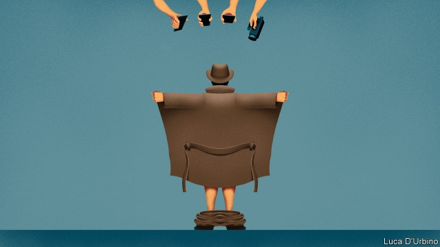

###### Caught on camera

# Paedophile-hunters give the police a headache—and evidence 

##### In 2017 information from vigilante groups was used to charge suspects on at least 150 occasions 

 

> May 23rd 2019 

IN A CAFÉ just along from Newcastle’s law courts, the hunters await their prey. Every few minutes, a telltale ping alerts the two 20-something men to an incoming message. In the gap between chats, they scroll back through their greatest hits. “I really fancy you,” reads a message, sent to one of the men, who has been posing as a teenage girl. “You look like a naughty schoolgirl,” reads another. “People accuse us of entrapment,” says one of the men. “But these people trap themselves.” 

The men, who go by the name Dark Justice, are paedophile-hunters. Dozens of such groups, including Guardians of Innocence and Taxi for Nonce UK, have popped up in Britain this decade. Members pose as under-age teenagers on websites, waiting to be groomed by paedophiles, whom they confront or report to the police. In 2017 evidence from the groups was used to charge suspects at least 150 times. The groups are so pervasive that on May 20th the Independent Inquiry into Child Sexual Abuse, a sprawling investigation set up after a string of scandals, took evidence from Dark Justice as well as from cops. 

Dark Justice—self-employed labourers who give their names as Scott and Callum—set up their first sting after hearing about budget cuts to the police unit that combats grooming. The target was Roger Lee, a convicted paedophile from Wiltshire who drove to Newcastle to meet what he thought was a 14-year-old girl. When he saw the two men instead, he sprinted back to his car. But they reported him to police and he was jailed for the offence. 

In the four years since then, they claim to have been responsible for 181 arrests and 106 convictions. The pair told the inquiry they are “concerned citizens”; they deny being vigilantes since they report suspected criminals rather than roughing them up. 

Other hunters have been less fastidious about this distinction. Some groups’ confrontations end in fisticuffs. Others have implicated the innocent or so hounded the accused that they take their own lives. Simon Bailey, the national police lead on child protection, has said the groups take “completely unnecessary risks” in their pursuit of notoriety (200,000 people follow Dark Justice’s Facebook page). 

Yet the evidence they gather is handy. In 2014 it was used in 11% of English, Welsh and Northern Irish court cases involving charges for meeting a child after sexual grooming. By 2016 the figure was 44%. “It’s a difficult relationship for the police to manage,” says Rick Muir of the Police Foundation, a think-tank. “They don’t want to promote it, but if someone has some information, they’ll want to act on that.” 

The Crown Prosecution Service now treats paedophiles who unwittingly groom vigilantes as if they had targeted genuine victims. And the groups argue they are picking up slack for the police, whose budgets have been chopped by 19% since 2010. “We wouldn’t exist if the police came in and arrested these people [first],” says Scott. “The experts have failed.” 

