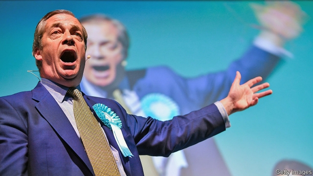
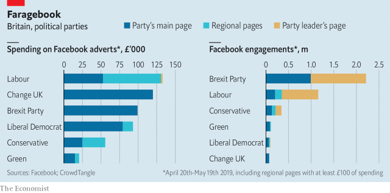

###### Social climbers

# The Brexit Party wins the battle for Facebook clicks 

##### Despite spending no more than rival parties on ads, it has got more likes, shares and comments than the rest combined 

 

> May 25th 2019 

“THEY LIED to you,” goads a video on Facebook, as news footage shows Remainers first vowing to respect the Brexit referendum’s results, then calling for a second vote. The clip, set to a pulsing soundtrack, has been watched 250,000 times. “Teach the establishment a lesson this Thursday,” it concludes: “Vote for the Brexit Party.” Polls suggested that more than 30% of voters would do so in Britain’s election to the European Parliament on May 23rd (results will be announced on May 27th). That would put Nigel Farage’s new outfit in first place, winning perhaps 30 of Britain’s 73 seats in Strasbourg. 

However the Brexit Party fares at the ballot box, it has won the battle for clicks. It has spent no more than most of its rivals on Facebook ads in the past month. But it has got dramatically better results (see charts). The party’s Facebook pages have attracted 2.2m likes, shares and comments, more than all the other parties combined, and some 30 times more than Change UK, a pro-Remain upstart which outspent it. 

 

Its focus on digital strategy is a legacy of the Vote Leave campaign, which spent 98% of its marketing budget online. Some £2.7m ($3.4m) of Vote Leave’s £7m allowance was paid to AggregateIQ, a data-mining firm linked to the now-defunct Cambridge Analytica. The Brexit Party has canny youngsters, such as Steven Edginton, its 19-year-old digital strategist, running its social-media feeds. Facebook’s algorithm rewards videos, especially those streamed live from events. The Brexit Party has posted more than any other page, including broadcasts of rallies in Wolverhampton, Durham and Newport. Its punchier clips are also popular on Twitter. 

It benefits from having a clear message, something both Labour and the Tories lack. Just as Vote Leave identified immigration and health as vote-winning subjects, the Brexit Party has alighted on the theme of democracy and its supposed betrayal. “This isn’t about left or right. It’s about right and wrong,” reads one post. “Democracy comes before party politics,” declares another. 

Who is paying for all these ads? After the referendum, the Electoral Commission found that Vote Leave broke the £7m cap by giving £675,000 to BeLeave, a youth group. Questions now hang over the Brexit Party’s finances. The commission is looking into whether any of its income has come via (prohibited) foreign donations of more than £500, which the party denies. Meanwhile the European Parliament is pursuing a complaint that Mr Farage, an MEP, failed to declare a personal gift of £450,000 from Arron Banks, a businessman whom the National Crime Agency is investigating for soliciting foreign money for Leave.EU, another pro-Brexit group (Mr Banks denies it). These are worrying allegations—which Leave-supporters who get their news from Facebook may never read about. 

