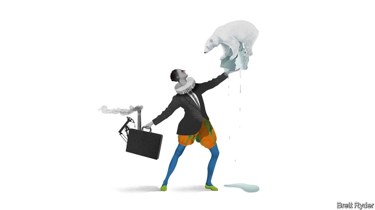

###### Schumpeter

# A Shakespearean guide to how firms tackle climate change 

##### The Seven Ages of Climate Man 

 

> May 23rd 2019 

“ALL THE world’s a stage,” wrote William Shakespeare in his monologue, “The Seven Ages of Man”. Centuries later, that stage is on fire, to paraphrase Greta Thunberg, the 16-year-old Swedish climate-change activist who delivered a raw message to titans of industry in Davos this year that their companies were helping stoke the blaze. 

It is not just Ms Thunberg who is wagging the finger of blame. Central bankers, shareholders, customers and employees are urging firms to take bolder action to tackle climate change. In some boardrooms, the message is sinking in; to date 210 firms collectively worth more than $6trn, ranging from carmakers (like Renault) to confectioners (such as Mars), have committed to “science-based targets” to cut their carbon footprint in line with the internationally agreed goal of limiting global warming to 2ºC or less relative to pre-industrial levels. Using data from CDP, which tracks firms’ climate disclosures, Schumpeter has developed (with stacks of poetic licence) a Shakespearean guide to climate action, from denial to reluctant engagement to bold ambition. 

Start with the infant “mewling and puking in the nurse’s arms”. That, broadly speaking, is the fossil-fuel industry. For the past three decades it has kicked and screamed against efforts to halt global warming even as its products have added roughly as much carbon dioxide to the atmosphere as in the previous 250 years. Coal-burners are the biggest culprits. But oil firms are little better. The biggest listed one, ExxonMobil, is a notable laggard: it aims to increase oil and gas production by 25% from 2017 to 2025. Some European rivals, such as Norway’s Equinor and Royal Dutch Shell win praise for prioritising lower-carbon gas over oil, and for pledging to disclose more fully their carbon footprints. But the 24 biggest listed oil firms invested just 1.3% of capital expenditure last year in renewable technologies—a baby step. 

The “whining schoolboy...creeping like snail unwillingly to school”, Shakespeare’s second age, sums up industries like iron and steel, cement and power-generation, which produce about half of all energy-related CO2 emissions yet grumble over carbon-pricing schemes and renewable-energy mandates intended to change their behaviour. A favourite excuse for foot-dragging is that onerous regulation risks “carbon leakage” to countries with laxer emissions rules. Yet a few star pupils show how much can be done. Dalmia Cement, an Indian company that already produces a third less CO2 per tonne of cement than the industry as a whole, aims to use less high-carbon clinker in its cement and use only renewable energy by 2030. Mahendra Singhi, its boss, says that it can reduce emissions to zero by 2040, which would be remarkable given that the industry is one of the hardest to decarbonise. In Europe, HeidelbergCement has also made bold climate pledges. 

The third age is that of the fickle lover, “sighing like furnace”. It corresponds to (unromantic) industries like mining, chemicals, capital goods and heavy transport. Yet they are in fact torn, lover-like, between the possibility of climate-induced pain and pleasure. Carbon taxes, or constraints on fossil-derived plastics, or fuel restrictions on shipping and flying would be painful—especially for the likes of General Electric, an industrial conglomerate whose decision to double down on fossil-fuel technologies has cost it dearly. Others, like Schneider Electric, are more animated by the pleasurable prospect of profit—from new kinds of industrial materials to equipment for the mass-electrification of energy. 

Next are the soldiers, “jealous in honour, sudden and quick in quarrel”. These are firms whose businesses are already in the throes of climate-related disruption that are finally jumping into the fray. They include carmakers, increasingly eager to disprove their dirty reputations by ramping up production of electric vehicles to meet fleet-wide emission curbs and demonstrate their prowess to low-carbon competitors such as Tesla. (Daimler, owner of Mercedes-Benz, is the latest to swerve, although its ambition to make carbon-neutral cars by 2039 is hardly foot to the floor.) Consumer-goods firms, facing upstarts that appeal to environmentally conscious consumers, have been jolted into action. Some, such as Nestlé and Unilever, are stockpiling climate-friendly brands. 

Those taking the boldest path towards a low-carbon future are the justices “full of wise saws”. They include some tech giants and even mature firms like Walmart. The world’s largest grocery chain, working with NGOs such as WWF, pledged in 2017 that its 100,000 suppliers will cut a cumulative 1bn tonnes of CO2 from their emissions by 2030, the equivalent of removing all the cars in America off the road for a year. Over 1,000 suppliers have been quick to join in, but others are being encouraged to take part with accolades and discounted trade finance. Walmart says that some schemes, such as energy efficiency, cut costs. It thinks others are a price worth paying. There are some precocious climate justices, too, like startups taking bold bets on zero-carbon technologies such as carbon capture and storage or hydrogen. 

It would help if more financial firms joined this category. But of the many financiers with “big manly voice” on the climate, plenty turn again, as does the Bard’s sixth age, to “childish treble, pipes and whistles in his sound” when it comes to allocating capital. As Mr Singhi from Dalmia Cement says, banks are loth to support projects like carbon storage because they take a short-term view and fear low returns. And even though many savers have long horizons, their fund managers only look three to five years ahead. 

Governments can make the biggest difference by more widely taxing carbon emissions. But while firms benefit from nature’s bounty—its water, minerals and energy—preserving it is also an act of self-interest. If they do not, the last scene of all may be what Shakespeare sums up as “mere oblivion”. Averting catastrophe could depend on whether business plays the role of hero or villain. 

