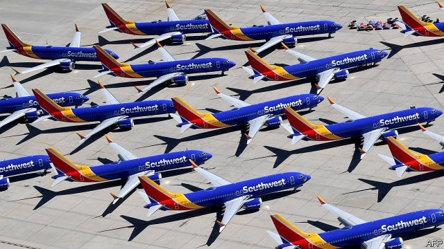
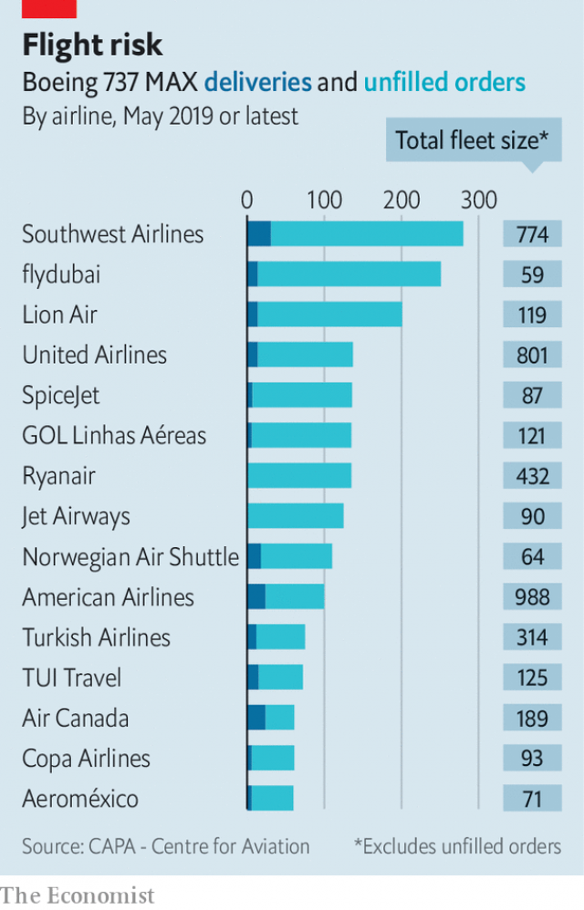

###### MAXed out

# Airlines would like to see Boeing’s 737 MAX back in the air 

##### Not as much as the American planemaker 

 

> May 25th 2019 

A YEAR AGO at Farnborough Air Show, Dennis Muilenburg, boss of Boeing, beamed as orders for its new 737 max jetliner rolled in. At next month’s Paris Air Show he will be less upbeat. In March regulators around the world grounded the plane, after two of them crashed within five months, killing 346 people. On May 23rd aviation regulators were due to convene in Dallas to review Boeing’s application to unground the max, now that it says it has fixed the software thought to have contributed to the accidents. Mr Muilenburg says he is “confident” that the updated plane will be “one of the safest aeroplanes ever to fly”. On May 22nd America’s Federal Aviation Administration suggested it could be a while before it is back in the air. All told, airlines have ordered around 5,000 maxes. This week Ryanair, which awaits 135 of them, said it will have to cut 1m seats from this year’s schedules. 

 

