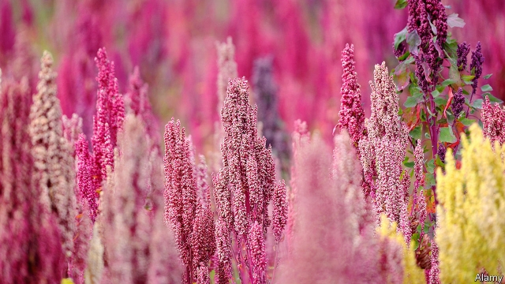

###### Seed bump

# Big agribusiness wants to make quinoa more mainstream 

##### Traders hope that reliable domestic supply will entice foodmakers to use more of the crop as an ingredient in processed snacks 

 

> May 25th 2019 

AMID GROWING appetite in the West for healthy food, the UN declared 2013 the International Year of Quinoa. Exports boomed out of Bolivia and Peru, the two largest producers. Prices tripled to $4,800 per tonne; organically grown stuff fetched $6,800. Poor Andean farmers who are the grain’s traditional custodians benefited. Protein-rich profits also lured Big Agribusiness. Intensive farms sprang up in South America’s fertile coastal plains. By 2015 supply topped 228,000 tonnes—and outstripped demand. Prices collapsed. Sales to America, the largest importer, have been flat. Traders’ margins have fallen by almost half, to 6% or so. Four out of Peru’s five leading exporters have gone bust. 

This has led some to talk of “peak quinoa”. Not everyone, though. Distributors in America and Europe think the slowdown is temporary. To help this come true, they are promoting production at home. 

To be more adventurous in their use of quinoa foodmakers need a more dependable supply, says Shrene White, general manager of Ardent Mills, America’s biggest flour-maker. Its adoption as an ingredient in higher-margin processed food has been hampered by volatile prices and inconsistent produce. A truckload imported by Andean Naturals, which is based in California and buys from thousands of Bolivian farms, can contain half a dozen different quinoa varieties. These behave differently when processed, and so are hard to convert reliably into flour or snacks. 

To remedy this, last year Ardent Mills launched a unit that works with breeders and food scientists to sponsor American growers, starting in its native Colorado and the Pacific north-west. It is eyeing California. Andean Naturals is testing a 32-hectare site in the state. It wants, optimistically, to convert 5% of California’s 223,000 hectares of rice fields to quinoa by 2025. France and Spain already have 3,000 hectares each. Early results look encouraging. Food producers are launching more quinoa snacks, says Ms White. Kellogg’s, the inventor of cornflakes, adds quinoa from Andean Naturals to frozen meals and cereal bars. A Nevadan subsidiary of Kameda Seika, Japan’s largest maker of rice biscuits, sprinkles it on its crackers. The Honest Kitchen, a startup in San Diego, uses it to enrich dog food. 

Sergio Núñez de Arco, Andean Naturals’ boss, expects the market for processed quinoa (outside its Andean home) to grow from $900m today to $2.2bn by 2025. South American exporters want a bite. Since its first shipment to China in December, Sindan Organic, a Bolivian firm, has dispatched 700 tonnes to the country—5% of its sales. Its boss gushes about the potential of China’s 1.4bn mouths. Health-conscious Chinese urbanites may take to the trendy grain, he believes—especially if it comes in readily munchable form. 

