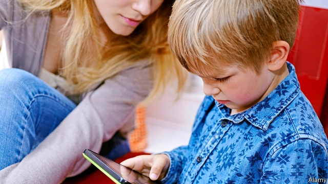

###### Kids aren’t alright

# How to make social media safe for children 

##### Politicians and regulators want to protect minors on the internet. About time 

 

> May 25th 2019 

IN MARCH AND April Jim Steyer, founder of Common Sense Media, a children’s advocacy group, badgered members of America’s Congress to regulate the apps children are using online. Their response on Capitol Hill shocked him. “We already regulated Nickelodeon, Disney channel and PBS Kids,” they replied, referring to rules for television enacted in the 1990s and 2000s (with his help). They had apparently missed a series of recent scandals: children exposed to violence and pornography, their data being collected, paedophiles lurking in comments sections of videos depicting youngsters. “We’re changing at warp speed,” Mr Steyer says, “and we’re still talking about ‘Sesame Street’.” 

Not for much longer. Members of Congress are drafting multiple bills to regulate how internet platforms treat children. Britain has proposed child-safety rules, including prohibitions on features designed to keep users hooked. From July it is expected to require porn sites to bar users under 18; MindGeek, which owns many salacious sites, wants to use an age-verification registry in order to comply (and, in doing so, make it easier to charge adult visitors for content). In Delhi politicians are considering rules that could stop the data of anyone under 18 from being collected. The EU bars tech giants from garnering data and targeting ads at children. Last year California adopted similar privacy protections that also forbid tech companies from ignoring users’ actual age. Most of these provisions will be enforced with heavy penalties. 

In the 1980s and 1990s public officials in America worried about what shows and advertisements children were being exposed to on TV. The Children’s Television Act of 1990 and subsequent regulations limited the number of commercials interrupting children’s shows and required that television stations provide educational programming for children. 

Compared with that concern, politicians and regulators have treated online video services like YouTube (owned by Google) with insouciance verging on neglect. Today children and teenagers are exposed to much dodgier fare in cyberspace than they were in the 1990s on broadcast TV—at the touch of a fingertip on their (or their parents’) iPad or smartphone. Teens run into white nationalists. Ten-year-olds encounter flat-earthers. Toddlers stumble on violent, scary or pornographic content. In comments attached to YouTube videos featuring children, molesters identify the parts they liked most, with time stamps to alert others with similar inclinations. 

In 2018 the Pew Research Centre found that 61% of American parents who let their offspring watch YouTube reported that the children come across unsuitable content. Youngsters are also easily manipulated, critics say, by “like” and “share” buttons, which may induce social anxiety and infringe on privacy. 

It would help matters if social-media companies worked out ways to divert children to stripped-down versions of their services without targeted ads and certain features—Instagram without a “like” button, YouTube without autoplay or comments. YouTube has a separate app, YouTube Kids—but most parents have not heard of it. On May 22nd SuperAwesome, a British company that provides software for children’s apps, announced that it had developed a tool, KidSwitch, which can recognise with a high degree of confidence when a child is using an app. 

The social-media giants, with their algorithms and rich stores of data, should be able to sniff out at least the very young. So far, most have merely repeated that children under 13 are not supposed to be using them without parental permission. That official posture is meant to shield them from liability for harvesting children’s data without parental consent, which is prohibited under existing law. 

The Federal Trade Commission, an American regulator, has received complaints against Facebook (which owns Instagram), YouTube and TikTok, a popular Chinese-owned video-sharing app, alleging that they collected data from children under 13. In February TikTok agreed to pay a fine of $5.7m, said it would take down any videos uploaded by children under 13, and pledged to limit the app’s functions for these young users. 

Data-privacy rules aside, it has mostly been up to social-media companies to regulate other aspects of their operations themselves. They can restrict content as they please, but have only done so in the glare of scrutiny, after journalists or activists shed light on problems. (In February YouTube largely banned comments on videos featuring children.) Without the threat of severe penalties, the platforms have had little financial incentive to change. MIDiA, a consultancy, estimates that in 2017 children’s channels accounted for 17% of YouTube views, and 15% of revenues, or $2.1bn. 

The threat is now materialising. In June Ed Markey, a senator from Massachusetts, is expected to introduce a sweeping child-protection bill, the “KIDS Act”. It would ban continuous “autoplay” on video sites and certain social features, set standards for content and restrict advertising. It would, in other words, be the internet era’s equivalent of the Children’s Television Act, which Mr Markey helped pass as a young congressman. As Mr Steyer says: “To a child a screen is a screen is a screen.” 

