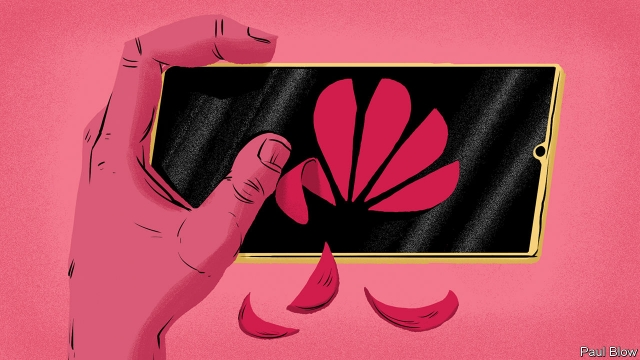
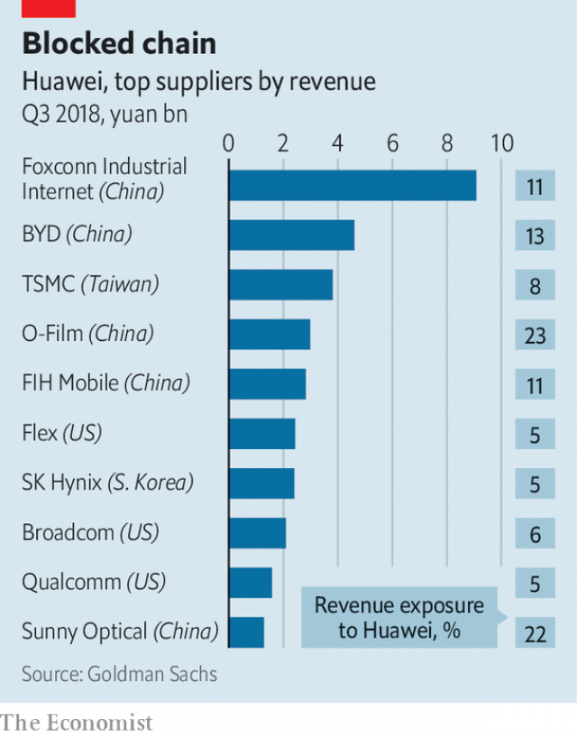

###### Technology and politics

# Huawei has been cut off from American technology 

##### The ban will be excruciating at best, and fatal at worst 

 

> May 25th 2019 

AMERICA IS NO fan of Huawei. Its officials have spent months warning that the Chinese giant’s smartphones and networking gear could be Trojan horses for Chinese spies (something Huawei has repeatedly denied). They have threatened to withhold intelligence from any ally that allows the firm in. On May 15th they raised the stakes. President Donald Trump barred American firms from using telecoms equipment made by firms posing a “risk to national security”. His order named no names. But its target was plain. 

For all the drama, the import ban hardly matters. Huawei has long been barred from America, in practice if not on paper. More significant was the announcement by the Commerce Department, on the same day, that it was adding Huawei to a list of firms with which American companies cannot do business without official permission. That amounts to a prohibition on exports of American technology to Huawei. 

It is a seismic decision, for no technology firm is an island. Supply chains are highly specialised and globally connected. Cutting them off—“weaponising interdependence”, in the jargon—can cause serious disruption. When ZTE, another Chinese technology company, received the same treatment in 2018 for violating American sanctions on Iran, it was brought to the brink of ruin. It survived only because Mr Trump intervened, claiming it was a favour to Xi Jinping, China’s president. 

Huawei matters more than ZTE. It is China’s biggest high-tech company, and is seen as a national champion. Its name translates roughly as “Chinese achievement”. Revenues of $105bn put it in the same league as Microsoft. Only Samsung, a South Korean firm, sells more smartphones. Huawei holds many crucial patents on superfast 5G mobile networks, and is the largest manufacturer of telecoms equipment. Were it to go under, the shock waves would rattle all of tech world. 

By May 20th the impact of the ban was becoming clear. Google said it had stopped supplying the proprietary components of its Android mobile operating system to Huawei. A string of American chipmakers, including Intel, Qualcomm and Micron, have also ceased sales. Later that day the Commerce Department softened its line slightly, saying that firms could continue to supply Huawei for 90 days, but for existing products—for instance, with software updates for Huawei phones already in use. New sales, on which Huawei’s future revenue depends, remain banned. 

 

Interdependence, of course, cuts both ways (see chart). Shares in American technology firms fell after the announcement, because Huawei is a big customer. Qorvo, which employs 8,600 people and makes wireless communication chips, derives 15% of its revenue from Huawei. Micron is in the memory business, of which Huawei is a big consumer. A report from the Information Technology & Innovation Foundation, a think-tank, also released on May 20th, guessed export controls could cost American firms up to $56bn in lost sales over five years. 

Unlike Intel, Qualcomm or ZTE, Huawei is privately owned, so lacks listed shares whose price swing would hint at the extent of its distress—though the price of its listed bonds has dropped to 94 cents on the dollar. In public, the firm is staying calm. Ren Zhengfei, Huawei’s founder, said it would be “fine” without access to American technology. Huawei has spoken of activating a “Plan B” designed to keep it in business despite American sanctions. It has been stockpiling crucial components for months, and has made a conscious push to become less reliant on American technology over the past few years. Its phones in particular make extensive use of chips designed by HiSilicon, its in-house chipdesign unit. 

Yet few analysts are as sanguine as Mr Ren. Three business areas in particular look vulnerable. Without Google’s co-operation, new Huawei phones will lack the latest versions of Android, and popular apps such as Gmail or Maps. That may not matter in China, where Google’s apps are forbidden. But it could be crippling in Europe, Huawei’s second-biggest market. Its telecoms business needs beefy server chips from Intel. The supply of software to manage those networks could dry up too. Huawei is developing replacements for all three, but they are far from ready. 

Two questions will determine whether or not Huawei can weather the storm, says Dieter Ernst, a chip expert and China-watcher at the East-West Centre, a think-tank in Honolulu. The first concerns America’s motives. The timing of the ban, a few days after broader trade talks between China and America had broken down, was suggestive. On one reading, it is a tactical move designed to wring concessions from China. If so, it might prove short-lived, and Huawei’s stockpiles may tide it over. 

Paul Triolo of Eurasia Group, a political-risk consultancy, is doubtful. Rather than a negotiating tactic, he sees the ban as “the logical end-game of the US campaign to take down Huawei”. A long-lasting ban would force the firm to look for alternative chips and software that Chinese suppliers would struggle to provide. 

The second question concerns the reach of American power. The tangled nature of chip-industry supply chains, says Mr Ernst, means that many non-American companies make use of American parts or intellectual property. They may therefore consider themselves covered, wholly or partially, by the ban. Take Arm, a Britain-based firm whose technology powers chips in virtually every phone in the world, including those made by HiSilicon. Arm says that it will comply with the Commerce Department’s rules. That suggests that Arm will not grant Huawei new licences. It is unclear if Arm will offer support for existing licences, however. As Arm’s technology advances, Huawei risks being left behind. 

Other non-American companies are as important. One industry insider with contacts in Taiwan says that American officials are pressing Taiwan Semiconductor Manufacturing Company (TSMC), a big and cutting-edge chipmaker, to drop Huawei, which is its third-biggest customer. That would be a crushing blow, for Chinese chip factories are not up to the task of manufacturing HiSilicon’s sophisticated designs. TSMC’s only peer is Samsung—and South Korea is another of America’s allies. TSMC said on May 23rd that it would continue supplying Huawei for now. 

Even if the optimists are right, and the ban is lifted in exchange for trade concessions, a return to business as usual seems unlikely. America has twice demonstrated a willingness to throttle big Chinese companies. Trust in American technology firms has been eroded, says Mr Triolo. China has already committed billions of dollars to efforts to boost its domestic capabilities in chipmaking and technology. For its rulers, America’s bans highlight the urgency of that policy. Catching up will not be easy, believes Mr Ernst, for chips and software are the most complicated products that humans make. But, he says, if you talk to people in China’s tech industry they all say the same thing: “We no longer have any other option.” 

