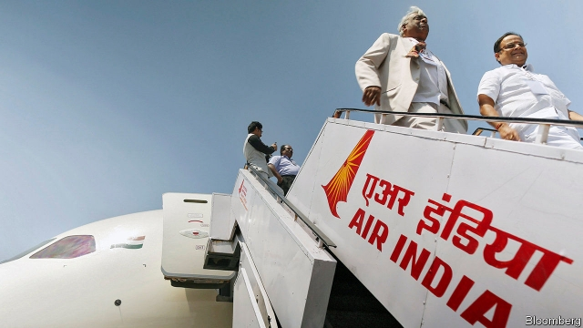
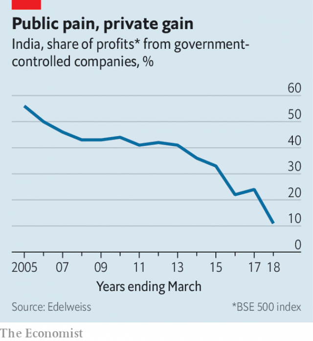

###### Shutting the state-wallah

# India’s stealth privatisation 

##### Government has been promoting the private sector—by letting state-run firms wither 

 

> May 23rd 2019 

IN 2007 INDIA combined two troubled state-run champions, Indian Airlines for domestic flights and Air India for international ones, in the hope that consolidation would produce higher profits and happier flyers. Instead, the merger created unhappy unions, shabbier service and mounting losses. Last year a plan to privatise the airline collapsed for lack of bidders with pockets deep enough to afford it. 

Such shambles invariably garner attention. What has passed largely unnoticed is the steady decline in the market share of state-run firms. Despite the nationalist mood that has coloured India’s marathon general election, which concluded on May 23rd, it is likely to continue. 

 

Among more than 50,000 companies analysed by consultants at McKinsey, the share of income generated by state-run firms declined from 45% to 37% between 2005 and 2017. The shift has been more pronounced among the biggest companies. Public-sector companies account for 11% of the profits in the benchmark BSE 500 stockmarket index, down from 56% 14 years ago (see chart). 

Sometimes the shift from public to private dominance occurs through divestments. The government got out of carmaking in 2008, when it ceded control in Maruti-Suzuki to its Japanese joint-venture partner. More often it lets state-controlled firms wither, as the private sector blooms. 

This reflects how the government has gone about reducing its role in the market, observes Rashesh Shah, chief executive of Edelweiss, a financial firm that itself emerged from the state’s retreat from banking. Call it privatisation by stealth. 

This has been most emphatic in consumer-facing businesses. The state duopoly which once controlled Indian telephony has been reduced to a 10% share of the market as people abandon fixed lines for mobile phones offered by frenetically competitive private providers. Doordashan, the once-monopolistic public broadcaster, is losing the battle for attention. In 2016 Hindustan Machine Tools, which sold one in seven wrist watches in India at the turn of the century, down from nine in ten in 1990, folded. That left the market wide open for private brands like Titan, which is controlled by Tata Group, India’s biggest conglomerate. 

In politically sensitive industries such as chemicals, energy and steel, public-sector companies cling on thanks to subsidies, price caps and a profusion of other government mandates. The state has been producing around half of India’s fertiliser for years. But even there the state’s grip is loosening. As recently as 2010 state-owned utilities generated nearly 80% of India’s electricity. Their share has fallen to 56%. These days just 15% of steel is smelted by the government, compared with one-third at the turn of the century. 

Then there is finance. Public-sector borrowers (and well-connected private ones) could historically count on cheap loans and cut-price policies from state-run banks and insurers. Between 2010 and 2018 the government’s share of banking assets declined from three-quarters to two-thirds. As it continues to shrink, so too does a critical lever used by politicians to control the activity of all business. 

Indian critics of privatisation, who far outnumber its fans, point out that private companies often seem little better than state-run ones. New telecoms providers may be cheap but service is poor, with frequent outages and dropped calls. Messy collapses of private firms—for example Jet Airways, India’s biggest private-sector carrier, in April—leave millions of customers in the lurch. 

India’s Thatcherite contingent argue that such problems could be solved with less state intervention, not more. Competition among private-sector firms, they say, often hinges on rights which the government allocates in an opaque manner. Mobile operators and airlines need spectrum or airport slots. Both are in the government’s gift. 

India’s central government still directly controls 339 enterprises. Over two dozen of them approved for sale by the administration of Narendra Modi, the incumbent prime minister who appeared on course for re-election as The Economist went to press, remain stuck in bureaucratic limbo because he did not want to anger powerful trade unions and politically connected suppliers ahead of the poll. It should let them go. Or let them quietly die. 

