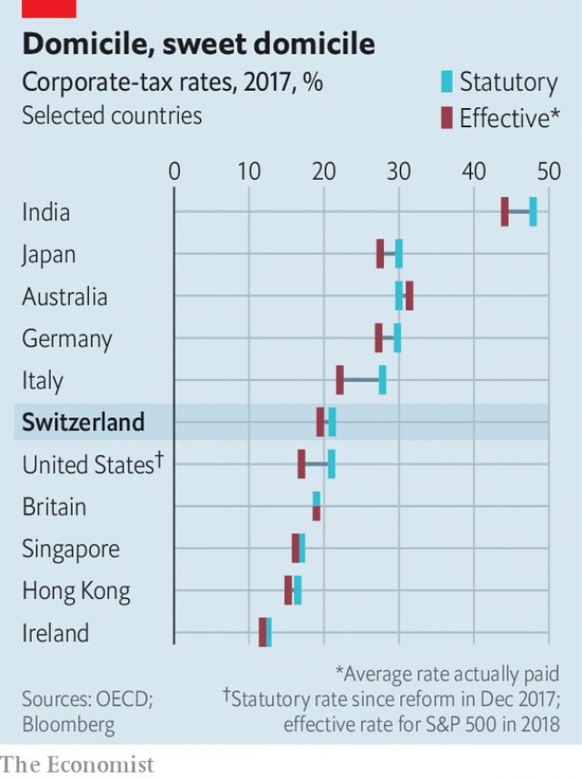

###### Havenly as ever

# Switzerland will remain a low-tax centre for big firms 

##### A referendum approving an overhaul of corporate taxes will not change that 

 

> May 23rd 2019 

SWITZERLAND IS KNOWN for its delicious chocolate, its luxury watches—and its lightly taxed multinationals. Some 24,000 international companies are domiciled there to benefit from low-tax deals offered by its 26 cantons, which set their own rates on top of the federal corporate income-tax rate of around 8%. Zug, a canton near Zurich, alone is home to some 1,800 of them, including global commodity traders, pharmaceutical giants and a cluster of blockchain and cryptocurrency firms. 

When federal and cantonal taxes are combined, Switzerland has an average effective corporate-tax rate of just under 20%, not far below Italy’s and higher than Britain’s (see chart). But sweetheart deals with cantons reduce it to as little as 9% for some big firms. That is set to change—a bit—after Swiss voters approved reforms on May 19th. 

 

These were crafted under pressure from the European Union, which had accused the Swiss of “harmful” tax practices and threatened retaliation. From next January cantons will still be able to set their own rates, but not offer better deals to foreign companies than to domestic ones. 

The Swiss have taken further steps to prevent an exodus of multinationals to low-tax rivals such as Ireland and Singapore. The reforms include new sweeteners for research and development and for patent-derived income. 

Not all multinationals own enough intellectual property to benefit greatly from such schemes; commodity traders have a lot less of it than pharmaceutical firms. So, besides installing “patent boxes” (frowned upon by tax-fairness campaigners but compliant with international tax rules), cantons are cutting their ordinary corporate-tax rates. In Basel, which is particularly popular with drugmakers and logistics-and-trading firms, it is set to fall from 22% to 13% (including the federal portion). 

In short, says Peter Uebelhart of KPMG, an accounting firm, Switzerland is “using all the room for manoeuvre it has” to remain competitive while complying with international standards. The average combined income-tax rate for multinationals that have made Switzerland their home will tick up only slightly once the changes kick in, he reckons, from 9-11% to 12-14%. “Our sense is that most of them consider that acceptable,” he says, especially combined with Switzerland’s other attractions, such as political stability, its central location in Europe—and all that chocolate. 

