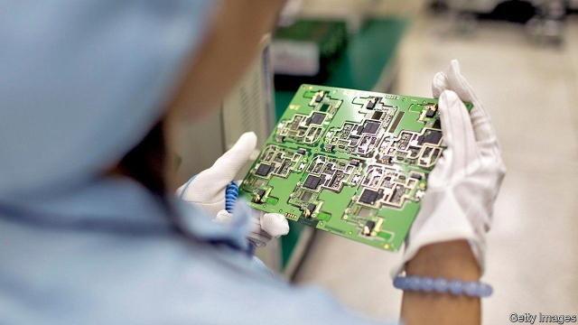

###### Acquired taste

# Western firms increasingly admire—and want—Chinese technology 

##### The trade war and animosity 

 

> May 23rd 2019 

IT IS A charge that American hawks love to level at China: that its companies, through fair means and foul, are after the crown jewels of American technology. Despite years of efforts to manufacture its own computer chips, the Asian giant still spends more on importing them than it does on crude oil. Politicians and companies in the West constantly grumble about Chinese rivals pilfering their intellectual property. So the idea that Chinese firms have some technology gems of their own to offer may seem fanciful. 

In fact, Western technology firms increasingly fancy Chinese tech. In some cases, they are buying Chinese rivals outright—with the acquiescence of authorities in Beijing. Those working on such acquisitions date the phenomenon back to 2016. Most deals are small and involve niche industries: makers of the powertrains and sensors for electric vehicles, or agencies managing social-media influencers. But the trend has taken root, even as animosity between the United States and China has escalated (see article). American officials have been treating technology bosses to classified briefings on the dangers of doing business in China. 

Those who operate there see things differently. For the first time last year, in an annual poll by the EU Chamber of Commerce in China, a majority of foreign companies (61%) said that domestic firms were as innovative as European ones, or more so. This year four-fifths of them saw opportunities in Chinese sparkiness. 

Three main motivations have historically driven Westerners to purchase Chinese companies. They wanted to gain market share in China, bolster their local distribution networks and get their hands on makers of lower-tech goods. Today, acquiring a Chinese startup can help some foreign firms gain an edge. Takeover targets have their own research teams, patents, clients and, sometimes, lavish state subsidies. For Chinese founders, the interest has been a boon as domestic sources of fundraising have dried up. 

In some cases the technology is hard to find elsewhere. In 2017 Faurecia, a French firm that is the world’s leading supplier of vehicle interiors, acquired Jiangxi Coagent Electronics, which develops human-machine interfaces. A person with knowledge of the deal says that Faurecia had been looking worldwide for a year before coming to China and spotting Jiangxi Coagent. “Faurecia said, ‘Wow’,” he says, and made the Chinese technology the core of its offer. 

The enthusiasm extends to artificial intelligence (AI), medical technology, cloud computing and, yes, even chips. Jim McGregor of Tirias Research, an American technology consultancy, discerns “tremendous interest on both sides of the ocean” in semiconductor and software acquisitions. Among the most prominent recently was one last July of DeePhi Tech, a machine-learning startup in Beijing, by Xilinx, an American chipmaker, for an undisclosed amount. DeePhi, which had developed software for Xilinx’s chips, was a young business at the time, but had raised close to $300m within 19 months of its founding. When Xilinx announced the deal, it described DeePhi’s capabilities as “industry-leading”. 

All told, American technology companies have invested $1bn in Chinese ones since the start of last year, according to Dealogic, a data provider. Chinese tech firms poured nearly four times as much, $3.8bn, into those in America. But high-profile investments signal the mood. In 2016 Apple put $1bn into Didi Chuxing, a ride-hailing giant, and Microsoft took a stake in Laiye, an “AI butler” that handles voice commands through an app. Intel has taken stakes in several startups, including, in 2018, a cloud-services provider and, this year, a firm that builds software for cashierless stores. 

In 2018 Alphabet, Google’s parent company, paid $550m for a stake of less than 1% in JD.com, an e-commerce giant. Nvidia, an American maker of AI chips, has invested in WeRide.ai, a Chinese leader in self-driving tech, and TuSimple, an autonomous-lorry startup. Last year Intuitive Surgical, the world’s largest surgical robotics company, took a stake in Broncus, a Chinese startup—chiefly, says Nisa Leung of Qiming Venture Partners, an investor in Broncus, for technology to help perform advanced lung surgery. Last week Reuters reported that Facebook was considering minority stakes in Chinese firms. 

China has blocked only one foreign acquisition in the past decade—Coca-Cola’s $2.4bn bid for Huiyuan Juice, a drinks giant, in 2009. Last year the “negative list” of areas where investments are restricted shrank from 63 to 48 industries. Chinese regulators surprised many by not reviewing the purchase of DeePhi, despite how strategic its technology could prove—or how easy it is to classify as defence-related and thus untouchable. Without trade tensions and the technological cold war, deals would multiply. That they now might not will delight America’s spooks. Its companies, less so. 

