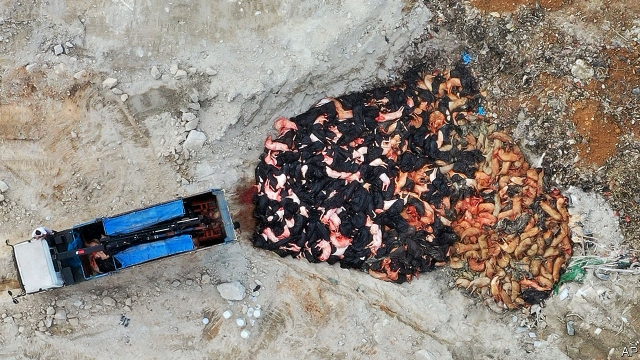
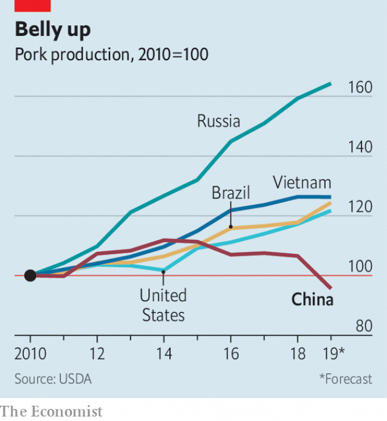

###### Aporkalypse now

# African swine fever hits China, home of half the world’s pigs 

##### Cover-ups are making it harder to curb the epidemic 

 

> May 23rd 2019 

WHILE THE Chinese zodiac celebrates the year of the pig, for the Earth-bound variety it is a terrible time. African swine fever, harmless to humans but fatal to porkers, has spread across the country. Hong Kong’s first case was reported on May 17th. The epidemic has affected colossal numbers of pigs, pushing up pork prices steeply. It has walloped the tens of millions of Chinese who depend on pig-rearing for their livelihood. There is no effective vaccine. Experts say that it may take years for China to control the disease. 

African swine fever is so named because the first known case was detected in Africa over a century ago. The virus spreads easily between pigs, which can also catch it from ticks, contact with contaminated surfaces or by eating infected food (cheap animal feed in China often contains pork). It causes haemorrhaging and often kills in less than a week. The death rate is at least 90%. Since 2016 outbreaks have occurred across Europe and Asia. But nowhere have they been more devastating than in China, which at least until recently was home to half of the world’s pigs. 

China’s first officially acknowledged case was reported in August last year in the north-eastern province of Liaoning. But many people in the industry believe that the virus began spreading, unreported, months earlier. The country (excluding Hong Kong) has a dismal record of transparency relating to animal or human epidemics. In the case of African swine fever, farmers have felt little incentive to report outbreaks. They are supposed to be compensated for pigs they cull to prevent the spread of the disease. But cash-strapped local governments are responsible for handing out most of this money. Pig-farmers worry that they will not receive the promised sums. They often reckon it is better to keep quiet and sell their infected animals or meat to unsuspecting customers. And so the disease keeps spreading. 

Local officials also try to cover up. They sometimes prefer not to alert their superiors to outbreaks because to do so would require implementing onerous disease-control measures. It would also mean having to divert money away from other projects to compensate pig owners. “Officials say they are doing all they can, but they are always a step behind,” says a Western agriculture expert. 

By the end of April, out of a total herd that was nearly 500m-strong before the epidemic, the government says just over 1m pigs in China had been culled to stop the disease spreading. That number is oddly low. Vietnam, which reported its first outbreak six months after China and has far fewer animals, says it has culled 1.3m. It is likely that many cullings in China are not being reported. Rabobank, a Dutch bank, reckons more than 150m animals in China may have been infected. It expects that the country will lose one-third of its pigs, roughly the number there are in the European Union. A report this month by the UN’s Food and Agriculture Organisation said that the disease’s spread was “unabated” and that its speed and severity “could prove more pronounced than currently assumed.” It said cull rates higher than 20% had been reported in many provinces. It will take a long time for farmers to replace animals by breeding more of them. In March the number of sows was declining nearly twice as fast as that of pigs overall. 

 

The impact on the pork supply is already evident. Prices of the meat are about 40% higher than a year ago. Last month they rose by more than 14%. Dealers have responded by releasing frozen stocks. In recent weeks this has helped to stabilise the market. But when frozen pork becomes scarcer, prices are likely to climb further. 

Some of the shortfall will be made up by boosting imports. But economists say that for the next two years at least the tight supply is likely to push up inflation. That will be a headache for the government, which is trying to keep inflation under control while stimulating the economy with tax cuts and spending on public works. 

In the long run, however, the devastation caused by the disease may have a positive impact. One reason why the virus has affected China so badly is that so much of the industry is small-scale. This has made it difficult to enforce biosecurity standards. Small operators usually lack the expertise or funds necessary to protect their herds. The government has been calling for the development of bigger, more efficient, operations. The ministry of agriculture says farms with more than 500 pigs now account for around 50% of total pork output, up from 38% in 2010. But progress has been impeded by a lack of financial support and training for those wishing to farm on a large scale. The swine-fever crisis may encourage the central government to spend more on solving these problems. 

For as long as it takes China’s pig industry to recover—which may be years—farmers elsewhere may have cause to celebrate. Foreign producers, whether in Brazil, Europe or America, cannot make up the vast amount of production that will be lost in China, but they will have more opportunities to sell their pork there (American pig-farmers will have a tougher time because of tariffs imposed as part of the ongoing trade war with China). 

Noel White, the boss of Tyson Foods, America’s largest meat-packing firm, said this month that in his 39 years in the business he had “never seen an event that has the potential to change global protein production and consumption patterns” as much as China’s epidemic of African swine fever. “All of us are rapidly waking up to the significance and the magnitude of this event,” says one boss at Archer Daniels Midland, an American animal-feed firm. China’s biosecurity regulators need to do so quickly, too. 

