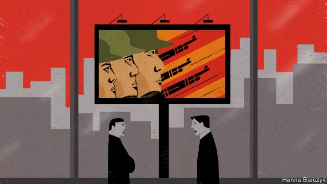

###### Chaguan

# Amid trade tensions with America, China is showing old war films 

##### This could be a propaganda own goal 

 

> May 23rd 2019 

THERE IS A lot for Americans to dislike in the Chinese propaganda film “Shangganling”. It is based on a real battle in late 1952, during which American and South Korean forces failed to take a mountain ridge from more lightly armed Chinese troops, who suffered terrible casualties. The weeks-long campaign came near the end of the Korean war of 1950-53, which began when the Stalinist regime of Kim Il Sung invaded the pro-American south and which eventually drew in millions of Chinese and UN forces. Chinese schools teach that China joined the war in self-defence and was victorious. Pupils are told their countrymen showed solidarity with communist brethren in Korea while standing up to American imperialists who were bent on attacking China’s heartland. Official histories avoid the awkward question of who started the “War to Resist America and Aid Korea”, as it is known. China’s internal estimates put the Chinese death toll at 400,000. The public is told that only 152,000 Chinese were killed. 

Newspapers have begun to cite the Korean war in editorials, as they brace the public for prolonged trade conflict with America. Filmed in 1956, “Shangganling” is one of several Korean war films shown on national television in recent days. Sporting crude, prosthetic hooked noses beneath their steel helmets, the “Americans” in that film cackle with laughter as they incinerate Chinese troops with a flame-thrower. In their foxholes they ogle photographs of pin-up girls. They fairly swagger as they advance with support from tanks and bomb-dropping US Air Force jets. But their bullies’ bravado vanishes in hand-to-hand combat, depicted in a close-up frenzy of wrestling and stabbing. Soon the Yanks are running away, hands raised in panic, only to meet a murderous American officer, who is shown coldly ordering the fatal machine-gunning of his own troops to frighten the rest back into action. 

Perhaps sensing that this Mao-era grotesquery could be misinterpreted, state media have offered guidance. In a tweet, Hu Xijin, editor of Global Times, a nationalist tabloid, argued that victory on Shangganling (Triangle Hill, as Americans called it) had enhanced China’s status in its talks with America during the war. “There is no equal negotiation without fighting” is the film’s message to Chinese viewers, Mr Hu wrote. A blog, Taoran Notes, which appears to have official backing for its musings on the trade feud, said references to Korea were a way of saying that China is a master of “talking while fighting”, including in today’s contest with America. 

To the Chinese public, the Korean war is an easily grasped symbol, signifying that “even if we go head-to-head with the Americans we should not be afraid. We can take them,” says the best-known Chinese historian of that conflict, Shen Zhihua. He hopes that China’s negotiators are signalling toughness to the public in order to leave themselves wriggle room in talks with America. 

Mr Shen is an unusually outspoken scholar, whose long research in Chinese, Soviet and Western archives emboldens him to challenge official accounts of the Korean war. He has angered Maoist hardliners by arguing that Stalin cornered Mao into entering the hostilities. The professor says that what the Chinese leader actually wanted was Soviet help to invade Taiwan, the redoubt of the Nationalist regime which was driven to the island at the end of the Chinese civil war in 1949. In 2017 Mr Shen gave lectures calling today’s North Korea, and its nuclear weapons, a liability for China. 

Propaganda should not be confused with history, the professor says, drawing deeply on a cigarette in his office at East China Normal University in a suburb of Shanghai. Chinese academics know about the “huge price” that China paid for a war that ended where it started, with Korea divided along the 38th parallel. Early Communist leaders “knew in their hearts” what happened, too. He is less sure that today’s still do. As for the general public, they do not know how many died and remember the war simply as a “great success”, he sighs. Mr Shen would like to explore hard questions about why talks to halt the Korean war lasted a year-and-a-half, and who benefited from that drawn-out process. Alas, he suspects, such research probably could not be published in China. 

Foreign historians do not face such constraints. They argue that Mao deliberately prolonged the war by dragging out talks on an armistice that other combatants were ready to declare, notably by stubbornly demanding the return to China of 14,000 Chinese prisoners-of-war who were desperate to be sent to Taiwan. His aim was, in effect, to talk in order to continue fighting (and receiving modern weapons and aid from Stalin), despite warnings from his own military chief about “massive, unnecessary casualties”. Mao, unmoved by human suffering, predicted early in the war that 400,000 Chinese would die, and told Stalin that his plan was to spend “several years consuming several hundred thousand American lives”. Told about his own son’s demise in Korea, Mao murmured only: “In a war, how can there be no deaths?” 

China’s noisiest patriots, vowing on social media to ditch iPhones for Chinese smartphones, have no idea of the true price their country paid in Korea. They know nothing, for that matter, about why America sought peace talks almost 70 years ago. True, America was daunted by China’s willingness to sacrifice lives. In the end, though, America and its allies wanted an armistice because a unified Korea was not an interest worth all-out war, let alone a nuclear one as some hothead generals proposed. 

Today, America is debating something unrelated: whether openness to a rising China is sensible and even necessary, or an act of self-harm. War talk and broadcasting xenophobic films is a gift to American hawks who argue that China is an ideological foe that cannot be trusted. In their desperation to assure their own people that they are not a pushover, China’s rulers are forgetting the first lesson of propaganda. Real history can be a valuable guide. Falsified history leads countries astray. 

