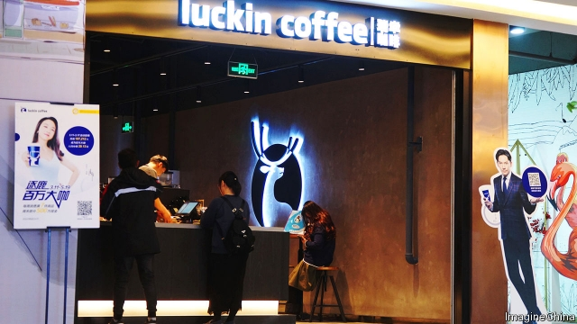

###### Full of beans

# China is a nation of tea-drinkers, but coffee is taking off 

##### It’s not just the drink that appeals, it’s the chance to share pictures of it 

 

> May 23rd 2019 

ON A SPRING morning in Chengdu, the capital of the south-western province of Sichuan, Zhang Xiaoyu stands in her classroom, teaching the art of coffee-making. On the wall a dozen plaques from the Specialty Coffee Association of Europe certify her proficiency in skills ranging from roasting beans to serving the drink. Seven students, all women in their 20s and 30s hoping to open coffee shops, take sips from tiny cups and make notes on the flavours. 

Until the 1990s coffee was rarely served in China except at luxury hotels aimed at foreigners. When Starbucks opened its first outlet there in 1999 it was far from clear that the country’s avid tea-drinkers would take to such a different—and usually more costly—source of caffeine. Starbucks tried to entice customers unused to coffee’s bitter taste by promoting milk- and sugar-heavy concoctions such as Frappuccinos. 

The average Chinese still only drinks five cups per year, says the International Coffee Organisation, a London-based group. That is just 1.3% of the amount consumed by the average Japanese or American. But coffee has become fashionable among the middle class. Starbucks now has about 3,800 outlets in China—more than in any other country outside America. Statista, a business-intelligence portal, says the roast coffee market in China is growing by more than 10% a year. Starbucks and its rivals see big scope for expanding there. 

So too, however, do home-grown competitors. A major new presence is Luckin Coffee, a Beijing-based chain. Since its founding less than two years ago it has opened more than 2,300 outlets. On May 17th Luckin’s initial public offering on the Nasdaq stockmarket raised more than $570m, giving it a value of about $4bn. 

Luckin’s remarkable growth is a sign of change. No longer do Chinese consumers see coffee as such a luxury. Most of Luckin’s outlets are merely kiosks where busy white-collar workers pick up their drinks, having ordered them online. Super-fast delivery can also be arranged through the company’s app. But, as demand for Ms Zhang’s classes suggests, the posh end of the market is flourishing too. Independent coffee shops are springing up, at which preparation of the drink is taken to artisanal extremes. No longer are whipped cream and sweet sauces essential. 

Whale Coffee, a shop in Chengdu’s trendy Yulin neighbourhood, is run by Pang Wenlong, who three years ago was among Ms Zhang’s first students. On most days Mr Pang can be seen behind the counter perusing manuals on coffee roasting, or examining his beans and separating out defective ones by hand. On a recent visit your correspondent ordered a Square Coffee (so-called because Whale looks out on a square), which combines two roasts of one’s choice. Mr Pang said he would favour the Colombia roast, rather than the requested Ethiopia, as a fit with the Kenya. 

There may be about 200 small coffee shops like Mr Pang’s in Chengdu, Ms Zhang estimates. Their growth is striking given the city’s renown for its tea-drinking culture. Many residents like to relax in open-air shops, sipping tea served gracefully by waiters from brass pots with long spouts. Xue Meiling, a Whale regular who owns a bakery, says she is as likely to invite a friend to coffee at Mr Pang’s as to tea. 

But the two markets are different. The teahouses tend to cater to older people who like to spend long hours in them, playing mahjong and gossiping. At the coffee shops it is rare to see anyone over 40. Young people use them for socialising, but much of their interaction is online—sharing photos of their drinks, of the coffee-making equipment and of themselves in chic interiors. An option on the Chinese rating app Dianping allows users to search for wanghong (“internet viral”) coffee houses: ones with particularly photogenic decor. Where better to sip and WeChat? 

