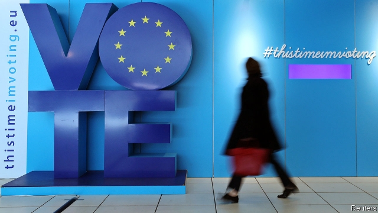
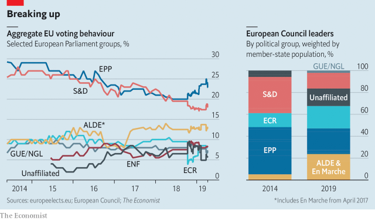

###### Centrifugal forces

# As Europe votes for its new Parliament, expect more fragmentation 

##### The cosy old days are gone 

 

> May 23rd 2019 

THE SQUARE outside Milan’s cathedral was packed, despite an unseasonal drizzle. The punters cheered as the leaders of 11 nationalist parties from around the continent called for a populist revolution against the European Union’s establishment. “Our Europe is not 60 years old but millennia old!” bellowed Marine Le Pen from France. Jörg Meuthen of Alternative for Germany called for a “Fortress Europe” closed to immigrants. Matteo Salvini, Italy’s deputy prime minister, pledged “common sense in Europe” to chants of “Salvini, Salvini, Salvini” from the crowd. 

The five-yearly European elections, the world’s second-biggest democratic exercise after India’s, began on May 23rd and will conclude on May 26th. They will decide the make-up of the European Parliament, the union’s legislature which, though often incomprehensible to outsiders, has gained substantial new powers in recent years. The European Commission, the EU’s executive, is the only body that can initiate legislation. But the parliament’s assent, along with that of the 28 national governments making up the EU Council, is required to pass the vast majority of it. The outgoing parliament was instrumental, for example, in shaping the union’s powerful new General Data Protection Regulation, a ban on single-use plastics and the EU-Japan free trade deal. Its future matters. 

The scene in Milan on May 18th was a glimpse of that future—but not as Mr Salvini intended. Right-wing populists are on the rise in Europe. But they are just part of a wider trend away from monolithic parties. And the populists are themselves subject to that process. Absent from the Milan rally were Poland’s Law and Justice party, who find Mr Salvini too pro-Russian and the Sweden Democrats, who dislike Ms Le Pen for the same reason. Even among those present, the fractures were obvious. Ms Le Pen declared war on “savage globalisation”, but Mr Meuthen called for a free-market, free-trade Europe. The political future of the EU is not populist or establishment, liberal or illiberal. It is fragmented. 

European politics used to be dominated by two big-tent political families, the centre-right European People’s Party (EPP) and the centre-left, currently called the Socialists and Democrats (S&D). Parties belonging to these two groups led most EU countries; in Brussels, the two acted as clearing-houses for disagreements. Yet in recent years the EU’s societies have became more plural, voters’ deference to established institutions has waned and debates over social change and identity have displaced old left-versus-right ones. 

 

In 2014, 76% of EU citizens lived in countries led by parties belonging to one or other of the two big families. Now the proportion is just 38%. In France, for example, the domination of the centre-right Republicans and centre-left Socialists has given way to a contest primarily between Emmanuel Macron’s centrist La République en Marche and Ms Le Pen’s populist National Rally. Italy, Poland and Greece are also led by outsiders. The same trend is present in the European elections: the EPP and S&D will probably lose the most seats and forfeit their joint majority, while the Greens, the centrist Alliance of Liberals and Democrats for Europe (ALDE) and two nationalist groups will probably gain. 

Attempts to consolidate are under way. On the nationalist right Mr Salvini wants to merge the current outfits into one mega-group with a third or more of the seats. But, as the rally in Milan illustrated, divisions among those parties—on everything from Russia to the EU budget—will probably frustrate his efforts. Meanwhile, Mr Macron wants to build his own centrist mega-group, combining En Marche with ALDE and poaching moderate pro-European parties from the EPP and S&D. That has succumbed to dithering, and even the more modest merger that he is now planning will be susceptible to internal differences on matters like the budget. 

So the old EPP-S&D duopoly in the parliament is dying, but nothing has yet emerged to replace it. Fragmentation has already come to the European Council, where the 28 member states are represented. Now it is coming to the Parliament. Then it will come to the next commission, which is appointed by the former and approved by the latter in a process that will begin at a post-election EU summit on May 28th. Under a convention established back in 2014 the designated candidate of the largest group in the parliament has the first claim to the commission’s presidency. But securing the necessary majority in the fragmented new legislature will be tricky. Manfred Weber, the EPP candidate, whose group will probably be the largest, will need the backing not just of the S&D but of liberals and perhaps some greens—a new centrist “super-grand coalition”. Leaders may pick an alternative figure deemed to have broader appeal, like Michel Barnier, the commission’s chief Brexit negotiator. They will be influenced by the quest for regional and ideological balance among the big posts to be filled in the coming months, which also include those of European Council president, High Representative for Foreign and Security Policy and president of the European Central Bank. 

The absence of easy majorities in the next parliament will mean an array of subject-by-subject coalitions, especially on contentious looming subjects like the next seven-year budget, carbon emissions targets, border policies and the rule of law in countries like Hungary and Poland. Simon Hix of the London School of Economics notes that the outgoing parliament has already seen the joint power of the two big groups decline, with a left-liberal coalition winning votes on justice and the environment and a right-of-centre one winning some economic votes. He predicts more of this, though with more horse-trading and uncertainty. A similar shift could occur in the council, with the weakened Franco-German alliance ceding more prominence to new groupings like the fiscally hawkish “Hanseatic League” of northern states. 

All of this fragmentation will advance the other tendency of the campaign evident at Mr Salvini’s gathering in Milan: European politics is slowly becoming more truly European. The old days of stitch-ups by the EPP and S&D or by Paris and Berlin are fading. Ideological conflicts are crossing borders more often. Much EU business will continue to be done at late-night summits and in little-watched parliamentary debates. But more than in the past they will spill out of these. A more fragmented EU is also a more political EU. 

