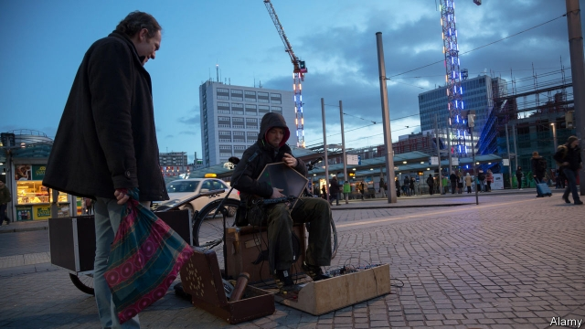

###### Fade to black

# Bremen, a Social Democrat stronghold, may be about to fall 

##### After 70 years, the Christian Democrats have the upper hand 

 

> May 23rd 2019 

BEAMING FROM ear to ear, Annegret Kramp-Karrenbauer saunters into the airy surrounds of the Klimahaus museum in Bremerhaven, a port city in north-west Germany, to deliver a campaign speech. Ms Kramp-Karrenbauer, leader of the country’s ruling Christian Democratic Union (CDU), has been ubiquitous at rallies across Germany in the European election campaign. But the Klimahaus assembly is especially resonant, for the state of Bremen, which comprises the city of that name along with Bremerhaven, may be about to deliver an almighty shock. 

On May 26th, while the rest of the EU elects its new parliament, Bremen’s voters will also be choosing their next government. The Social Democrats (SPD) have run Bremen, the tiniest of Germany’s 16 states, for 72 years, hoovering up votes from dockers, factory hands, civil servants and even merchants in a city-state that still styles itself “free Hanseatic”. A carousel of coalition partners provided the only novelty. If the CDU can end the SPD’s long reign, as polls suggest, the effects would reverberate well beyond this pair of rainy cities. 

The repository for the CDU’s hopes is Carsten Meyer-Heder, a lanky IT entrepreneur who joined the party only a year ago with no background in politics. His peppery business patter and limited command of policy detail mean he faces a tough battle against the able but uncharismatic SPD mayor, Carsten Sieling (campaign slogan: he “governs Bremen competently”). But the forces squeezing social democracy across Europe may prove too powerful for Mr Sieling to resist. 

It is not hard to see why. Once rich and bustling, Bremen has long been a German problem child. The closure of docks and steel mills decades ago swelled the ranks of long-term unemployed and entrenched hardship: in Bremerhaven 40% of children live in households on long-term unemployment benefit. The bureaucracy has grown tired and inefficient. Schools are notable for crumbling buildings and appalling test scores. In Gröpelingen, a migrant-heavy area walloped by the shuttering of a shipyard in 1983, life expectancy for men is almost eight years lower than in rich parts of town. “It’s another world here,” says Dennis, an entrepreneur from the area who says he will not vote. 

Bremen has plenty of well-paying jobs in sectors like aerospace, but many workers live and pay taxes in surrounding Lower Saxony, commuting daily into the city. Mr Meyer-Heder says a priority will be to entice them back by redeveloping areas like Neustädter Hafen, a port with a lease that is up for renewal in 2027. Thousands more flats are needed, and a dozen new schools planned. Investment is constrained by Bremen’s vast debts, a legacy of public hiring sprees enacted to help laid-off labourers. But from 2020, a tweak to Germany’s system of redistribution from rich to poor states will channel over €400m ($447m) to Bremen each year, on top of the €700m subsidy it already gets. 

Mr Meyer-Heder’s likeliest partner in government are the Greens, with the liberal Free Democrats making up the numbers. For his part, Mr Sieling is pushing for a left-wing coalition with the Greens and far-left Die Linke. 

That is not the only national resonance. Losing Bremen after seven decades would be a “knife to the heart” of the SPD, says Lothar Probst, a local political scientist. Andrea Nahles, the SPD leader, may struggle to keep her job, especially if the party suffers in the European elections too. Rarely can Bremen have roared so loudly. 

