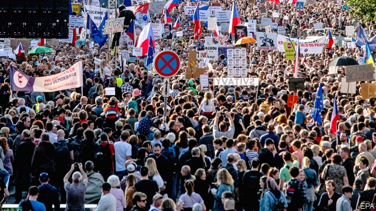

###### Toughing it out

# Can protesters bring down the Czech prime minister? 

##### Andrej Babis is going nowhere 

 

> May 23rd 2019 

IT WAS THE biggest so far of a series of weekly demonstrations against the Czech government. On May 21st some 50,000 protesters, more than double last week’s number, gathered on Wenceslas Square, the focal point of the Velvet Revolution in 1989 and the anti-communist revolt in 1968, to rail against Andrej Babis, a billionaire industrialist who has been prime minister since October 2017. 

The protesters are incensed by Mr Babis’s latest attempt to capture the Czech Republic’s institutions by replacing Jan Knezinek, the justice minister, with Marie Benesova, a loyal footsoldier of Milos Zeman, the president and an ally of the prime minister’s. Mr Babis is facing criminal charges related to his alleged misuse of 50m koruna (€2m) in European Union funds earmarked for small businesses. Mr Knezinek was pushed out a day after the police recommended Mr Babis be charged for fraud. Protesters fear that Ms Benesova will now slow down or even prevent the prosecutor from indicting Mr Babis (along with his wife and other members of his family, also implicated by the police). If convicted, the prime minister could face between five and ten years in prison. Mr Babis, who portrays himself as the target of a political witch-hunt, has vowed not to resign even if he is indicted. 

Protests brought down the government in neighbouring Slovakia last year, but though tens of thousands are on the streets in the Czech Republic, Mr Babis is unlikely to go. The party he founded, ANO (an acronym that also means “Yes” in Czech), is by far the country’s strongest. His media assets help: dubbed Babisconi after a former Italian prime minister, he owns two influential dailies, as well as a radio station and a music television channel. He runs a superb marketing machine that recently came up with Donald Trump-style red baseball caps emblazoned with “Silne Cesko”, or “Strong Czechia”. 

Mr Babis’s model seems to be Viktor Orban, the Hungarian leader. Mr Orban changed the judicial system to cement his power over judges in 2018, and got away with a mere slap on the wrist from the rest of Europe. 

