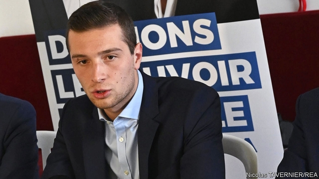

###### Marching into trouble

# French President Emmanuel Macron’s party is struggling 

##### Disappointment looms at the European elections 

 

> May 23rd 2019 

THE APPLAUSE in the small auditorium was polite, rather than enthusiastic. A friendly senator in the front row tried to stir electoral fervour, clapping her hands rhythmically over her head as the star guest walked in. But Nathalie Loiseau, Emmanuel Macron’s softly spoken leading candidate at elections to the European Parliament, is a technocrat who says that she is “not made for big glittery shows”. And indeed, on stage in a town north-west of Paris, she is not. Despite weeks of non-stop campaigning across the country, Mr Macron’s party seems to be stalling. 

The election in France matters beyond the country’s borders. It is in some ways a test of whether the liberal-democratic centre can hold against the forces of nationalism and populism. Two parties have been neck-and-neck in the polls and well ahead of their rivals: Mr Macron’s La République en Marche, and Marine Le Pen’s National Rally (formerly the National Front). The vote has become a replay of the second round of the presidential election in 2017. 

Both sides have played up the stakes. The French president this week rolled up his sleeves and began to campaign, calling the vote an “existential” moment. Europe, he said, faces a choice between unity and disintegration. With Steve Bannon, Donald Trump’s former strategist, camped out in a hotel suite in the same road as the Elysée Palace, Mr Macron also warned of foreign interference in the French campaign. 

For her part, Ms Le Pen has sought to turn the election into a referendum on the unpopular Mr Macron. Six months after the start of the gilets jaunes (yellow jackets) protests, the president’s ratings have recovered to where they were before the movement began. But, at around 30%, they remain low. Mr Macron continues to crystallise anger in a fractured country. “Vote against Macron”, instructs one of Ms Le Pen’s blue-and-yellow campaign flyers. 

Ms Le Pen is an old hand at this game. Her party came top at the previous European elections, in 2014, with 25% of the vote, partly because it plays the mid-term protest tendency well. This time, she has criss-crossed France to visit the sort of small towns and villages—Chassors, Rocquigny, Villeblevin—where the gilets jaunes occupied roundabouts, jobs are scarce and anti-establishment feeling runs deep. The far-right leader (who was raised in a mansion outside Paris) promises to “give power to the people”. And she has selected a slick 23-year-old, Jordan Bardella, to head her list. Having grown up in the heavily immigrant suburb of Seine-Saint-Denis, outside Paris, Mr Bardella draws on his back story to insist that opposing immigration is not prejudice but the conclusion of personal experience. 

Next to the earnest Ms Loiseau, a former director of the elite Ecole Nationale d’Administration, Ms Le Pen and her troops are offering up comic entertainment at their rallies, deriding Mr Macron, “the globalist”, at every turn. Ms Le Pen has also been showcasing her new approach to Europe. Formerly Eurosceptic, to the point of advocating France’s exit from the euro, Ms Le Pen now favours a “Europe of nations”, with strangely Gaullist echoes. The reason for the pirouette? Her new friends in government, she argues, notably Italy’s Matteo Salvini, with whom she campaigned recently in Milan, can now change Europe from within. 

In some ways it is remarkable for Mr Macron even to be close on her heels. In 2014 the sitting Socialist president, François Hollande, came in third place, with just 14% of the vote. This time, there is little enthusiasm anywhere for the election, and the turnout is likely to be low. “Abstention is the real threat,” says Stéphane Séjourné, Ms Loiseau’s campaign director. Up against apathy, Mr Macron has stepped in to try to mobilise his electorate. If he does come second, this would not affect his parliamentary majority, nor in principle his ability to govern. But it would be a symbolic setback. And this campaign is a reminder that his party, like the discontent in the country, centres overwhelmingly on him. As one supporter at the Cergy rally puts it: “The campaign isn’t really about Loiseau; it’s all about Macron.” 

