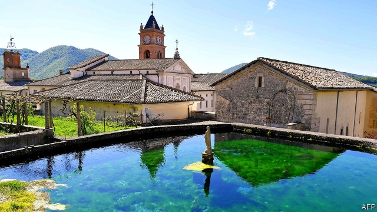

###### Academic controversies

# Steve Bannon’s monastic academy denies monkey business 

##### Allegations of a forged letter are dismissed as “dust kicked up by the left” 

 

> May 23rd 2019 

A PLAN BY Steve Bannon, Donald Trump’s former chief strategist, to launch an alt-right academy in an Italian monastery now risks being scotched by the authorities. Evidence has emerged that a key document used to secure tenancy of the property was forged. 

Mr Bannon is paying the €100,000-a-year ($111,000) rent on a former Carthusian monastery, the Certosa di Trisulti, in the mountains east of Rome. The property belongs to the state. But in February 2018 Italy’s arts and heritage ministry granted a 19-year lease to a Catholic non-profit organisation then based in Rome, the Dignitatis Humanae Institute (DHI), of which Mr Bannon is a trustee. Two official bodies are investigating the concession: the attorney-general’s department and the regional auditors’ court in Lazio, the region around Rome in which the monastery is situated. An official says the ministry is not ruling out revoking the lease. 

Mr Bannon has described the Academy for the Judaeo-Christian West that the institute plans to open at its monastery in the autumn as a “gladiator school for cultural warriors”. Benjamin Harnwell, the director of the DHI, says that his institute will offer a master’s course that includes teaching in philosophy, theology, history and economics. Mr Bannon will be personally responsible for additional tuition in the practical aspects of political leadership. 

The DHI took over the monastery following a competitive tender. Accompanying the institute’s bid was a business plan and a letter endorsing it, apparently provided by the Gibraltar branch of a Danish financial institution, Jyske Bank. But on May 7th La Repubblica, an Italian daily, reported a statement by Jyske Bank declaring the letter to be fraudulent. The managing director of Jyske Bank in Gibraltar, Lars Jensen, confirms the statement. “It is a fraudulent letter, put together by I don’t know who,” he told The Economist this week. The signature purported to be that of “a lady who hasn’t been in the bank for years. Her role was that of an assistant and in that letter she’s a director or something like that. So it is obviously fraudulent,” he said. 

Mr Harnwell admits that news of the bank’s statement “hit me sideways”. But Mr Bannon told The Economist that “Everything actually is totally legitimate…all of this stuff is just dust being kicked up by the left.” The business plan, however, was crucial to the success of DHI’s bid, which the ministry assessed using a points system. To qualify for the tender, the Institute needed at least 60 points. It secured 72.6. But of those, 17.8 were awarded for its business plan. So if that plan is ruled invalid because the “letter of certification” from the bank is found to have been forged, the authorities could revoke the lease. 

The controversy over the DHI’s business plan is only the latest of several blows to the institute in recent months. Since December the DHI’s chairman, Luca Volontè, a former Christian Democrat politician, has been on trial in Milan, charged with taking a €2.4m bribe from private and public sources in Azerbaijan. Mr Volontè was allegedly paid for helping to block criticism of human-rights abuses in Azerbaijan while a member of the parliamentary assembly of the Council of Europe. Mr Volontè denies any wrongdoing. 

Mr Harnwell founded the DHI in 2008 and won support from a variety of prominent Catholics. They included conservatives such as Austin Ruse, president of the Centre for Family and Human Rights in America, and liberals like Lord Alton, a British peer and former Liberal Democrat politician. But Mr Harnwell admits that, as Mr Bannon has taken an increasingly visible role, several of his liberal members and officials, including Lord Alton, have quit. The latest to go was a high-ranking Vatican prelate, Cardinal Peter Turkson. 

As Mr Harnwell readily agrees, the Institute’s stewardship of the Certosa, or Charterhouse, of Trisulti has brought with it daunting responsibilities. Founded in the early 13th century amid woodlands in a part of Italy renowned for its hermits and mystics, abbeys and convents, the complex covers 86,000 square metres—the size of 12 football pitches. It houses a watermill, a herbal pharmacy, an elaborately frescoed church and a topiary maze. 

But many of its roofs are in urgent need of repair, and there is water infiltration in several places. The DHI committed itself in its bid to spend an additional €1.9m on restoration. Mr Bannon says that more than the row over the lease, the bigger concern “is making sure I can pull together all the resources needed to restore the monastery to what it should be.” 

The local authority has presented a further challenge by demanding €86,000 a year in property tax and for waste collection. Mr Bannon remains unfazed by all this. “I couldn’t be more excited,” he says. More excitement is probably to come. 

