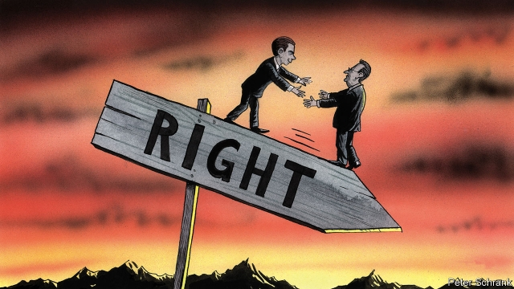

###### Charlemagne

# Why cosying up to populists rarely ends well for moderates 

##### “Ibizagate” in Austria is just the latest example 

 

> May 23rd 2019 

ON A FREEZING morning in Vienna in December 2017, Charlemagne heard a tempting case for what might be called “the hug strategy”. He was drinking coffee with an ally of Sebastian Kurz, the young leader of the centre-right Austrian People’s Party who was hours from a coalition deal with the hard-right Austrian Freedom Party (FPö). “He has grown up,” said the Kurz-ite of Heinz-Christian Strache, the FPö’S leader, adding that, in any case, Mr Kurz would be able to manage his new ally. Having already edged towards some FPö positions and won back some of its supporters, the incoming chancellor would render his coalition partner irrelevant in government and thus contain the hard-right while governing pragmatically. It all sounded very clever. 

It proved otherwise. Mr Kurz’s big hug failed to stifle Mr Strache. At recent rallies in the South Tyrol and Linz your columnist watched the vulpine vice-chancellor charge in to the boisterous oomph of Johann Strauss’s Radetzky March before unveiling his latest designs: Austrian passports for German-speakers in northern Italy, mosque closures, an end to the “population replacement” of white Europeans by immigrants. Support for the FPö remained high and stable at around 25%. Its ministers undermined the independence of Austria’s state broadcaster and attacked the rights of asylum-seekers. Karin Kneissl, the FPö-backed foreign minister, danced with Vladimir Putin at her wedding. Some containment this was turning out to be. 

On May 17th it all came crashing down. Two German newspapers published a video secretly filmed in a villa on the Spanish island of Ibiza in the summer of 2017. In it, a woman posing as the niece of a Russian oligarch suggested to Mr Strache that her uncle take over the Kronen Zeitung, Austria’s largest newspaper, and use it to pump out pro-FPö messages in return for government contracts. The FPö leader responded enthusiastically and expressed admiration for how Viktor Orban, Hungary’s authoritarian prime minister, had crushed the independent press in his country. The scandal—dubbed “Ibizagate”—prompted a tearful Mr Strache to announce his resignation and a chastened Mr Kurz to dissolve the alliance. “Enough is enough,” the chancellor said. Yet he had hardly been ignorant of the risks of the coalition from the start. He merely thought he could manage them. 

The sorry tale is part of a bigger saga. All over Europe populist nationalists like Mr Strache are challenging moderate politicians, many of whom are adopting a version of the hug strategy by emulating some of the populists’ language and policies, or bringing them into government, or both as in Austria. In Bavaria’s state election campaign last autumn the conservative Christian Social Union tilted right on migration and picked fights with Angela Merkel’s moderate Christian Democrat Union. Ahead of Sweden’s election in September the previously liberal-conservative Moderates lambasted multiculturalism and did deals with the hard-right Sweden Democrats in local government. Spain’s centre-right People’s Party formed a regional government with the nationalist Vox party in January and aped its hardline positions on Catalan autonomy. In subsequent elections the three mainstream parties fell to their lowest results since 1950, 2002 and 1979 respectively. 

Elsewhere the cost has, as in Mr Kurz’s case, been less electoral than reputational and ideological. Britain’s Conservatives vanquished the anti-EU United Kingdom Independence Party by appropriating its main policy (Brexit) but are now tearing themselves apart. In Denmark the centre-right Venstre’s rightward shift (allowing police to confiscate jewellery and other valuables from arriving asylum-seekers, for example) and informal collaboration with the hard-right Danish People’s Party has pushed the country’s entire political contest in that direction. Manfred Weber, the centre-right candidate to be president of the European Commission, has long hugged Mr Orban in the hope of moderating him. This has emboldened the Hungarian leader, toxified Mr Weber and may impede him from marshalling the broad mainstream coalition that he needs in the European Parliament after this week’s elections—unless, that is, he relies on votes from the hard-right. 

Political scientists who have studied such things could have warned of the dangers. Pontus Odmalm and Eve Hepburn, for example, have used the examples of British, French, Finnish, Danish and Dutch politics from 2002 to 2015 to chart the effects of mainstream parties moving towards populist positions on immigration. Having expected that these shifts would dent support for the populist parties, they found no such effect. Mainstream parties moving right, they hypothesise, may legitimise extreme parties and push them into yet more extreme positions—creating a bidding war that mainstreamers cannot win. This difference applies even if the outsiders are brought into government. Studying the effects of hard-right parties on qualitative measures of transparency, individual liberties, rule of law and minority rights in 30 European countries from 1990 to 2012, Robert Huber and Christian Schimpf showed that the presence of anti-system populists in opposition can be good for democracy, because they act like “drunken guests” at a dinner party and blurt out awkward truths. But they also found that there is “a substantial negative effect on democratic quality” when they enter government. Ibizagate should have come as no surprise to Mr Kurz. 

But if this is not enough, Europe’s moderates may be about to get another big dose of evidence. The European Parliament elections will probably see the centre-right bloc, many of whose member parties have pursued some version of the hug strategy, lose more seats than any other group. The right-wingers, some of them emboldened by roles in coalitions at national and regional levels, are expected be among the main winners. If so, it will be yet more proof that the hugs don’t work. 

