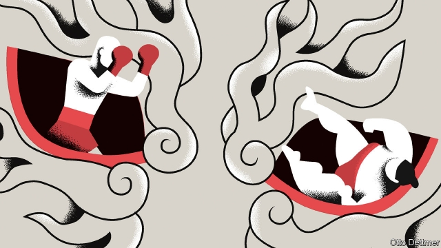

###### Free exchange

# As the trade war heats up, China looks to Japan’s past for lessons 

##### Japan’s problems stemmed more from its own miscues than from American pressure 

 

> May 23rd 2019 

HISTORY IS NEVER far from China’s mind in its trade dispute with America. A few months ago, when negotiations looked on track, staunch nationalists warned of echoes with the “unequal treaties” that foreign powers had forced upon China in the 19th century. In recent weeks the breakdown in talks has led state propagandists to draw comparisons with the Korean war of the 1950s, a bloody struggle between China and America (see Chaguan). But the analogy that haunts Chinese economists does not involve China itself. They fear a replay of the Plaza accord of 1985, when Japan, under American pressure, tried to resolve trade tensions by pushing the yen higher. That calmed the tensions but, most Chinese economists think, at an intolerable price: stagnant Japanese growth for two-plus decades. 

The parallels are imperfect. Dependent on America for security, Japan was constrained in its pushback. The Plaza accord also involved Britain, France and West Germany. Jeffrey Frankel of Harvard University has called it “a high-water mark of international policy co-ordination”, which is not President Donald Trump’s trademark. The substance was different, too. The five countries announced that they wanted the dollar to depreciate and intervened in currency markets to make it happen. Within a year the yen soared by nearly 50% against the dollar. By contrast, currencies are just one part of today’s tussle between China and America. Over the past decade China worked to address complaints that the yuan was too low. So there are no calls for appreciation, only demands that China does not weaken it to help its exporters. 

Looked at more generally, though, there are similarities. The Plaza accord is best understood not as a one-off event but as a critical stage in a multi-year dispute, which ranged from agriculture to electronics. America accused Japan of stealing intellectual property and plotting to control future industries. Robert Lighthizer, America’s lead negotiator against China today, earned his spurs in these earlier battles. In 1990 the two countries agreed to a “Structural Impediments Initiative”, which bears a striking resemblance to the crux of the debate today. America wanted Japan then—and wants China now—to improve its competition laws, open more widely to foreign investors and weaken its giant conglomerates (keiretsu groups in Japan, state-owned firms in China). 

The case against the Plaza accord is that it set Japan on a path to doom. To counter the effect of a strong yen, an obvious drag on exports, Japan slashed interest rates and unleashed fiscal stimulus. These moves brought about an economic rebound. But they also generated asset bubbles: stock and land prices tripled within five years. In 1990 these bubbles burst and the economy slumped, never to recover its former mojo. In nominal terms Japanese stocks are still 40% below their peak on the final trading day of 1989. The Plaza accord, in this view, did succeed in defusing tensions between Japan and America, but only because it neutered Japan as a challenger. This has percolated into official thinking in China. As Cui Tiankai, China’s ambassador to America, said last year: “Give up the illusion that another Plaza accord could be imposed on China.” 

The sequence of Japan’s woes does seem to make for a damning indictment. But a closer look at each step shows that nothing was preordained. One point, clear in retrospect, is that Japan overcompensated for the slowdown in exports. Within 18 months of the Plaza accord, it had cut benchmark interest rates from 5% to 2.5%. It also announced a big stimulus package—increasing spending and cutting taxes—in May 1987, though by then its recovery was already under way. It did not shift gears and raise rates again until 1989, when its asset bubbles were already a few years old. 

As the International Monetary Fund has argued, there were at least two other factors that could have led to a different outcome. Excessive stimulus, by itself, did not guarantee that Japan would suffer an asset bubble. It was that much more dangerous when combined with financial deregulation, which led banks to lend more to property developers and homebuyers. And the bursting of the bubble did not guarantee that Japan would suffer a lost decade, let alone three. A sluggish response by regulators compounded the trouble. Rather than pushing banks to raise capital, they encouraged them to go on lending to zombie firms. 

So the simplistic story—that the Plaza accord felled Japan—misses the mark. Rather, China should draw two lessons from Japan’s experience of trade tensions with America. First, it must get its domestic-policy response right. Japan feared that the deal with America would cause its growth to suffer; China fears the same about the absence of a deal. But the bigger dangers for Japan were over-stimulus and flawed regulation. China seems to grasp that. So far it has been cautious about pumping up growth. The real test will come if the trade war continues to escalate. 

A second lesson is the danger of resisting America’s demands, just because it is America that is making them. Had Japan acted on some of America’s long-standing gripes, it might have fared better in the 1990s. Domestic competition would have been stronger. A bigger role for foreign investors might have prompted Japanese banks to tackle their festering problems. Similarly, it is China, not America, that would be the biggest beneficiary if it moves more quickly to open its economy to foreign firms. 

China might also note a historical curiosity. The talks in 1985 were in New York’s Plaza Hotel, which was bought three years later by a property tycoon named Donald Trump. He paid nearly $1bn in today’s money. At the time he said he had “knowingly made a deal which was not economic”, because the hotel was a masterpiece, not just a building. Sure enough, in 1992 the Plaza Hotel entered bankruptcy. That Mr Trump ended up harming himself might be comforting for China. That he went ahead despite knowing the risks should be less so. 

