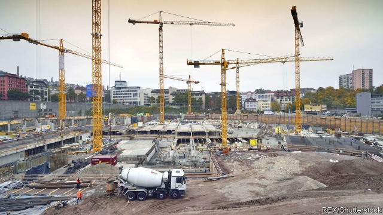
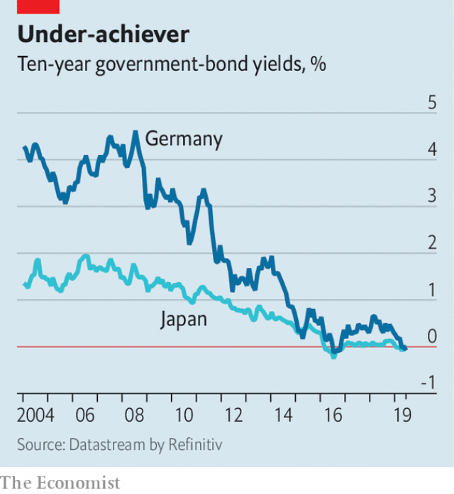

###### Black books

# Should Germany borrow to invest? 

##### Politicians and academics clash over the debt brake 

 

> May 23rd 2019 

OUTSIDE THE headquarters of the German Taxpayers’ Federation in Berlin, a display tracks the public debt in real time. Now displaying a total of just under €2trn ($2.2trn), it has been ticking down since early 2018. Germany’s public-debt ratio, expected to be 58% of GDP in 2019, is as much the envy of other rich countries as its engineering prowess. Thanks to rising labour-market participation, says Michael Hüther of the German Economic Institute, a think-tank, tax revenues per head reached their highest level ever, in real terms, in 2018. 

Even so, Germany’s fiscal policy is becoming a subject of debate. Olaf Scholz, the finance minister, has warned that the “fat years” are over. Economic growth is projected to slow this year, reducing the tax take. If he is to meet Germany’s stringent fiscal rule, he must rein in public spending. 

The Schuldenbremse (debt brake) was enshrined in the constitution in 2009, when the financial crisis was expected to swell public debt beyond 80% of GDP. It restricts the federal-government deficit to no more than 0.35% of GDP a year unless a downturn hits; any overshoot beyond that must be made up in better times. (The debt brake also affects states’ finances: from 2020, they will be forbidden to run structural deficits.) Some economists, though, are asking whether the rule is a good one. Pointing to Germany’s rock-bottom interest rates and crumbling infrastructure, they argue that the country needs more debt-financed investment. 

 

Germany’s government debt is in such high demand that, at some maturities, investors are willing to pay to lend it money. Yields on ten-year bonds turned negative in May, as investors spooked by the trade war between America and China, and by Italian politicians’ hints that they would break the euro zone’s fiscal rules, sought safety. On May 9th the yield on Germany’s ten-year government bonds slipped below that of Japan’s (see chart). 

At such attractive rates the case for borrowing for projects that could boost growth seems obvious. Public investment, at 2.3% of GDP, lags behind the euro-zone average and barely covers depreciation. Mr Hüther was once a proponent of the debt brake. But in a recent column in the Süddeutsche Zeitung, written with Jens Südekum of the Heinrich-Heine University Dusseldorf, he argues for a return to a “golden rule”, which allows for investment to be financed by debt. The debt brake was supposed to spare future generations from being saddled with today’s borrowing. But by limiting investment, they argue, it penalises future generations instead. 

Moreover, the government may have been overzealous in its application of the rule. Catarina Midoes and Guntram Wolff of Bruegel, a think-tank, find that since 2010 officials, when drawing up budget plans, have consistently come up with predictions for tax revenues that turn out to undershoot reality. That has had the effect of restraining public spending. 

In part, the forecasting errors reflect the fact that the economy has beaten expectations over the past decade, resulting in unexpectedly high tax revenues. But the researchers speculate that the debt brake may also have led to a “surplus bias”, with forecasters being deliberately cautious for fear of breaking the rule. (The finance ministry, however, says that the analysis does not consider the possible influence of tax-policy changes or one-off effects.) 

Not everyone agrees that the debt brake has led to a squeeze on capital spending. Officials in the finance ministry point out that government investment has grown at 7% annually in recent years, outpacing nominal GDP growth. Bottlenecks prevent plans from turning into reality, meaning that investment cannot rise much more. Clemens Fuest of the Ifo Institute for Economic Research points out that €8bn allocated to public projects by the federal government in recent years has not yet been spent. Public planners are in short supply and the building industry is close to capacity. NIMBYism has held up the redevelopment of a railway network in Stuttgart and a third runway for Munich’s airport. 

Political appetite to release the debt brake seems limited. Though the finance ministry’s new chief economist, Jakob von Weizsäcker, is receptive to fresh ideas, Mr Scholz is still keen to balance the books. Even so, there is nothing stopping the government from dismantling other barriers to investment. More of it would, after all, boost the future tax take—thus making it less likely that the government would need to slam its foot on the debt brake further down the line. 

