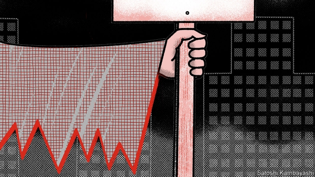
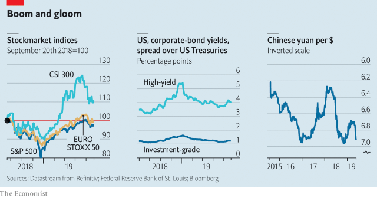

###### Late in the day

# The joys and pains of investing in a mature business cycle 

##### Investors fear that a recession cannot be far off 

 

> May 23rd 2019 

IN 14TH-CENTURY Germany a heretical cult grew up around the figure of Frederick II, a dead emperor. Its adherents believed that the apocalypse was close at hand. “In all countries a hard time sets in,” is how a prophecy from the period begins. “Rapine and arson go hand in hand,” it continues. “Everyone is at everyone else’s throat. Everyone harms everyone else in his person and his belongings. There is nobody but has cause to lament.” 

This is not the sort of language used in investment-bank research notes and hedge-fund letters, or by pundits on CNBC and Bloomberg News, however troubled the outlook might seem for financial markets. Yet there is a parallel between today’s market chatter and the prophecies of medieval cults. The millenarians believed they were living in the end times or “last days”; and so, in a way, do today’s investors. Much of the talk is of “late-cycle” market conditions—the kind that prevail after a long expansion, when economic slack is largely used up and assets are richly priced. 

The late-cycle mindset is a battleground for two impulses. On the one hand, it recognises that these are the good times. The economy is strong, jobs are plentiful, and factories and offices are humming with activity. Animal spirits are higher than they were in the earlier stages of the business cycle. So there is money to be made. And who knows? Perhaps the good times might last a little longer than usual. On the other hand, if it is late in the cycle a recession cannot be far off. Jitters about anything that might bring that day forward—rising interest rates; a prolonged trade war—are understandable. 

These warring impulses set the pattern for late-cycle markets. The general tendency is for prices of risky assets (stocks, corporate bonds and so on) to go up—perhaps by a lot. But recurring fears of recession mean this rising trend will be punctuated by sometimes-violent sell-offs. 

To understand this push-and-pull dynamic, go back to last year. By September a wave of optimism about the strength of America’s economy, buoyed by tax cuts, had taken the S&P 500 index of leading stocks to a fresh peak. Then a host of growth risks suddenly loomed. China’s economy was losing momentum. The Federal Reserve was bent on tighter monetary policy. By Christmas Eve the S&P index had fallen by 19.7% from its peak. Credit spreads—the extra yield investors demand as a buffer against default—blew out. Then, just as suddenly, the markets recovered. A succession of policy changes, including tax cuts, convinced investors that China would not let its economy go down. The Federal Reserve changed tack, taking interest-rate increases off the table, at least for this year. The good times were back again. 

Yet a feature of late-cycle markets is that recession scares recur. Another is brewing. This one has its origins in the growing breach between America and China over trade. Earlier this month America stepped up its tariffs on Chinese imports. It has now opened a new front in the dispute by requiring American firms wishing to supply Huawei, China’s technology champion, to seek licences. Markets are choppier, though more in Asia than America. Investors seem fairly calm. But few yet want to bet against a quick resolution. 

This latest leg of the trade dispute started with a tweet from President Donald Trump. It might also be ended by one. So why sell now? But the longer it goes on, the more harm it will do to business confidence in America, China and elsewhere. If a deal is not struck at or before the G20 Summit in Japan on June 28th and 29th, another sell-off seems likely. 

The foreign-exchange market may be the place to watch for trouble. The yuan is still a long way from being widely used outside China. But it increasingly reflects, and to some degree sets, the tone for global currency markets. Other major currencies, including the euro, have tended to track its movements up and down against the dollar. A stronger yuan has thus often implied that the dollar is weaker against a range of currencies. At the start of the year the yuan rose against the dollar in line with better news on China’s economy. But it has fallen again (see chart) and is now close to the seven-yuan mark, widely seen as a meaningful threshold, not least within China. 

 

That has fuelled speculation that China might use its currency as a weapon in the trade war. Were the yuan to go through seven to the dollar, from this perspective, the gloves would be off. A weaker yuan would mean a stronger dollar—certainly in Asia and probably across the board. Not only would that squeeze American exports, it would also spark a broad sell-off in stocks and in credit. For the dollar is also a thermostat for global risk appetite: it rises with a weak dollar and falls with a strong one. Yet China has so far been “very responsible” in its handling of the yuan, says Steven Englander of Standard Chartered, a bank. Were the yuan to break the seven mark, he reckons, it would be in response to a wave of risk aversion hitting Asia; China would not be the initiator. 

If trade peace breaks out, a fresh growth scare will emerge sooner or later. As Willem Buiter of Citigroup notes, each of the world’s three biggest economies has a financial frailty: corporate leverage in America, a debt mountain in China and rickety banks in Europe. Even so, he argues in a recent note, it might still take a severe shock to kick off a global recession. If the economy keeps surviving—and it may take a fresh dose of stimulus from China or the Fed to lift spirits—the conviction that the cycle can keep going may take hold. Market “capitulation” usually means a sudden loss of unwarranted optimism. But in the present circumstances capitulation is “melt-up, not meltdown”, says Eric Lonergan of M&G, a fund-management group. 

For now it is hard to see past the trade skirmish and the G20 summit. Today’s late-cyclists might envy the faith of the medieval millenarians. They were hedged. The apocalypse would mark the start of their longed-for salvation. But if it were to be delayed a little, it would be no great loss. 

