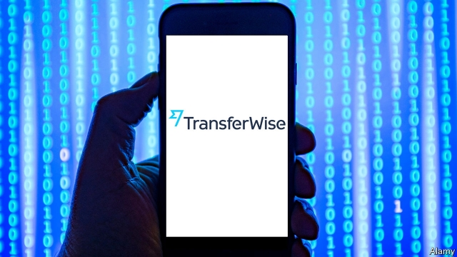

###### Into the big league

# TransferWise becomes Europe’s most valuable fintech 

##### The British cross-border payments firm hopes to turn banks into its clients 

 

> May 23rd 2019 

THE TEA BUILDING, in London’s hip Shoreditch district, used to hold factories making biscuits and bacon. Now it is home to tech startups and media firms. Yet their ideas require space, too. In the outsized lifts, still operated by push buttons as big as traffic lights, a pair of movers have just finished a job. TransferWise, which rents Floor 6, is taking over another level, barely three years after moving in. 

On May 22nd the cross-border payments firm, which was founded in 2011, said it had collected $292m in fresh capital. The fundraising round, led by Lead Edge Capital, Lone Pine Capital and Vitruvian Partners, venture-capital firms known for backing tech stars such as Uber, Snap and Spotify, valued it at $3.5bn—a doubling in 18 months. Now Europe’s most valuable private fintech firm, it plans to add 750 staff in the next 12 months to its existing 1,600. 

TransferWise allows users to send money along 1,600 currency routes at 15% or less of the fee banks typically charge. Unburdened by old IT systems and focused on moving money, it has automated many of the steps required. It also aggregates transfers and nets them out against payments going the other way, which means it need borrow less currency offshore to meet customers’ requests. And it seeks to build direct relationships with multiple banks, even as those lenders are trimming the old “correspondent” banking networks they use to send money across borders. 

Matt Briers, TransferWise’s chief financial officer, says it did not need to raise more capital. Unlike many “unicorns”, as startups worth over $1bn are known, it is profitable. But it needed patient capital to provide an exit to its “angel” investors—wealthy individuals with an appetite for risk. It now counts funds managed by BlackRock, the world’s biggest investment firm, among its backers. In due course it will consider going public, though Mr Briers acknowledges that its latest funding round may have delayed that moment. 

Analysts who watch the sector reckon the valuation is fair. The firm’s revenue grew by over three-quarters in the 12 months to March 2018, to £117m ($155m). Though it is already the largest fintech focused on cross-border consumer transfers, there is no sign that growth is close to tapering off, says Daniel Webber of FXC Intelligence, a data provider. It processes $60bn a year—a fraction of the $2trn market. 

There are three ways it can meet investors’ lofty expectations. The first is to seek dominance beyond Britain, where it accounts for 15% of outbound consumer transfers, more than any bank. Though America is a tough market for fintechs, because regulations vary from state to state, the firm says its American unit is growing fast (it may help that Chinese rivals are less welcome than they used to be). It is also improving its service for small businesses, of which it is signing up 10,000 a month. 

Its main hope, however, is to convert foes into clients by selling its services to banks, to offer in turn to their own customers. That might mean sacrificing margin, but in return for greater volume and economies of scale. It already has tie-ups with BPCE, France’s second-largest bank, and with three digital banks: Monzo, based in Britain, N26, in Germany, and bunq, in the Netherlands. More are likely. “Technology is enabling it; consumer demand is requiring it,” says the head of fintech at one of Britain’s biggest high-street banks. “You either join the game or you lose out.” 

