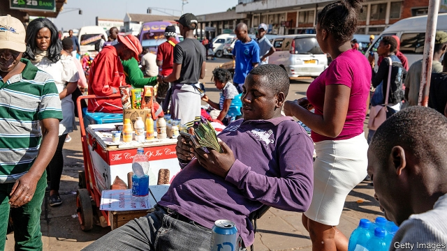
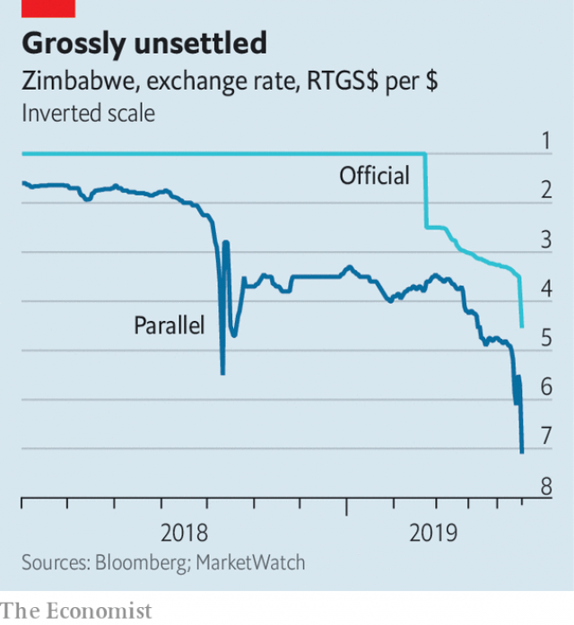

###### A mouthful of zollars

# Zimbabwe struggles to keep its fledgling currency alive 

##### Redollarisation 

 

> May 23rd 2019 

MOST CURRENCIES have snappy names, like yen, won, kip or lek. Some have unfortunate ones: dong or colón. Few have names as cumbersome as Zimbabwe’s Real-Time Gross-Settlement Dollars, also known as RTGS-dollars or “zollars”. Hard to say, the new currency is also hard to price. Last week it lost about 20% of its value against the American dollar, according to Market Watch, which tracks the currency’s movements on the black market. This week it zagged, then zigged again (see chart). “You have to follow Zimbabwe hour by hour,” says an economist in Harare. 

Zimbabwe’s previous homegrown currency was destroyed by the hyperinflation of 2007-08, forcing the country to adopt the American dollar (and other foreign currencies) instead. That worked well until 2015. But in the final years under Robert Mugabe, the longstanding dictator ousted in November 2017, the government could not muster enough genuine dollars to meet its spending ambitions. Instead it paid people with money of its own creation, transferred electronically into their dollar bank accounts. These “zollars”, it claimed, were identical to a dollar. But if depositors withdrew them from the bank they received not greenbacks, but “bond notes”: paper currency issued by the Reserve Bank of Zimbabwe, the country’s central bank. 

Last October the new government, led by Emmerson Mnangagwa, admitted that zollars and dollars were not the same, allowing depositors to keep them in separate accounts. By mid-December the banking system had almost 9.7bn in zollar deposits and only $660m in dollars. But the government insisted that a zollar could fetch $1. 

 

If only. In reality, the central bank sold only small amounts of the American currency at the official one-to-one exchange rate, reserving a portion for grain and fuel imports, another for essential inputs to production and the remainder for favoured insiders. Dollars could be bought for higher prices on the black market. But that was not an option for many listed companies and foreign multinationals, which were wary of breaking the rules. They struggled to find hard currency. Delta Corporation, a beverage firm that bottles Coca-Cola, had to stop making fizzy drinks for months. 

With the economy going flat, the government finally dropped the pretence of parity, devaluing the official exchange rate by 60% in February. But this forced move was not accompanied by a plan to build the new currency’s credibility. It was a “kick-and-rush strategy”, says one observer. Like an English football team in the 1980s, the government hoofed the currency upfield, with no guarantee of regaining control. 

Three months later the gap between the official and unofficial exchange rates has only widened. The finance ministry can boast a narrower budget deficit, thanks partly to higher fuel duties and a 2% tax on financial transactions. The central bank is also apparently planning to limit the growth of the money supply, narrowly defined, to 8-10% this year. And the government has asked the IMF to monitor its progress, even though it will remain ineligible for any IMF money until it has settled more than $5.6bn of arrears to other official creditors, including the World Bank. 

None of this, however, has brought the new currency under the government’s spell. In March the economy suffered from Cyclone Idai, which displaced 16,000 households and damaged crops that were already suffering from severe drought. The water shortage has also parched the country’s hydroelectric dams, contributing to widespread power cuts. Last week the state electricity utility said it cannot import more electricity from South Africa and Mozambique until it has settled its $80m debts to their producers. Its search for dollars may have contributed to the latest sharp turn in the exchange rate. 

Over the weekend the Reserve Bank said it would step in, selling some of the $500m it has reportedly borrowed from the African Export-Import Bank, a multilateral lender based in Cairo. And on May 21st it did so. But this support for the local currency was overwhelmed by another revelation. The central bank said Zimbabwe’s petrol companies would no longer receive dollars at highly favourable rates, leaving them unsure if they could cover their costs. The confusion has prompted long queues at petrol stations, a further loss of confidence and another dash for dollars. 

The new currency is becoming less widely used as well as cheaper. Shops and even schools are increasingly demanding dollars in payment, or setting zollar prices forbiddingly high. Inflation surpassed 75% in the year to April. If the government cannot restore faith in its own currency, the country may once again adopt America’s instead. That should restore price stability: Zimbabwe’s inflation averaged less than Japan’s from 2012 to 2016. But it would also obliterate many households’ zollar savings, create a shortage of small bills and coins, and limit the room for macroeconomic manoeuvre. The dollar has a simple name. But redollarisation could be as ugly as it sounds. 

