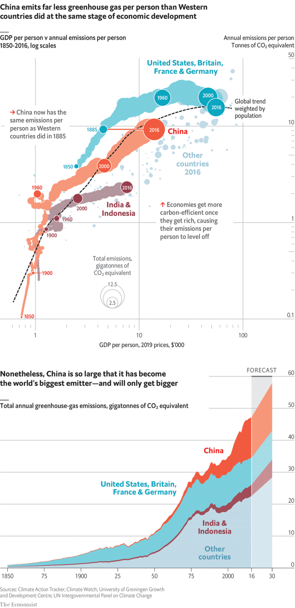

###### Not-so-cold comfort

# China is surprisingly carbon-efficient—but still the world’s biggest emitter 

##### It will take an unprecedented reduction in China’s emissions per head to stave off severe warming 

 

> May 25th 2019 

WITH ITS four-tiered smog warnings and lethal dumps of toxic waste, China has become Exhibit A for the environmental costs of economic development. Its growing meat consumption and reliance on fossil fuels have also made it a focus for people worried about climate change. 

In one sense, China’s reputation as the bellows of “hothouse Earth” is overblown. Since 1850 countries with a GDP per head of $12,000-16,000 in 2019 dollars have produced a population-weighted average of 10.6 tonnes of carbon dioxide-equivalent gases per person per year. In 2016 China’s GDP per head was $14,000, and it emitted just 9.3 tonnes per person. 

Moreover, China pollutes far less per person than Western countries did at the same stage of development. When America, France, Britain and Germany had incomes similar to modern China’s, they relied on inefficient power stations and cars, and spewed out 16.6 tonnes per person. 

The combination of China’s huge population and rapid GDP growth has nonetheless made it the world’s biggest emitter of carbon. China is predicted to produce 16bn tonnes of greenhouse gases in 2030—four times the entire world’s output in 1900. 

To prevent the stock of greenhouse gases in the atmosphere from reaching levels likely to cause disastrous warming, China must do better than merely beating the past records of richer countries. Instead, it will need an unprecedented decline in emissions per head—at least to the more carbon-efficient level of similarly rich Latin American economies, and ideally onto the trajectory of poorer Asian giants like India and Indonesia, which rely less on heavy industry and manufacturing. Those countries, perched at the sweltering latitudes where farmers will be most hurt by climate change, must in turn work out how to reach upper-middle-income status without replicating China’s emissions path. 

To their credit, Chinese authorities, spurred by public concern about air pollution, have prioritised green policies, such as switching from coal-fired power stations to renewable sources and setting up an emissions-trading system. China’s annual rate of emissions growth has fallen from 9.3% in 2002-11 to 0.6% in 2012-16. The waning of its cement-intensive construction boom should slow emissions further. But it will take more than incremental gains to stave off severe warming. 

 

