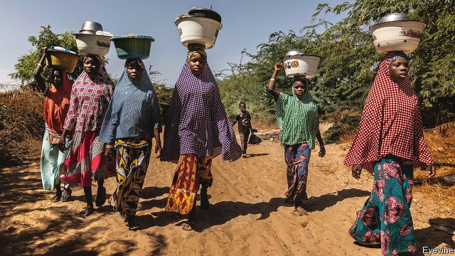
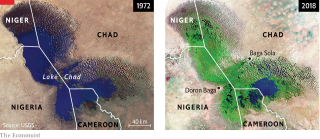
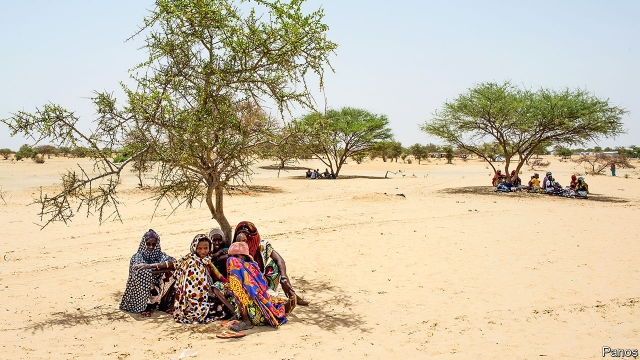

###### Heating up

# How climate change can fuel wars 

##### Droughts are already making conflict more likely. As the world gets hotter, mayhem could spread 

 

> May 23rd 2019 

ON THE OUTSKIRTS of Baga Sola, a small town in Chad not far from the border with Nigeria, is a refugee camp called Dar es Salaam. The name means “haven of peace”, but the surrounding area is an inferno of war, spilling across the borders of four countries: Chad, Nigeria, Niger and Cameroon. Some 2.4m people have been forced to flee the fighting. 

The most obvious cause of their suffering is ideological. The jihadists of Boko Haram want to establish a caliphate, snuffing out such sins as Western-style education and imposing a harsh form of sharia (Islamic law) as the sole system of government. To this end, they torch villages, behead aid-workers and enslave or strap bombs to young girls. 

Religious extremism is not the war’s only fuel. Poverty is another. Boko Haram would find it harder to recruit footsoldiers if hungry young men did not see picking up a rifle as an attractive career move, leading as it does to opportunities for pillage. Another factor is oppressive, ineffectual government, which gives locals little to cheer about and plenty of grievances against which to fight. All four countries are cursed with predatory, incompetent officials and security forces. But in addition to all these long-standing ills is an aggravating factor created far away, in industrialised countries: climate change. 

Fifty years ago the Dar es Salaam camp would have been under several metres of water. In the 1960s Lake Chad was the sixth-largest freshwater lake in the world, an oasis and commercial hub in the arid Sahel. Water and fertile lands were shared by farmers, herders and fisherfolk alike. 

The vast lake has shrunk from 25,000 square km to half that area today (see satellite picture). In the camp, which the UNHCR (the UN’s refugee agency) helps run, over 12,000 men, women and children huddle in any shade they can find from heat that often reaches 45°C. The camp has no guard towers or walls. Boko Haram fighters are only a few miles away. A tangle of torn tarpaulins and human debris is scattered across the desert. For miles around, baked white sand is dotted with sparse, scraggy trees bristling with inch-long thorns. The sole signs of life are camels pecking at the dry vegetation. 

 

Al-Haj Adam Ibrahim arrived with his family this year. Boko Haram many times attacked his home in Doron Baga, in Borno state, Nigeria, and the neighbouring market town, Baga. In 2013, 185 people were reported to have been killed in Baga; over 2,000 houses were torched. In 2015 Amnesty International released satellite photographs showing how both towns were nearly wiped off the map by an attack in which thousands were massacred. Jihadists went from house to house, shooting men of fighting age and rounding up old people, women and children. 

As Mr Ibrahim sees it, the violence was a consequence of the drought. He remembers when the lake stretched over the horizon. “Before the lake began to shrink everything was going normally,” he says. “And now, nothing. We cannot get food to eat.” As the lake receded, people moved towards it, plagued by swarms of tsetse flies. Herdspeople, farmers and fisherfolk competed for access to the shrunken supply of water. Mr Ibrahim had to walk farther and farther to get to the fishing grounds. 

Mr Ibrahim is not the only one to see a link between climate and war. Globally, the proportion of people who die violently has been falling for decades, as poverty has tumbled and wars between states have become rarer. But many fret that climate change will be so disruptive that it will make future conflicts more likely. Some fear that as the Arctic sea-ice melts, Russia, China and America will scramble for the sea lanes that will open up and the minerals that may lie beneath. Others worry that, as temperatures rise, thirsty countries such as India and Pakistan or Egypt and Ethiopia will fight over rivers they share with their neighbours. 

However, the most immediate threat is of civil wars, not inter-state ones, and one of the most vulnerable regions is the Sahel, an arid strip below the Sahara desert. Here, the roots of many conflicts lie in competition over dwindling fertile land. 

In Mali, for example, struggles over resources between farmers and herders as the population rises have escalated into ethnic cleansing. Mahamadou Souleymane, a Fulani herder, fled his village last year when militiamen from the Dogon ethnic group attacked. “They were our friends from our great, great grandfathers,” says Mr Souleymane. But one day last year, they came with automatic rifles and machetes. “They cut off hands, arms and penises, and took them away.” They told the villagers that if they did not leave, “no one will survive. We will kill everyone.” So “we ran into the bush,” recalls Mr Souleymane. 

Green campaigners and eager headline-writers sometimes oversimplify the link between global warming and war. It is never the sole cause. But several studies suggest that, by increasing the frequency and intensity of extreme weather events, including floods and droughts, it makes conflict likelier than it would otherwise be. In a meta-analysis carried out in the early 2010s, Solomon Hsiang, then at Princeton University, and Marshall Burke, then at the University of California, Berkeley, found “strong support” for a causal link between climate change and conflict (encompassing everything from interpersonal to large-scale violence). They even tried to quantify the relationship, claiming that each rise in temperature or extreme rainfall by one standard variation increased the frequency of interpersonal violence by 4% and intergroup conflict by 14%. 

History offers several examples of climate change appearing to foment mayhem. An examination of Chinese records spanning a millennium found that the vast majority of violent eras were preceded by bouts of cooler weather. The team behind the study argues that lower temperatures reduced agricultural production, provoking fights over land and food. 

Some see the recent civil war in Sudan’s Darfur region as the first modern climate-change conflict. In 2007 the UN Environment Programme argued that desertification and dwindling rainfall had made supplies of food and water less secure, which may have helped spark the rebellion that Sudan’s government put down with a campaign of genocide and mass rape. 

However, just as one can never be sure that any individual hurricane would not have happened without global warming, one can never prove that a given war would not have occurred without it. Environmental forces interact in unpredictable ways with human greed, opportunism and cruelty—and sometimes with mankind’s better angels, too. And the environmental forces themselves are complex. 

Consider Syria. Between 2012 and 2015 three academic papers argued that climate change had been a catalyst or even a primary driver of the civil war. Headlines blamed it for the waves of refugees reaching Europe. The argument was that human emissions had caused or exacerbated a severe drought in Syria in the late 2000s that triggered mass migration from farmland into cities, contributing to tensions which ultimately led to war. 

The headlines were too simplistic, as headlines often are. Climate modelling led by Colin Kelley, then at the University of California in Santa Barbara, estimated that greenhouse-gas emissions made the drought twice as likely. That is significant, but need not mean that in the absence of climate change, there would have been no drought and no war. Syrians had many reasons to revolt against their ruler, Bashar al-Assad, a despot from a religious minority who enforced his rule with mass torture. 

The conflict around Lake Chad is also a tangled tale. Its roots can be traced back to a deadly drought in the 1970s and 1980s. Many have blamed that drought on industrial emissions of greenhouse gases. But climate models suggest they did not in fact play a big role in the drought. The recurrent failure of monsoon rains was caused by cooler temperatures in the north Atlantic, which pushed the rains too far south. The cooling was itself caused by a mixture of natural and human factors, notably air pollution above the ocean—a striking reminder that greenhouse-gas emissions are not the only way in which human activity may alter the climate. 

A report published this month by Adelphi, a Berlin-based think-tank, shows that Lake Chad is no longer shrinking. Its authors examined 20 years of satellite data and found that the southern pool was stable for the duration. The northern pool is still shrinking slightly, but total water storage in the area is increasing, as 80% of the water is held in a subterranean aquifer, which is being replenished, as is moisture in the soil, as the rains have returned. 

This has big implications for plans to alleviate tension in the region, says Janani Vivekananda, who led the research. Earlier this year government ministers dusted off a decades-old proposal to divert billions of cubic metres of water from tributaries of the Congo River, down a 2,400km canal and into the Lake Chad basin. The latest findings suggest this would do little good, at enormous cost. 

Despite all these caveats, climate change clearly can play a part in fostering conflict. The Sahel is warming 1.5 times faster than the global average, owing to greenhouse-gas emissions. In future, most models suggest, it will experience more extreme and less predictable rains over shorter seasons. In a region where most people still grow or rear their own food, that could make millions desperate and restless. 

Traditional systems for sharing resources can break down if farmers suddenly have to adapt to different growing seasons or herders need to move their cattle at different times. Around Lake Chad, people are concentrated in a much smaller area than before, says Fode Baba Condé, who leads the UNHCR’s mission on the Chadian side of the lake, including the camp at Dar es Salaam. Many confrontations between farmers and herders result, he says. Cattle that used to wallow in the lake can now die for lack of water; those that survive may trample farmland. 

Yusfa Issa, a 60-year-old, came to Dar es Salaam camp from Brasserie, a Chadian village of farmers and fisherfolk. He laments the old days, when people would share food. “Now people won’t give you a potato, onion or cassava…There is nothing left.” His village is just 10-15km away, but too dangerous to go back to, he says. 

Climate models predict that, as global average temperatures rise, dry regions will get drier and wet regions will get wetter, with more extremes and greater variability. Poverty makes it harder for farmers to adapt. Trying something new is always risky—and potentially catastrophic for those with no savings to fall back on. In conflict zones, farmers who once had the means to plant several different crops may only be able to plant one. They end up with all their seeds in one basket. On the shores of Lake Chad, violent clashes between government forces and armed opposition groups have created zones that are off-limits to civilians, says Chitra Nagarajan, a researcher for the Adelphi report, who spent two years conducting surveys in all four littoral countries. 

Conflict and environmental change disproportionately bring suffering to women. “We are seeing high levels of divorce, high levels of domestic abuse,” says Ms Nagarajan. “Men are migrating, leaving the women to fend for themselves.” 

Conflict itself makes the poor even poorer, and more vulnerable to the vagaries of a changing climate. Fearing murder, pastoralists cannot take their herds to places with water and vegetation. The UNHCR’s Mr Condé says that fishermen can no longer go into the deep lake to fish. Government troops block them, and Boko Haram is still on the prowl. Fighters steal farmers’ crops. All the farmers can harvest is wood, which they sell as fuel. In a bitter twist, doing so accelerates desertification, further degrading the land. 

  

Climate change makes conflict more likely but not inevitable. The Sahelian drought of the 1970s and 80s was felt across the region, but the violence began and has been most intense in a particularly ill-governed part of Nigeria. Likewise, the drought that preceded the Syrian civil war also affected Jordan, Lebanon and Cyprus, none of which imploded. Lebanon took in 1.5m refugees with barely a complaint. 

The Adelphi report confirms that the Lake Chad conflict had many causes besides climate variability, including bad governance, corruption, rising inequality and religious extremism. Similarly, the origins of Syria’s war are complex. It was a revolt against a blood-drenched tyrant who had recently slashed fuel and fertiliser subsidies. But, as Charles Iceland of the World Resources Institute (WRI), a research organisation, points out, a horrible drought preceded the outbreak of hostilities, and “it isn’t logical to say that it contributed less tension or the tension stayed the same.” 

The question is in what circumstances environmental stresses can tip a precarious peace into violence, and how to respond. Governance can make the difference. Badly governed or poor countries find it harder to cope with climate change, especially when, as often, they have weak institutions. The Netherlands and Bangladesh both face similar environmental challenges: low-lying coastlines and frequent floods which will become more frequent and more extreme as sea-levels rise. The Netherlands has the political, technological and financial means to cope; much poorer, Bangladesh may not. No sensible person expects a Dutch civil war because of climate change; in Bangladesh, the risk of such a conflict is not trivial. 

Aaron Wolf of Oregon State University and his collaborators have catalogued 2,606 instances of international conflict and co-operation over water between 1948 and 2008. In 70% of cases, countries co-operate. The biggest risk of conflict comes when an upstream country builds infrastructure, such as a dam, without an agreement on how to soften the downstream impact. Many of these dams are built because climate change is making water scarcer, or because of a move away from fossil fuels towards hydropower—ie, a secondary link to climate change. 

 

Mr Wolf says that conflict is most likely when the change outpaces institutional capacity to adapt: “The problem is not the dam but the dam plus the absence of an agreement for how to deal with it.” At a meeting this year of the Planetary Security Initiative, a consortium of think-tanks, delegates from Mali gave their own illustration of this, drawing on the degradation of the Inner Niger Delta whose waters support farmers, pastoralists and fisherfolk. Ancestral agreements had created a system of shared commons. “Before, there were traditional mechanisms, a calendar that everyone respected. When the farmer was done, the pastoralist could bring his animals to graze the same land,” said Diallo Tata Touré, president of a commune in the delta. But as the supply of water to the delta has been depleted by irrigation upstream, these pacts have disintegrated, fuelling outbreaks of violence. 

“Pastoralists enter the delta earlier because their animals are hungry. They cross farms and fish-nurseries. The different groups are in conflict where before there was peace,” said Karounga Keita, a Malian economist, at the meeting. “All this is because the flooding area is reduced by dams and irrigation upstream.” There is concern that the proposed $280m Fomi dam upstream of the delta in the Guinean highlands will make matters worse. Conflicts between agriculturalists have existed for centuries, says Seydou Doumbia, a Malian official, but have never resulted in a security crisis. “Not until now.” 

Mr Iceland and his colleagues at the WRI, in collaboration with nine other organisations, are working on a predictive tool for future conflicts, with a focus on water stress. The team has fed large historical data sets of risk factors for conflict (social, economic, demographic and geographic), in addition to a number of water indicators (precipitation, groundwater availability, length and severity of droughts) to machine-learning software to generate a model that predicts the probability of conflicts. In October 2018, WRI’s Manish Bapna presented preliminary results to the UN Security Council. Using data from 2016, the model was able to predict instances of water conflict in 2017 with 83% accuracy. 

Academics may squabble about the specific causes of past conflicts, and develop complex models to forecast future ones. But there is consensus that tensions, and so the potential for bloodshed, will be heightened by climate change. And conflict, in turn, makes it harder to prepare for or respond to climate change. How to save for a rainy (or dry) day if men with guns keep stealing your savings or burning down your grain stores? Saleh Isaka, a Chadian village elder, remembers when his people used to graze thousands of animals on land where the Dar es Salaam camp now stands. Three years ago, Boko Haram attacked. They were armed with automatic weapons and they stole away all the animals, as well as women and children. “Now we are suffering. It’s hotter than before… Everything is dead,” Mr Isaka says, gesturing into the bone-dry distance. 

