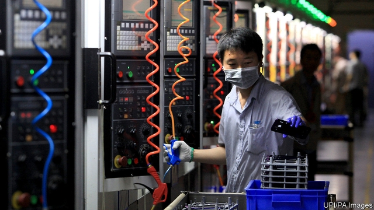

###### Circuit breaker

# Big tech and the trade war 

##### As the fight spreads, it is becoming a danger to investors, consumers and American interests 

 

> May 23rd 2019 

WHEN TRADE talks between America and China fell apart on May 10th, the effect on financial markets was muted. Most firms and investors are betting on a long struggle between the superpowers but not a sudden crisis or a financial panic. As the conflict over the tech industry escalates, however, that assumption looks suspect. On May 15th America’s Commerce Department said that companies would need a special licence to deal with Huawei, China’s hardware giant, which it deemed a threat to American interests (it later said the order would not take full effect for 90 days). Fears that other Chinese tech firms will be blacklisted have caused their shares to tumble. A chain reaction is under way as a giant industry braces for a violent shock. 

The hawks in the White House may believe that isolating the tech industry will slow China’s long-term development and that isolation is a good negotiating tactic, since China has more to lose in the short term than America does. In fact the brutal fallout from a full-blown tech war would rapidly be felt by financial markets as well as by America’s allies and the world’s consumers. In the long run it may even make China self-sufficient. 

The tech confrontation began in earnest in April 2018, when America blacklisted ZTE, a Chinese hardware firm, for breaching sanctions on Iran and North Korea and then lying about it. Unable to buy American semiconductors and other components, or to deal with Western banks, ZTE almost collapsed (President Donald Trump reversed the ban). Since then the scope of American actions has broadened and the burden of proof fallen. The Huawei ban comes after a campaign to stop American allies from using its 5G gear. Further bans are likely. According to the New York Times, the blacklisted firms will include Hikvision, which makes systems used for surveillance of the beleaguered Uighur minority in Xinjiang. Suppliers and customers are cutting these firms off. Google and Arm, a British chip-design firm, have both said they will limit supplies to Huawei. Telecoms firms in Britain and Japan have said they will stop selling some Huawei phones. 

The confrontation is a reminder of America’s awesome power. By stopping foreign firms from using its intellectual property and financial system, it can put them out of business. The White House is also right that the bill for a tech war will at first be asymmetric. American firms will lose perhaps $10bn a year of licensing revenue for chips and components. But much of China’s hardware-manufacturing industry depends on American components that cannot easily be sourced from elsewhere or produced at home. Huawei carries only 80 days of inventory and has 188,000 staff (see article). A hiatus in the trade of tech goods would cause huge job losses in China’s coastal cities. 

Tech is not like the other industries, such as steel and soyabeans, that obsess the White House’s trade warriors. The supply chain is so complex that it more closely resembles the interconnected global financial system before the crisis of 2007-08. Tech hardware firms around the world, which mostly depend on production in China, have a total market value of $5trn. Apple, which makes a fifth of its profits in China, could find itself banned or its products boycotted; its cash-rich balance-sheet could survive the shock, but its shares would slump. Hundreds of smaller suppliers with rickety finances could go bust. 

The ripple effect would hurt America’s allies in Asia, because they host factories that supply China’s tech-manufacturing hubs and are home to companies that operate in China. In October 2017, for example, components for smartphones accounted for over 16% of exports in Malaysia and Singapore and over 33% in Taiwan. Two Taiwanese giants, TSMC (which makes chips) and Foxconn (which assembles devices), straddle the fault line of the tech cold war, having production and customers in both America and China. The same is true of South Korea’s champion, Samsung. America’s allies face an impossible test of loyalty. 

Consumers will suffer, too. Until now, the cost of the trade war has been masked, because tariffs are paid by producers who absorb their cost or pass it on stealthily to consumers. Now the bill could become visible. Huawei has sold 300m handsets outside China in the past five years. Their buyers may soon find that their phones no longer work properly. And just imagine if Americans were suddenly unable to buy Chinese-made iPhones. 

The cost of a rupture means that both sides are likely to back down. Yet the battle will hasten the race to develop an indigenous capacity to supply every vital technology in China—and in every aspiring power, including India. America’s hold over the digital economy lets it enforce its will. But by unleashing its power so clumsily, it will hasten the end of its own dominance. 

