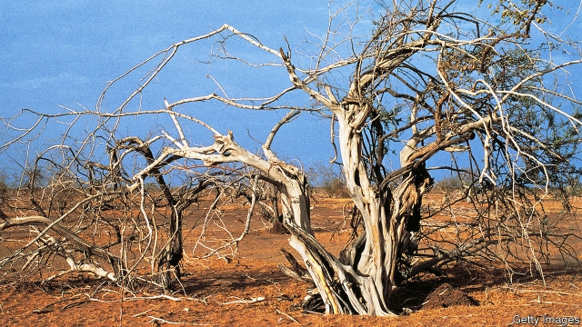

###### Climate of fear

# How to think about global warming and war 

##### They are linked—and that is worrying 

 

> May 23rd 2019 

DID CLIMATE change cause the war in Syria? Or the genocide in Darfur? Obviously, that is not the whole story. Suppose Syria’s despot, Bashar al-Assad, or Sudan’s former tyrant, Omar al-Bashir, were to find themselves on trial in The Hague and tried to blame their country’s carnage on global warming. Such a risible defence would flop. No conflict occurs without leaders to give orders and soldiers to pull triggers. No atrocities are committed unless human beings choose to commit them. 

Nonetheless, future-gazers are right to warn that global warming has made some wars more likely than they would otherwise have been, and will make others more so in the future. It is never possible to pinpoint a specific war and say that it would not have happened in the absence of climate change, just as it is impossible to say that a particular flood or typhoon was caused by it. Rather, climate change is causing environmental upheaval that destabilises regions and raises the risk of bloodshed (see article). 

Some worry that the Arctic will be a flashpoint. As the ice cap shrinks, NATO and Russia bolster their military presence there. China is building a nuclear-powered icebreaker. At the Arctic Council on May 6th Mike Pompeo, America’s secretary of state, downplayed climate change but waxed indignant about Russia’s “aggressive behaviour” in reopening military bases in the region. If the North-West Passage opens to shipping or enough valuable minerals are found beneath Arctic waters, expect a tussle between great powers for polar pre-eminence. 

But none of that is likely to lead to war. Nuclear-armed states are wisely wary of provoking each other too much. The bigger danger of climate-induced conflict lies farther south, in hotter, drier zones, and involves mostly civil wars in poor countries, not international ones. 

Some things are clear. Accumulating greenhouse gases in the atmosphere are increasing the frequency and intensity of extreme droughts and floods in some regions. Seasonal rains and monsoons are becoming more variable and less predictable. As one area grows parched, its inhabitants encroach on land traditionally farmed or used for grazing by others. Disputes erupt, some of which are already turning violent, especially in the Sahel, a huge strip of Africa below the Sahara. Environmental stress plays a role in deadly conflicts in Burkina Faso, Chad, Cameroon, Mali, Niger, northern Nigeria and South Sudan, not to mention non-Sahelian states such as Yemen. As global temperatures continue to rise and the weather becomes more erratic, such conflicts could grow more common. 

Several other factors tend to foment war, including poverty, stagnation and bad government. Ethnic differences, religious zealotry and the availability of minerals to loot are often assumed to increase the risk, but they typically do so only in countries that are too poor, stagnant and ill-governed to keep violence in check. The good news is that, as poverty has receded worldwide, the proportion of humankind who die in wars and civil strife has fallen sharply, from nearly four per 100,000 each year in the 1980s to less than one in the past decade. The bad news is that climate-related disruption is likely to get worse. And if it leads to more conflicts, it can start a vicious cycle, since war makes regions poorer, and poverty fosters future wars. 

Climate-induced war is one more reason for governments to take global warming seriously. However, as Australia showed on May 18th, when it elected a coal-cuddling conservative government, voters are not yet willing to pay much to avert planetary peril. Cheaper ways to reduce emissions are urgently needed, along with incentives to remove carbon from the atmosphere. 

Alas, none of this will help end conflicts today or prevent them in the short term. For that, poor countries need the help of the rich to build early-warning systems and pay for peacekeepers. Outsiders should also impose sanctions on warmongers and offer aid for governments that sincerely seek to rebuild themselves after wars, thereby reducing the risk of a relapse. For every dollar spent on such intervention, roughly $10 of harm can be averted, estimates Paul Dunne of the University of Cape Town. This is good value for money, and fits well with efforts by America, France and others to curb jihadism in Africa. 

Since climate change will make some areas uninhabitable, people will leave them. Not many will move to rich countries—starving farmers cannot afford such a costly journey. Many more will move to towns or cities in their own country. It makes no sense to try to stop or discourage such migration, as many governments do. Moving is a rational way to adapt to a changing environment. Better for governments to manage the influx, building roads and schools to accommodate the newcomers. If people cannot act globally in a global emergency they will have to make do with acting locally.   

