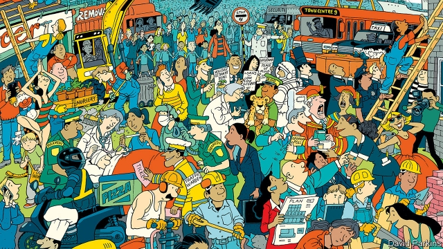

###### Work

# The rich world is enjoying an unprecedented jobs boom 

##### Capitalism’s critics are yet to notice 

 

> May 23rd 2019 

EVERYONE SAYS work is miserable. Today’s workers, if they are lucky enough to escape the gig economy and have a real job, have lost control over their lives. They are underpaid and exploited by unscrupulous bosses. And they face a precarious future, as machines threaten to make them unemployable. 

There is just one problem with this bleak picture: it is at odds with reality. As we report this week (see Briefing), most of the rich world is enjoying a jobs boom of unprecedented scope. Not only is work plentiful, but it is also, on average, getting better. Capitalism is improving workers’ lot faster than it has in years, as tight labour markets enhance their bargaining power. The zeitgeist has lost touch with the data. 

In America the unemployment rate is only 3.6%, the lowest in half a century. Less appreciated is the abundance of jobs across most of the rich world. Two-thirds of the members of the OECD, a club of mostly rich countries, enjoy record-high employment among 15- to 64-year-olds. In Japan 77% of this group has a job, up six percentage points in six years. This year Britons will work a record 350bn hours a month. Germany is enjoying a bonanza of tax revenue following a surge in the size of its labour force (see article). Even in France, Spain and Italy, where joblessness is still relatively high, working-age employment is close to or exceeds 2005 levels. 

The rich-world jobs boom is partly cyclical—the result of a decade of economic stimulus and recovery since the great recession. But it also reflects structural shifts. Populations are becoming more educated. Websites are efficient at matching vacancies and qualified applicants. And ever more women work. In fact women account for almost all the growth in the rich-world employment rate since 2007. That has something to do with pro-family policies in Europe, but since 2015 the trend is found in America, too. Last, reforms to welfare programmes, both to make them less generous and to toughen eligibility tests, seem to have encouraged people to seek work. 

Thanks to the jobs boom, unemployment, once the central issue of political economy, has all but disappeared from the political landscape in many countries. It has been replaced by a series of complaints about the quality and direction of work. These are less tangible and harder to judge than employment statistics. The most important are that automation is destroying opportunities and that work, though plentiful, is low-quality and precarious. “Our jobs market is being turned into a sea of insecurity,” says Jeremy Corbyn, leader of Britain’s Labour Party. 

Again, reality begs to differ. In manufacturing, machines have replaced workers over a period of decades. This seems to have contributed to a pocket of persistent joblessness among American men. But across the OECD as a whole, a jobs apocalypse carried out by machines and algorithms, much feared in Silicon Valley, is nowhere to be seen. A greater share of people with only a secondary education or less is in work now than in 2000. 

It is also true that middle-skilled jobs are becoming harder to find as the structure of the economy changes, and as the service sector—including the gig economy—expands. By 2026 America will have more at-home carers than secretaries, according to official projections. Yet as labour markets hollow out, more high-skilled jobs are being created than menial ones. Meanwhile, low-end work is becoming better paid, in part because of higher minimum wages. Across the rich world, wages below two-thirds of the national median are becoming rarer, not more common. 

As for precariousness, in America traditional full-time jobs made up the same proportion of employment in 2017 as they did in 2005. The gig economy accounts for only around 1% of jobs there. In France, despite recent reforms to make labour markets more flexible, the share of new hires given permanent contracts recently hit an all-time high. The truly precarious work is found in southern European countries like Italy, and neither exploitative employers nor modern technology is to blame. The culprit is old-fashioned law that stitches up labour markets, locking out young workers in order to keep insiders in cushy jobs. 

Elsewhere, the knock-on benefits of abundant work are becoming clear. As firms compete for workers rather than workers for jobs, average wage growth is rising, pushing up workers’ share of the pie—albeit not as fast as the extent of the boom might have suggested. Tight labour markets lead firms to fish for employees in neglected pools, including among ex-convicts, and to boost training amid skills shortages. American wonks fretted for years about how to shrink disability-benefit rolls. Now the hot labour market is doing it for them. Indeed, one attraction of the jobs boom is its potential to help solve social ills without governments having to do or spend very much. 

Nonetheless, policymakers do have lessons to learn. Economists have again been humbled. They have consistently underestimated potential employment, leading to hesitant fiscal and monetary policy. Just as their sanguine outlook on finance in the 2000s contributed to the bust, so their mistaken pessimism about the potential for jobs growth in the 2010s has needlessly slowed the recovery. 

The left needs to accept that many of the criticisms it levels at capitalism do not fit the facts. Life at the bottom of the labour market is not joyous—far from it. However, the lot of workers is improving and entry-level jobs are a much better launch pad to something better than joblessness is. A failure to acknowledge this will lead to government intervention that is at best unnecessary and at worst jeopardises recent progress. The jobs boom seems to be partly down to welfare reforms that the likes of Mr Corbyn have vociferously opposed. 

The right should acknowledge that jobs have boomed without the bonfire of regulations that typically forms its labour-market policy. In fact, labour-market rules are proliferating. And although the jury is out on whether rising minimum wages are harming some groups, such as the young, they are not doing damage that is large enough to show up in aggregate. 

The jobs boom will not last for ever. Eventually, a recession will kill it off. Meanwhile, it deserves a little appreciation. 

