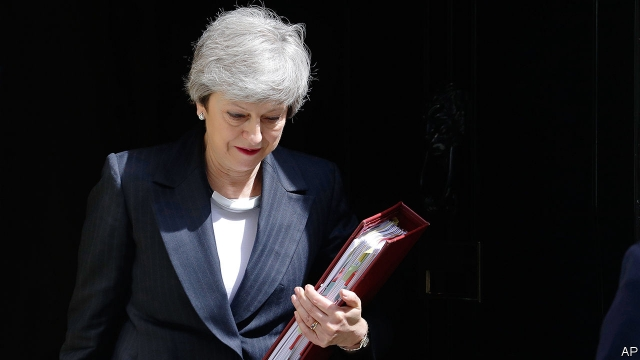

###### Brexit chaos

# Theresa May reaches the end of the road 

##### She will leave Britain even more divided than she found it 

 

> May 23rd 2019 

THERESA MAY has devoted her time in Downing Street to a single task: getting Britain out of the European Union. In November she cleared the first hurdle when she signed a draft Brexit deal with her opposite numbers in Brussels. But its terms were so much worse than those she had promised at home that she has been unable to get the deal through Parliament. MPs have rejected it three times, by crushing margins. Under pressure from her party, Mrs May has promised to quit if she fails on her fourth and final attempt. Even though the vote is not due until next month, it became clear this week that the deal was indeed doomed when her last-ditch attempt to win over doubters backfired spectacularly and triggered the resignation of a senior minister (see article). At the same time, the Conservative Party is set to take a drubbing in European elections at the hands of Nigel Farage and his new Brexit Party. Britain will soon have a new prime minister. 

Historians may be a fraction kinder to Mrs May than today’s commentators. But the prime minister’s ineptitude has rendered the fiendishly hard Brexit project almost impossible. Faced with the many painful trade-offs that Brexit entails, Mrs May refused to accept that compromise was necessary until too late—after others’ positions had hardened and compromise was defined as losing. Many Leavers now believe that a perfect, costless version of Brexit exists, which they are being denied only through some mix of incompetence and conspiracy. At the same time many Remainers, seeing the government constantly in retreat, believe that Brexit could yet be cancelled altogether. 

This polarisation is Mrs May’s legacy—and it will bedevil her successor. In the aftermath of the referendum, nearly three years ago, many Brexiteers might have accepted a deal in which Britain left the single market and ended free movement, with temporary membership of the customs union as the only tie. Most now see such an outcome as an intolerable betrayal (never mind that some of them still seem unsure what a customs union actually is). In the same way, Remainers might once also have been satisfied by the prospect of a customs union, so long as it was tied to a vote in Parliament on whether to hold a second referendum. But when Mrs May belatedly offered such things this week, it was dismissed by all sides as inadequate. The scope for compromise has drastically narrowed from where it stood in 2016. Talks with the Labour opposition and indicative votes among MPs on possible Brexit options have gone nowhere, in large part because they were initiated so late in the day. Mrs May inherited a divided country which urgently needed to be coaxed back together. Her approach has driven its two tribes still further apart. 

She has no cards left to play. A change of leader might give new momentum to talks in Westminster, which have stalled in the past few weeks, despite the EU’s urging of Britain to get on with it. Boris Johnson, the favourite among the Conservative Party members who will choose the next leader, represents a dangerous gamble for the country (see Bagehot). But he may be more capable than Mrs May of the political and ideological flexibility that will be required to get Britain out of the trap in which it has placed itself. 

No one should assume that Mrs May’s exit will solve Britain’s Brexit problems. Mr Johnson proposes to renegotiate the withdrawal agreement, but the EU is sure to refuse him. At home, most Leave-voters detest the current deal so vehemently that they would rather quit with no deal at all (another dreadful legacy of Mrs May, who spent two years saying Britain could prosper with no deal, before admitting that she was wrong). Upstart parties on both the Leave and Remain sides are tugging Labour and the Tories towards the extremes. The possibility of cross-party agreement seems more remote than ever. And as the chances of no deal edge up, the pound is sliding. Mrs May has had a wretched time in office. Her successor will find it no easier. 

