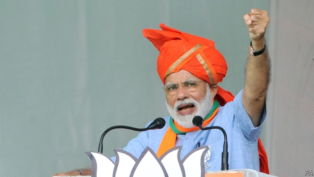

###### Hindu juggernaut

# What Narendra Modi should do next 

##### India’s ruling party has won a huge victory. If only it governed as well as it campaigns 

 

> May 25th 2019 

FOR THE second time in a row, the Bharatiya Janata Party led by Narendra Modi has swept an Indian election. As The Economist went to press, early projections suggested the alliance it leads had won well over 300 of the 545 seats in the lower house of parliament. The BJP itself looked set to claim a slender majority in its own right, of more than 272 seats (see article). 

To put the scale of the BJP’s success in perspective, the last politician to lead a party to two successive electoral majorities in India was Indira Gandhi, in 1971, at the helm of the Congress party. Congress, now led by Indira’s grandson, clawed back a little ground after its disastrous performance at the previous election, in 2014, in which it won only 44 seats. But with a haul of perhaps 50, it remains a distant also-ran in Indian politics. In a country where previously routine anti-incumbency had generated decades of fissiparous politics, the BJP appears to have become the natural party of government, just as Congress was in the first years after independence. 

Investors cheered the result, sending the main share index to a record high. The BJP’s victory holds out the prospect not just of stability, but also of development and reform. Its manifesto pledged lavish investment in infrastructure, including 100 new airports and 50 metro systems. By 2030, the BJP says, India will be the world’s third-biggest economy (it now ranks sixth). 

Yet the BJP has little to say about the biggest obstacles to growth, such as the poor education of many workers, the lack of clear title to much of India’s land and the domination of the banking system by sclerotic state-owned firms. Its activists tend to focus on less practical matters, to say the least. It has long promised to build a temple to the Hindu god Rama in the city of Ayodhya, for example, on the site of a mosque demolished by Hindu zealots in 1992. This time around, for good measure, it pledged to keep women out of a big temple in the southern state of Kerala, in contravention of the Supreme Court’s orders. It also wants to revise the constitution to take away special privileges granted to India’s only Muslim-majority state, Jammu & Kashmir. One of the BJP’s likely new MPs is a woman awaiting trial for aiding a terrorist attack that killed six Muslims. 

This is the ambiguity on which the BJP thrives. To the world, and to upwardly mobile voters, it presents itself as a modern, reformist party, determined to fulfil India’s potential. But it derives equal support from its claim to be a muscular champion of Hinduism, that will not flinch from putting Muslims—and their foreign embodiment, Pakistan—in their place. 

 

Listen on: Apple Podcasts | Spotify | Google | Stitcher | TuneIn 

In its five years in office, Mr Modi’s government did not quite live up to either identity, to the dismay of business and the relief of minorities. It did enact two urgently needed reforms, introducing a uniform national sales tax and streamlining bankruptcy proceedings. But it also appalled businessmen (and economists) by abruptly voiding most banknotes in a quixotic quest to catch tax-dodgers. By the same token, it did not build the temple at Ayodhya or preside over the sort of anti-Muslim pogrom that stained Mr Modi’s tenure as chief minister of the state of Gujarat. But it did inflame the Muslim areas of Jammu & Kashmir with brutal policing, launch risky airstrikes against Pakistan and wink at alarmingly regular beatings and lynchings of Muslims and low-caste Hindus for various perceived insults to the religion of the majority. 

Mr Modi’s second term gives him another chance to hasten development and turn India into a genuine global power—goals that appeal to both his enterprising supporters and his religious ones. But to do so he will have to focus on the economy. The sectarian concerns the BJP has been stirring up during the election campaign are a harmful distraction. So far, Mr Modi has governed in perpetual campaign mode, with more emphasis on slogans than outcomes. He needs to show Indians that he is not just good at winning elections, but at putting his victories to use. 

