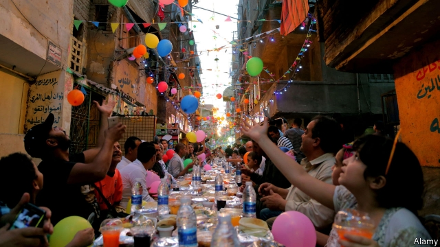

###### Full bellies and full bins

# Arab states waste heaps of food during Ramadan 

##### Hotels and restaurants have come up with some novel solutions 

 

> May 23rd 2019 

AS MUSLIMS HAVE for centuries, Ahmed Toufiq broke his Ramadan fast by nibbling a date while the call to prayer echoed across the Nile. Then he turned to the heaped plates in front of him. He made short work of a fragrant lentil soup, but his pace slowed as he picked through salads and scooped dips with steaming pita bread. When he walked outside for a cigarette 20 minutes after sunset, a server collected half a plate of untouched kebab and rice. “Before iftar, you feel like you want to eat for two,” he said. 

Arab states waste a lot of food. A study in 2016 by the Economist Intelligence Unit, our sister company, found that Saudi Arabia bins 427kg per person annually, triple the average in Europe and North America. Some may chalk this up to traditions of hospitality: even a “light lunch” in Cairo or Beirut leaves guests in a torpor. The reasons are more varied, though. Half of the fruits and vegetables grown in Egypt are never eaten because they are often moved to market in open-air trucks and wilt quickly in the heat. 

The problem gets worse during Ramadan. Residents of the United Arab Emirates each produce an extra 1.8kg of waste per day in the holy month, a 67% increase. Food accounts for 55% of Dubai’s trash, up from 22% in other months. Bahrain’s food waste increases by half to 600 tonnes daily. Buffets are a major culprit, especially in the Gulf, where hotels and restaurants often serve through the night. A study by researchers at Masdar, a state-owned renewable-energy firm in Abu Dhabi, found that just 53% of food at iftar buffets is eaten. 

This is an expensive waste. Some governments see it as a security risk, too. The region is a net food importer. In the weeks before Ramadan, state-run media admonish their citizens to be less wasteful. On social media diners now swap recommendations not on lavish buffets but on à la carte options. Autocratic regimes that frown on civil society are happy for their citizens to take up the cause of food waste. Wahab, a Qatari startup, sends volunteers to collect leftovers from hotels and restaurants. 

A few hotels in Dubai have installed cameras and scales to track what winds up in the bin. Chefs use the data to cook less of the unpopular dishes. One Hilton property says the system cut buffet waste by 70%. Others are doing away with the buffet altogether—if not for iftar then for suhour, the pre-dawn “dinner”. A growing number of restaurants advertise prix fixe menus as a waste-free way to break fasts. These meals are also cheaper. A lavish hotel buffet might cost 200 dirhams ($54). Set menus are about half that. 

Egypt’s national food bank feeds about 1.8m families during Ramadan. Some of the food is sourced from hotels that package leftovers. For health reasons, though, uneaten food from a customer’s plate must be thrown away. After 15 hours of fasting, eyes are bigger than stomachs. Cameras will not help. So one Cairo hotel found a low-tech solution for its buffet: it made the plates smaller. 

