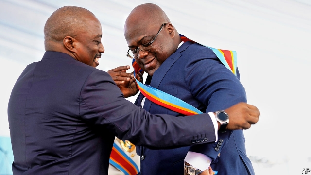

###### Who’s the boss?

# Congo’s new president, Félix Tshisekedi, does not call the shots 

##### His predecessor has yet to move out of the presidential villa 

 

> May 23rd 2019 

VENDORS SELLING mobile-phone airtime and money-changers swinging bags of Congolese francs mill around beneath a billboard in Kinshasa that reads “Kabila forever”. It reminds people that Joseph Kabila, who stepped down in January as president of the Democratic Republic of Congo after 18 years, has not really gone. Though Mr Kabila (pictured, left) handed over the sash of office to Félix Tshisekedi, the leader of the main opposition party, he appears still to be calling the shots. 

The ascent of Mr Tshisekedi (pictured, receiving the sash) was remarkable. It was the country’s first transfer of power via the ballot box; all previous leaders were either killed or fled. It also involved a novel kind of election-rigging. Mr Kabila’s chosen successor was so unpopular that the regime could not plausibly claim he had won. Instead, and presumably after some interesting backroom discussions, it announced that Mr Tshisekedi had won, though impartial estimates suggest he came a distant second with less than 20% of the vote. The real winner with 60%, Martin Fayulu, had promised justice for Congo’s many corrupt bigwigs. He now tours Western capitals trying to drum up support for another election, which is unlikely to happen. 

Just as important as the jiggery-pokery around the presidential election was the theft of the parliamentary one, which implausibly handed almost 70% of the seats in the national assembly to members of Mr Kabila’s party. That party also controls the senate, which is elected by members of the provincial assemblies, some of whom were reportedly paid as much as $50,000 for their votes, according to candidates who withdrew from the race. Mr Tshisekedi tried to take a stand against flagrant vote-buying by blocking the new senators from taking their seats. But after little more than a week he backed down. 

With both houses of parliament in Mr Kabila’s pocket, Mr Tshisekedi is just “renting the seat of power”, says Manya Riche, of the Congo Peace Centre at Texas A&M University. He has little power save for a presidential veto that he can use to block new laws. But this can be overruled by the constitutional court, which is also stacked with Mr Kabila’s loyalists. Moreover, Mr Tshisekedi can be kicked out of office by a two-thirds majority in parliament. 

Mr Kabila, who says he is enjoying his retirement catching up with his mother, seems confused about what retirement entails. He has refused to move out of the presidential villa or, apparently, hand over the presidential plane to his successor, who is in temporary accommodation and slumming it on commercial flights. Mr Kabila is also holding court, hosting politicians on his farm near Kinshasa. Selfies of the former president and newly elected governors, grinning among verdant bushes, recently circulated on social media. Tellingly, Mr Kabila had glad-handed the governors before Mr Tshisekedi met them. 

More ominously, Mr Tshisekedi spent four months bickering with Mr Kabila over who should be prime minister. Parliament only appointed someone this week: Sylvestre Ilunga Ilukamba, a 74-year-old former director of a state railway company and a little-known member of Mr Kabila’s party. That it took so long bodes ill. Tensions over who pulls the levers of power and public frustration at the slow pace of change could lead to a “violent stalemate” with bloody protests, frets Kris Berwouts, the author of “Congo’s violent peace”. 

Still, there are reasons for hope. The new president has already gained some popularity by making politics a little less oppressive. He has released some 700 political prisoners and allowed Moïse Katumbi, a former governor and presidential hopeful, back into the country after three years in exile. 

Mr Tshisekedi is supported by the EU and America, which had fraught relations with his predecessor. Diplomats say that, although the election was clearly stolen, America and the EU accepted the outcome in the hope that it will weaken Mr Kabila’s grip on power and allow for a cleaner vote at the next presidential election due in 2023. To signal its distaste for an election it had endorsed, America slapped sanctions on three election officials. 

The suspicion that Mr Tshisekedi was complicit in the theft of the election infuriates some members of his party. They say that he rose to prominence on the reputation of his late father, Étienne, a stalwart of the opposition. “How can a biological son of Étienne do this?” asks Valentin Mubake, his father’s former aide, who scoffs that the new president has no power of his own. “He wouldn’t even dare remove that Kabila billboard.” 

