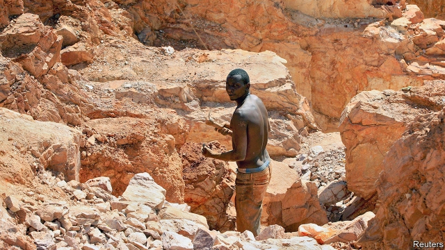
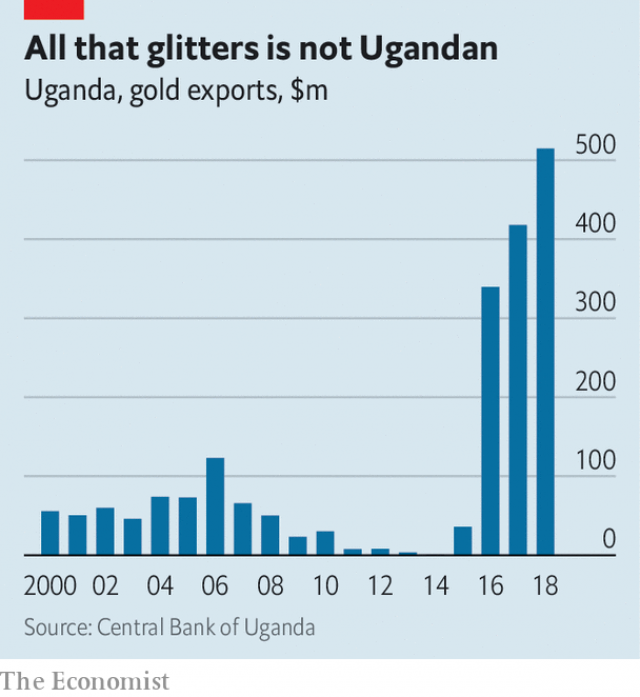

###### Gold blush

# How can Uganda export so much more gold than it mines? 

##### Some suspect it is smuggled from war-torn Congo next door 

 

> May 23rd 2019 

DEEP IN PITS hewn from the earth dozens of teenage boys slam their hammers into the rock. Other men pan the crushed ore by hand in tubs filled with water and mercury. Uganda does not have many gold mines and most, like this one in Busia, in the east of the country, are neither sophisticated nor especially productive. Yet this small east African nation exports a fantastic trove of the yellow metal. 

According to official statistics, gold exports surged to $514m in 2018 from less than $10m a decade ago. Last year gold surpassed coffee as Uganda’s biggest earner of foreign currency. 

The open secret of Uganda’s gold boom is that most of this metal is dug up elsewhere. Its central bank reckons that only 10% of the exported gold comes from local mines. It blandly says the rest comes from elsewhere in Africa. Officials insist that the trade is all legal and untarnished. But industry insiders gesture over the border to the Democratic Republic of Congo, whose lawless eastern provinces are rich in minerals including gold, and which levies a 3% tax on gold exports. They think that more than 90% of Congo’s gold production is illegally whisked to neighbours such as Uganda and Rwanda and then onto planes flying to Dubai. Some go direct. In 2016 customs officials in Dubai checked the rather overweight baggage of a Congolese frequent-flyer from Lubumbashi. In it was 150kg of gold. One investigation for the OECD, a club of mostly rich countries, found that airline passengers were regularly stopped by security officials at Entebbe airport trying to sneak off with gold bars crammed into their carry-on bags. 

 

Uganda, too, used to tax gold exports, but in 2014 Uganda’s president, Yoweri Museveni, waived the tax. In 2015 Belgian investors spent $15m building African Gold Refinery after being assured of tax exemptions for both the import of raw gold and the export of refined gold for at least ten years. Since then the refinery has exported more than 31 tonnes of gold to Dubai and Antwerp. Last year a competitor, Bullion Refinery, entered the market, and is now thought to be exporting similar quantities. 

Uganda’s export boom ought to be a shining example of how governments can spur investment and minerals beneficiation with sensible tax policies. Yet investigators for the UN have singled out Uganda for shame and named both refineries in a report to the Security Council on how gold smuggling funds warlords and militias. 

Their report says that middlemen selling gold to the refineries are linked to Congolese smugglers. The Sentry, an American watchdog backed by George Clooney, an actor, last year estimated that $300m-600m of gold is smuggled out of Congo each year. African Gold Refinery says it selects its suppliers carefully and complies with laws prohibiting the trade in minerals from conflict areas. Bullion Refinery, whose website welcomes “small, medium and large scale suppliers” of “raw gold dust and powder”, did not respond to a request for comment. 

Most of the gold processed in Uganda comes from areas controlled by armed militias that extort money from artisanal miners. A report for the UN found that one militia forces miners to sell their gold at $25 per gram, far less than the $60 they would get on the open market, and charges miners a monthly fee for access to the pits. Rebel militias are not the only ones getting rich. Another UN report alleges that officers in Congo’s army illegally own mines or extort gold from miners. 

Mr Museveni shows little interest in policing the trade. At the opening of a gold refinery he said he would deal harshly with officials who were “frustrating” investors in the industry. Some locals may profit, but gold smuggling fuels violence in the country’s large, unstable, neighbour. 

