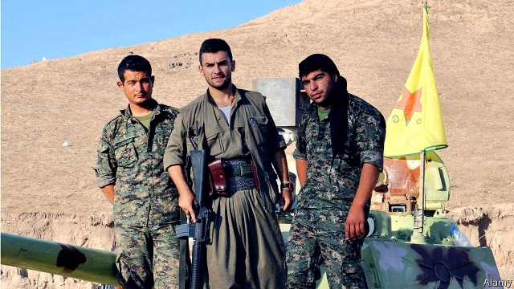
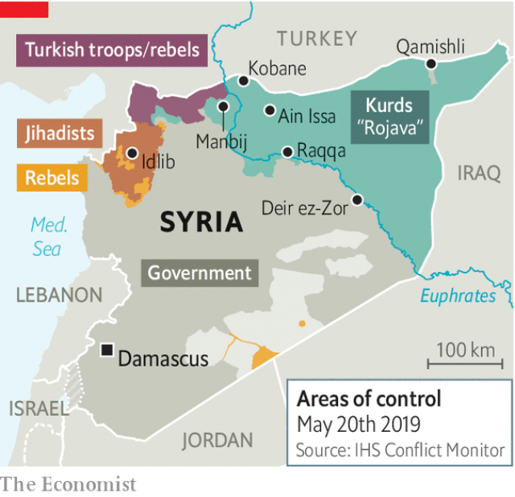

###### Who will rule the north?

# The Kurds are creating a state of their own in northern Syria 

##### But the would-be nation of Rojava faces many enemies 

 

> May 23rd 2019 

THE KURDS have their own name for northern Syria: Rojava, which means where the sun sets. For decades that seemed fitting. Arab nationalists pushed them off their land and suppressed their language. Then came the jihadists of Islamic State (IS). War with them levelled cities. But with IS defeated those cities are rising again. One of the largest, Kobane, is bigger and taller than before. It sports a towering war memorial and is hosting its second art fair. “We’ve had enough of the pain,” says Brivan Hammoush, a landscape artist. 

Over the course of Syria’s multi-sided civil war, which began in 2011, the Kurds captured a third of the country (see map). In 2016 they declared their own autonomous region in Rojava, which contains most of Syria’s oilfields, its highest dams and its bread basket. Trade routes as old as the Silk Road run through the territory. Such valuable land is a boon to Rojava’s Kurdish-led administration. But it also attracts enemies. As they rebuild their region, the Kurds face threats, at home and from abroad. And many fear their strongest ally, America, will abandon them at the drop of a tweet. 

 

For now things are looking up. Fighting, sanctions and a lack of funds stymie reconstruction in most of Syria, but juggernauts loaded with diggers and cement queue for miles at Rojava’s border with Iraq. Convoys of petrol tankers ply the highways to Damascus. Western-funded aid agencies repair infrastructure, hospitals and schools in the region. The parliament, formed in September, still meets in a high school. But that also means that politicians are accessible. Your correspondent got a meeting with the two heads of government simply by knocking on their office door. 

On social issues Rojava’s leaders are rather progressive compared with those in much of the Middle East. Polygamy is outlawed. A man and a woman co-lead every office in government. A woman runs Raqqa, which IS once declared its capital. Few, if any, senior female officials wear a veil. The Kurds, though Muslim, are distinctly relaxed about it—they openly drink and smoke during the Ramadan fast. Faith is considered a private matter. To the delight of America’s evangelicals, a new church has opened in Kobane for the growing number of Christian converts. 

But Rojava’s new rulers owe their power to gun-toting revolutionary committees, not the ballot box. They emerged from the Kurdish Workers’ Party (PKK), which is based in northern Iraq and considered a terrorist group by many countries. Rojava has the trappings of a repressive one-party state. Protests are censured and opposition parties harassed. Officials say they are better than the regime of Bashar al-Assad, Syria’s dictator, or the rebels who fought him—a miserably low bar. “It’s just another totalitarian regime,” says a Kurdish journalist who fled abroad. 

Rojava’s demography makes ruling hard. There are thought to be between 500,000 and 1m Kurds in the region, compared with at least 1.5m Arabs. So Kurdish officials have tried to broaden their appeal. In September they replaced the name Rojava with the more inclusive, but wordy, “autonomous administration of north and east Syria” (NES). They also moved the administrative capital from Qamishli, a Kurdish city, to Ain Issa, a drab Arab town. Arabs have been appointed to many senior positions in government. “We’re seeking a geographic federation, not an ethnic federation,” says Polat Can, a commander in the Syrian Democratic Forces (SDF), the local army. Half of Mr Can’s soldiers are Arab. 

Still, the Arabs in Rojava feel increasingly alienated. Kurdish forces known as the People’s Protection Units, or YPG, lead the SDF. “Kurd or Arab?” ask guards of visitors at a military base. Arab sheikhs claim the Kurds have seized their land and are imposing their own customs. “They want us to bring our wives to tribal gatherings,” fumes one who considers such mingling of the sexes improper. Some speak of the Kurdish “occupation”. Protesters near Deir al-Zour’s oil wells have blocked access with burning tyres. “The Kurds”, they chant, “have stolen our oil.” 

Turkey in the north and Mr Assad’s government in the south prey on the differences. They have each held tribal gatherings in an attempt to win over the Arabs of Rojava. Turkey wants to carve out a buffer zone on its southern border, which might contain Kurdish cities. Rojava, it says, offers the PKK a rear base to continue its 40-year war against the Turkish government. West of Manbij, Turkish tanks train their turrets on Kurdish positions. The Kurds have no air force and little heavy weaponry. They are no match for the Turkish army. 

Nor can they challenge the army of Mr Assad, who says he wants to reclaim all of Syria. He is currently focused on Idlib, the last rebel stronghold. At the height of the war Mr Assad pulled his troops from the north to defend Damascus; the Kurds did not fight them. But the regime still holds some sway in Rojava. It runs the mobile-phone network and oversees many courts and schools. In the region’s only civilian airport, controlled by the regime, portraits of the dictator are ubiquitous and travellers who work for the NES risk arrest. A proposal by Russia, which backs Mr Assad, would have the Syrian army return to Rojava and turn Kurdish forces into local police. 

Meanwhile, the threat of IS lingers. The jihadists set up impromptu checkpoints on highways. A ban on motorbikes in war-shattered Raqqa has only partially succeeded in curbing attacks on infrastructure. Officials describe camps crammed with displaced and disgruntled Arabs as potential incubators of jihadism. Many women in the region, still fearful of IS, continue to wear niqabs. 

The Kurds are reassured by the presence of America. Some 2,000 of its troops are spread across the territory. Its warplanes buzz overhead and its forces deter the Turks. President Donald Trump appears to have backtracked from his tweet in December ordering a pullout from Syria. But uncertainty over America’s intentions complicates life for the Kurds. The local administration has found it harder to recruit and retain Arabs. Even the Kurds are hedging their bets. Rojava’s leaders recently went to Damascus for talks with Mr Assad’s intelligence chief. The founder of the PKK, Abdullah Ocalan, has urged them to “take account of Turkish sensitivities”. 

Kurdish leaders in Syria aspire to be America’s permanent ally, like the Kurds next door in Iraq. But Rojava, unlike the Kurdish autonomous region in Iraq, lacks UN recognition. “You don’t know how long it’s going to last,” says a teacher in Qamishli. “You feel it’s built on sand.” 

