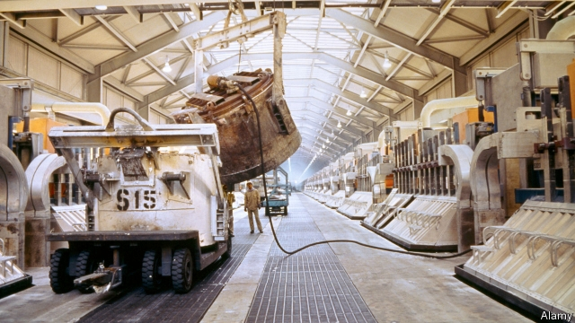

###### A Gulf case study

# The lessons of Bahrain, a state that tried to wean itself off oil 

##### Many reforms other Gulf states are mulling were tried first in Bahrain 

 

> May 23rd 2019 

THE ORANGE helmets are a burst of colour in the desert, where drab aluminium potlines stretch for almost a mile across the sands. Workers at Alba, Bahrain’s aluminium smelter, are finishing a $3bn expansion. A country of just 1.5m people will soon produce 1.5m tonnes of aluminium a year, more than 2% of global output. Alba will add another 500 to its staff of 3,200. Almost 90% are citizens, meaning the firm will employ 2% of the national workforce. The aluminium industry will account for 15% of GDP, says Tim Murray, the CEO. “People don’t realise it’s that big.” 

All six members of the Gulf Co-operation Council (GCC) have lofty plans to wean their economies off oil. Bahrain is in many ways a forerunner of this effort. It built a financial sector back in the 1980s. More recently it passed a bankruptcy law, allowed 100% foreign ownership of firms and introduced flexible visas that allow some migrants to freelance. “Everything those guys are doing now, we tried already,” says Ausamah al-Absi, who heads the labour regulator. The results have been mixed—with lessons for Bahrain’s neighbours. 

Compared with other Gulf states, the job market in Bahrain looks vibrant. Two-thirds of citizens work in the private sector, compared with 55% in Saudi Arabia and 10% in Kuwait. Unemployment is 4%. In Saudi Arabia, where joblessness is three times higher, the government is raising work-permit fees to drive out migrants. In Bahrain such fees are low. Most migrants toil in low-wage jobs that locals spurn. Bahrainis do not want to lay bricks. 

Bahrain ploughs 80% of the take from work-permit fees back into the domestic economy through Tamkeen, which offers subsidised loans and grants to help businesses buy equipment and training. Though it has a few national champions, Bahrain has tried harder than other GCC states to cultivate small firms. Businessmen praise its simpler bureaucracy. A restaurateur says he needs nine licences to operate a fast-food joint in his native Kuwait. Bahrain consolidated its permits into one. 

Yet the fiscal picture is bleak. Oil provides about 70% of government revenue—and there is not enough of it. Last year’s deficit was a yawning 12% of GDP. Wealthier Gulf countries had to offer a $10bn bail-out. Bahrain trimmed subsidies for power and water consumption in 2016. But more reforms planned for this year were postponed for fear they would trigger unrest. 

Cutting subsidies will only get Bahrain so far. But even though Bahrain introduced a 5% value-added tax in January, a corporate or income tax seems politically impossible. Without new taxes the Gulf states will struggle to balance their budgets. 

State jobs still pay 70% more than those in the private sector, a figure that has grown over the past decade as the monarchy doled out increases and stipends to buy political calm. The gap fuels unrest in a country where the Shia majority is often frozen out of state jobs. Flexible work permits might slowly drive up wages in migrant-heavy sectors—but unhappy employers are trying to kill the programme. 

Oil still accounts for more than half of exports. Sameer Abdulla Nass, the head of the chamber of commerce, complains that 100% foreign ownership has brought only “retail and restaurants”, not industry. Bankers talk giddily about fintech as a growth industry. In a venture-capital firm overlooking the Gulf, though, investors complain that universities do not produce enough entrepreneurs. Nor do they provide the sort of training that might help graduates land well-paid technical jobs. 

Bahrain has done well at convincing its citizens to try the private sector instead of counting on cushy state gigs. But it has not upended the social contract, whereby oil pays the bills and foreigners do the manual labour. Some day, it will have to, says Mr Nass. “We have no choice.” 

