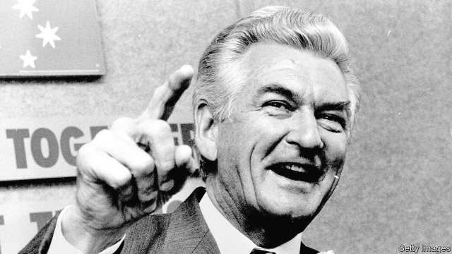

###### Advance Australia Fair

# Obituary: Bob Hawke died on May 16th 

##### Australia’s longest-serving Labor prime minister, who opened his country to the world, was 89 

 

> May 23rd 2019 

WHATEVER YOU thought about Bob Hawke, and he gave people plenty to think about, you couldn’t deny that he brimmed with self-confidence. At the age of 15 he was telling friends he was going to be prime minister. Even at three, visiting a sick old lady with his minister father, he climbed on a chair and preached a sermon to her, which mightily raised her spirits. 

He did the same for the whole of Australia in the nearly nine years he was prime minister: raised its spirits. He opened up the economy, tore down tariff walls, floated the currency, demolished inflation, privatised state-owned companies, revived universal health care and set the path for decades of uninterrupted growth. Thanks to him, Australia was hardly hurt by either the Asian financial crisis of 1997 or the Great Recession. Other people helped along the way, especially his treasurer Paul Keating, with whom he blew hot and cold (and the feeling was mutual). But the engine room driving change was his own personal office. He also opened up Australia to the world, pivoting towards the countries of Asia as neighbours and trading partners and founding APEC, which grew to 21 members. Cocky insouciance was his middle name as he strode across the global stage, forcing the end of apartheid in South Africa, leading the campaign to ban mining in Antarctica, encouraging China to engage. Golda Meir consulted him on how to sort out the Middle East, and Mikhail Gorbachev asked him how he should restructure the Soviet economy. He was glad to tell them. He also, incidentally, taught Shane Warne how to bowl. 

Britain’s Gordon Brown once asked him the secret of his success. That he didn’t reveal, but it was simplicity itself. He loved Australians and they loved him. It fascinated him that waves of immigrants had melded into a warm, generous race whose chief principles were mateship and “a fair go”, and where the worst sin was to be up yourself. He was never happier than when he was out among them in factories or pubs, on ranches or on the beach. Wherever he went he walked in a tropical breeze of adulation, but the reason women wept and young folk wanted to embrace him was because he was one of them. For all his education and his Rhodes scholarship to Oxford, he wasn’t some milk-pale type from the groves of academe. He was Hawkie, a true dinky-di Australian. 

Added to that he was a larrikin, a rowdy fun-loving rogue. Many voters loved that. He held the world record, 11 seconds, for drinking a yard of ale, and his party trick was to down a pint in one, although he did give up the grog from time to time. Sport obsessed him, especially cricket, for which there were never enough hours in the day. He shed tears, lost his temper and spoke his mind: one of his rivals was “three sausages short of a barbecue”, another had “kangaroos in the top paddock”. When Australia won the America’s Cup in 1983, when he was fresh as prime minister, he endeared himself indelibly to the country by appearing at the Royal Perth Yacht Club, in a jacket stamped all over with “Australia”, crying: “Any boss who sacks anyone for not turning up today is a bum!” and throwing back his silver-cockatoo head to roar with laughter. 

He also understood that Australians had no time for people squatting under the banyan tree wrapped in the warm euphoria of their principles, such as the Keynesian ideas so much loved by the Labor Party when he took it over. Such people were a million miles from power and from making a better world. When he came in, at a time of industrial strife and with the economy a shambles, his slogan was simply “Bringing Australia Together”, and his first act was to unite trade-union bosses and business leaders in a national summit to forge an accord on wages and social welfare. Mateship in action. This was the fruit of years he had spent first studying the history of Australian wage-fixing, then fighting for and leading the Australian Council of Trade Unions, infuriating whole benches of wage-arbitration judges to get more money into workers’ pockets. That was when the people really started to love him, and in high office, which he calmly knew he was bound for even when he started, he didn’t disappoint them. Once the economy took off, there was more cash in everyone’s wallets. 

There were hiccups, of course, to do with women, who threw themselves at him although Hazel was waiting not-so-patiently at home, and with his children, for whom he couldn’t spare enough time in his 16-to-20-hour working days. Because he felt low he nearly threw away the second election in 1984, and in 1987 a sharp downturn forced him to cut spending in almost every department. Cabinet could be a bloody circus, steaming with egos, especially when he and Keating fell out over Keating’s pet consumption tax. The Labor Party was a difficult horse to ride. He couldn’t just jab his spurs into its flanks, but had to coax it along, firmly pointing in a centre-left free-market direction. With Medicare and social security there was no problem; liberalising the economy was harder graft, but business and the banks lined up eagerly behind him. Once tariffs and exchange controls were swept away, Australia became a proper citizen of the world and he, as first citizen, had that world at his feet. Not that he exalted himself. At The Lodge, his official residence, he opened his own car door and sat beside the driver, just two government workers together, Bede and Bob. 

Leaving was difficult. He made a fair fist of life afterwards, going into business consultancy, becoming a multimillionaire and marrying the beautiful mistress who was also his biographer. But he wasn’t leading the country any more. He had told Keating, who badly wanted his job, and whom he never knew whether to tell off or pat on the head, that he would leave a year after he won the 1990 election. When the time came he changed his mind, so Keating brought him down as party leader. He was never voted out by the Australian people. 

Many assumed he changed his mind because he loved being in power. Not so, he insisted. It was because Keating had described Australia to him as the arse-end of the world. He couldn’t put the country into the hands of someone who felt that way for a second. It rightly belonged to a bloke who couldn’t love it enough. 

