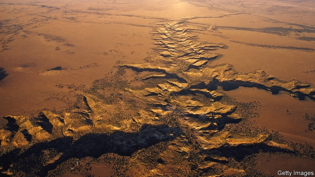

###### Human evolution

# Did cooking in hot springs make humans brainy? 

##### Geothermal springs could help explain how early humans evolved such big brains 

 

> May 25th 2019 

HOW AND WHY, roughly 2m years ago, early human ancestors evolved large brains and began fashioning relatively advanced stone tools, is one of the great mysteries of evolution. Some researchers argue these changes were brought about by the invention of cooking. They point out that our bite weakened around the same time as our larger brains evolved, and that it takes less energy to extract nutrients from cooked food. As a result, once they had mastered the art, early chefs could pare back their digestive systems and invest the resulting energy savings in building larger brains capable of complex thought. There is, however, a problem with the cooking hypothesis. Most archaeologists believe the evidence of controlled fire stretches back no more than 790,000 years. 

Roger Summons of the Massachusetts Institute of Technology has a solution. Together with his team of geomicrobiologists, he analysed 1.7m-year-old sandstones that formed in an ancient river at Olduvai Gorge in Tanzania. The region is famous for the large number of human fossils that have been discovered there, alongside an impressive assembly of stone tools. The sandstones themselves have previously yielded some of the world’s earliest sophisticated Acheulean hand axes: large tear-drop-shaped stone tools that are associated with Homo erectus. Creating an Acheulean axe by repeatedly knocking flakes off of a raw stone in order to create two sharp cutting edges requires a significant amount of planning. Their appearance is therefore thought to mark an important moment in cognitive evolution. 

Trapped inside the Olduvai sandstones, the researchers found distinctive but unusual biological molecules that are often interpreted as biomarkers for heat-tolerant bacteria. Some of these thrive in water between 85 and 95°C. The molecules’ presence suggests that an ancient river within the gorge was once fed by one or more hot springs, fitting nicely with its location within the geologically active East African Rift. The findings are published in a paper posted to the online bioRxiv preprint server. 

Dr Summons and his colleagues say the hot springs would have provided a convenient “pre-fire” means of cooking food. In Rotorua in New Zealand, the Maori have traditionally cooked food in geothermal springs (see picture), either by lowering it into the boiling water or by digging a hole in the hot earth. Similar methods exist in Japan and Iceland, so it is plausible, if difficult to prove, that early humans might have used hot springs to simmer meat and roots. 

Richard Wrangham, a primatologist at Harvard University who devised the cooking hypothesis, is intrigued by the idea. Nonetheless, fire would have offered a distinct advantage to humans, once they had mastered the art of controlling it since, unlike a hot spring, it is a portable resource. 

