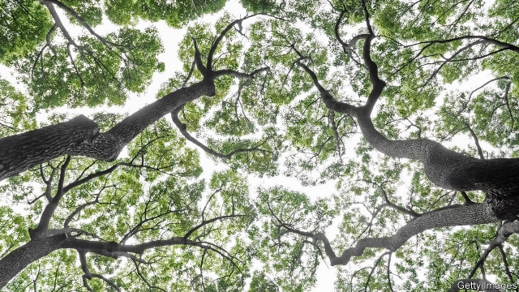

###### Gold prospecting

# If you’re looking for gold, look in trees 

##### Prospecting for gold by looking for it in leaves has finally proved itself commercially in Australia 

 

> May 23rd 2019 

IN THE GOOD old days, gold miners could seek out visible specks of bling at the surface in order to find deeper, richer veins. These days, prospectors must examine samples of dirt for more minute traces suggestive of a hidden seam below. Analysing water from boreholes can also yield clues, but boreholes are scarce and new ones are costly and time-consuming to drill. 

Trees offer an alternative that is finally bearing fruit in Australia. The idea has been around since the 1940s but, until now, never practical. Some trees have roots that reach deep underground, drawing up water and, along with it, tiny quantities of minerals that end up distributed throughout the tree. In this way, even lofty leaves bear traces of what lies far beneath. The quantities are minuscule. In areas where there is no gold, leaves may have a background level of 0.15 parts per billion (ppb) of gold; on gold-rich sites that can rise to 4ppb. 

In theory, “biogeochemical” prospecting is a simple matter of collecting leaves from across a site and mapping mineral concentrations to reveal subterranean treasures. It is best applied to dry regions where plants seek out water with deep roots. Some even break down soil to extract mineral nutrients, thus increasing the amount of telltale minerals in their leaves. Gold is the obvious element to look for, but checking for elements that are associated with gold deposits, such as antimony and bismuth, can also be sensible. 

Sampling is harder than it sounds, though. Different trees accumulate gold in different ways, so exactly the same species must be sampled across each site for valid comparisons. Acacia is one of the trees of choice, but Australia has about 1,000 Acacia species, many of which look similar. To confuse matters further, the degree to which elements accumulate in leaves varies with the seasons. 

In proof-of-principle studies over the last few years, Nathan Reid and his team at CSIRO, Australia’s national science agency, have shown that biogeochemical prospecting closely tallies with the surface and groundwater analyses. Inspired by these results, Marmota, an exploration firm, put the method to the test at its Aurora Tank site, 50km from the highly-productive Challenger mine in South Australia. 

Leaves collected immediately around a known deposit that lies beneath ten metres of rock contained traces of gold, validating the approach. Further samples were taken 40 metres apart around known deposits, and at wider spaces farther out. This turned up several anomalies, where gold seemed to be present but other tests had shown nothing. “The usual calcrete [surface sample] testing was saying ‘Don’t drill here’,” says Colin Rose, Marmota’s executive chairman, “but the tree sampling was saying ‘Drill here’.” 

Then came the pay-off. Drilling revealed a five-metre-thick vein with 27g of gold per tonne, more than 30 metres below the surface. A metre-thick inner layer held an impressive 105g per tonne. Five grams per tonne is considered high-grade. 

Marmota is keen to explore further. In the outer sampling zone, the company found four anomalies in an area where only one potential seam had been identified. They have yet to be drilled but plans are afoot. Prospecting with trees is starting to look less like a scientific curiosity and more like a golden opportunity. 

