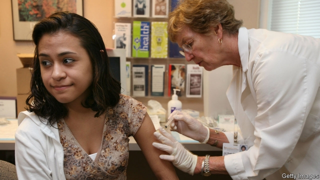
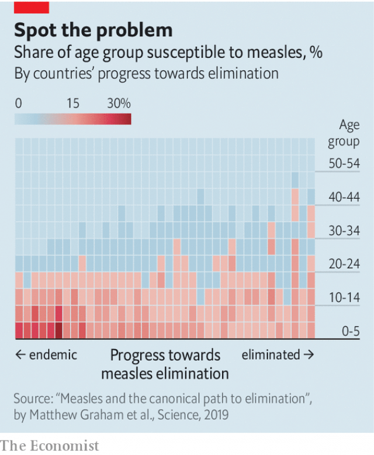

###### Never too old

# Measles is often spread by adults 

##### Vaccinating children only is no longer enough 

 

> May 25th 2019 

BEFORE A vaccine became widely available in the 1960s, measles was an inevitable childhood disease. The highly contagious virus came round like clockwork. Infection conferred lifelong immunity—but at the cost, each year, of about 500 deaths and 50,000 hospitalisations in America alone. In the decades that followed, routine childhood vaccination in Western countries made measles increasingly rare. In recent years, however, outbreaks have become more frequent, with no signs of abating. 

The resurgence has been blamed on parents refusing to vaccinate their children or delaying jabs. But what has also become clear is that vaccinating only children is no longer sufficient. In 2013-17 between 33% and 63% of the annual measles cases in Europe were among people older than 14 years. In 2017 the median age for measles cases in Italy, which has frequent outbreaks, was 27 years. 

A paper published in Science this month shows how this pattern evolved. Using historical data and statistical modelling, the paper’s authors find that as a country gets closer to fully eliminating measles, the age range of those who are not immune to the disease widens (see chart). Catch-up jabs, in other words, need to cover older and older groups of people. 

The main reason for this is the accumulation over time of people who missed one or both of the two measles jabs that are routine for children. At the same time, falling birth rates have led to fewer and fewer babies, who are susceptible to measles until they are old enough to be vaccinated. As a result, the average age of susceptible people has crept up. 

 

For a variety of reasons, some cohorts in a given country may be particularly prone to a measles outbreak when they reach a certain age. One example in Britain is people born in the few years after 1998, when a fraudulent study linking a measles vaccine with autism scared many parents away from vaccinating their children. Now in their teenage years, these children are travelling abroad, including to countries with ongoing measles outbreaks. High-risk groups like these may become evident only when an outbreak sweeps through the population and the ages of those infected are tallied by health officials. 

A growing number of studies in recent years have tried to get ahead of the curve by predicting which age groups have the highest risk of an outbreak. They typically draw on data from health records and various surveys asking people about their vaccinations and socialising habits (to gauge how easily they can catch and spread the virus). 

Serological surveys, which measure antibodies in blood, are a particularly useful tool, but are not always available. Where they are, they have identified groups of people whose susceptibility to the virus is greater than those targeted by public health services for catch-up jabs—usually schoolchildren and university students, who are easier to cover with a mass vaccination campaign. In this way, a study in Belgium found that in 2013 those aged 20 to 30 were particularly susceptible. At the time, the government was prioritising jabs for 10-to 13-year-olds. 

Why such studies matter is illustrated by outbreaks like one that hit a childcare centre near Antwerp, in Belgium, in 2014. An adult employee at the centre caught measles during a trip to the Dutch “bible belt”, an area with a high concentration of religious groups opposed to vaccines. Upon returning to work, the employee started an outbreak that infected 28 infants; 12 were hospitalised. 

There is another developing wrinkle in measles vaccination policy. For several months after birth, babies are protected by maternal antibodies passed on while they are still in the womb. But inherited antibodies wane two to three months earlier if the mother was vaccinated than they do if she became immune after being infected by the virus. 

One seemingly obvious solution would be to vaccinate babies earlier. The catch, however, is that the vaccine is not very effective in children younger than a year, so they would still need to have two boosters later on in life. At a time when many parents fret over giving their children too many vaccines, adding a jab that is only partially effective may be a tough sell. 

