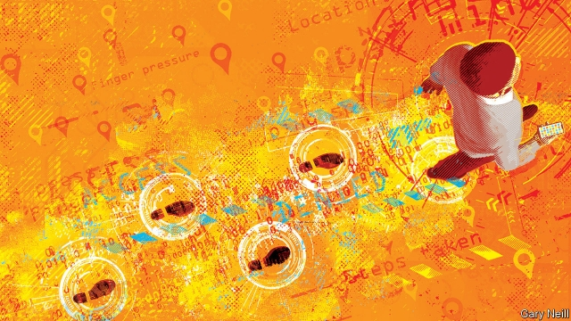

###### Behavioural biometrics

# Online identification is getting more and more intrusive 

##### Phones can now tell who is carrying them from their users’ gaits 

 

> May 23rd 2019 

MOST ONLINE fraud involves identity theft, which is why businesses that operate on the web have a keen interest in distinguishing impersonators from genuine customers. Passwords help. But many can be guessed or are jotted down imprudently. Newer phones, tablets, laptops and desktop computers often have beefed-up security with fingerprint and facial recognition. But these can be spoofed. To overcome these shortcomings, the next level of security is likely to identify people using things which are harder to copy, such as the way they walk. 

Many online security services already use a system called device fingerprinting. This employs software to note things like the model type of a gadget employed by a particular user; its hardware configuration; its operating system; the apps which have been downloaded onto it; and other features, including sometimes the Wi-Fi networks it regularly connects through and devices like headsets it plugs into. 

The results are sufficient to build a profile of both the device and its user’s habits. If something unusual is then spotted—say, a bank detects access to an account from a phone with a different profile from that which a customer usually uses—it can take appropriate measures. For example, additional security questions can be posed. 

LexisNexis Risk Solutions, an American analytics firm, has catalogued more than 4bn phones, tablets and other computers in this way for banks and other clients. Roughly 7% of them have been used for shenanigans of some sort. But device fingerprinting is becoming less useful. Apple, Google and other makers of equipment and operating systems have been steadily restricting the range of attributes that can be observed remotely. The reason for doing this is to limit the amount of personal information that could fall into unauthorised hands. But such restrictions also make it harder to distinguish illegitimate from legitimate users. 

That is why a new approach, behavioural biometrics, is gaining ground. It relies on the wealth of measurements made by today’s devices. These include data from accelerometers and gyroscopic sensors that reveal how people hold their phones when using them, how they carry them and even the way they walk. Touchscreens, keyboards and mice can be monitored to show the distinctive ways in which someone’s fingers and hands move. Sensors can detect whether a phone has been set down on a hard surface such as a table or dropped lightly on a soft one such as a bed. If the hour is appropriate, this action could be used to assume when a user has retired for the night. These traits can then be used to determine whether someone attempting to make a transaction is likely to be the device’s habitual user. 

Behavioural biometrics make it possible to identify an individual’s “unique motion fingerprint”, says John Whaley, head of UnifyID, a firm in Silicon Valley that is involved in the field. With the right software, data from a phone’s sensors can reveal details as personal as which part of someone’s foot strikes the pavement first, and how hard; the length of a walker’s stride; the number of strides per minute; and the swing and spring in the walker’s hips and step. It can also work out whether the phone in question is in a handbag, a pocket or held in a hand. 

Using these variables, UnifyID sorts gaits into about 50,000 distinct types. When coupled with information about a user’s finger pressure and speed on the touchscreen, as well as a device’s regular places of use—as revealed by its GPS unit—that user’s identity can be pretty well determined, Mr Whaley claims. UnifyID began offering behavioural biometrics to its clients (which include retail banks, online retailers, delivery companies and ride-sharing firms) in 2017. In time, advertisers will pay for the scoop on individuals’ lifestyle-revealing movements, reckons Mr Whaley, though his firm has no plans yet to expand in that direction. 

Behavioural biometrics can, moreover, go beyond verifying a user’s identity. It can also detect circumstances in which it is likely that a fraud is being committed. On a device with a keyboard, for instance, a warning sign is when the typing takes on a staccato style, with a longer-than-usual finger “flight time” between keystrokes. This, according to Aleksander Kijek, head of product at Nethone, a firm in Warsaw that works out behavioural biometrics for companies that sell things online, is an indication that the device has been hijacked and is under the remote control of a computer program rather than a human typist. 

On a device with a touchscreen rather than a keyboard, however, the reverse is true. Most people type with their thumbs on touchscreens, so flight times between keystrokes are longer. In this case, therefore, it is short flight times which are a signal of something suspicious going on—for example, that a touchscreen device is actually being operated remotely, using the keyboard of a laptop. 

Used wisely, behavioural biometrics could be a boon. As Neil Costigan, the boss of BehavioSec, a behavioural-biometrics firm in San Francisco, observes, the software can toil quietly in the background, continuously authenticating account-holders without badgering them for additional passwords, their mother’s maiden name “and all that nonsense”. UnifyID and an unnamed car company are even developing a system that unlocks the doors of a vehicle once the gait of the driver, as measured by his phone, is recognised. 

Used unwisely, however, the system could become yet another electronic spy on people’s privacy, permitting complete strangers to monitor your every action, from the moment you reach for your phone in the morning, to when you fling it on the floor at night. 

