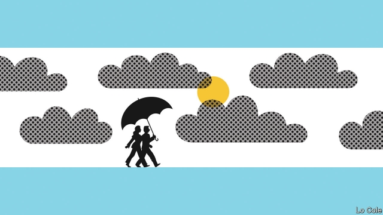

###### Bello

# Argentina’s former president wants to be Veep 

##### Is Cristina Fernandez de Kirchner playing a game? 

 

> May 23rd 2019 

HÉCTOR CáMPORA, a dentist and second-rank politician, won an election in Argentina in 1973 with the slogan “Cámpora to the presidency, Perón to power”. Having served his purpose as a placeholder, Cámpora resigned after 49 days. Juan Perón returned from long exile and went on to win an election himself. This episode is etched on Argentine memories. It explains why some scoffed when on May 18th Cristina Fernández de Kirchner, a populist former president, made the surprise announcement that she was running in October’s election—but for vice-president on a slate headed, at her invitation, by Alberto Fernández (no relation), who was briefly her cabinet chief. 

So is this a ruse, or an act of brutal political realism? Ms Fernández divides Argentines. When in 2007 she succeeded her (late) husband, Néstor Kirchner, as president, Argentina was riding the commodity boom. She slammed taxes on farmers and spent the proceeds on padding the public sector, on welfare and on subsidies for fuel and transport. When the economy overheated, her government imposed price and exchange controls and fiddled the inflation numbers. When money got tight it raided the central bank and pension funds. Through it all, insiders made corrupt fortunes. Ms Fernández herself went on trial this week in the first of several corruption cases (she denies wrongdoing). Around a third of Argentines (mainly the poorer ones) love her; many of the rest abhor her. 

That she had a chance of regaining power owes everything to the travails of her successor, Mauricio Macri, a liberal businessman turned politician. He set out to restore reality to the make-believe mess left by Ms Fernández. To ease the pain of adjustment he borrowed, until investors turned tail. In the past year, the peso has lost half its value and inflation has surged to over 50%. Mr Macri has secured a $57bn IMF bail-out. Strict monetary and fiscal policy is starting to bring stability, but at the cost of a deep recession. Real incomes are down by about 10%. 

With Mr Macri wounded, a national poll last month put Ms Fernández clearly ahead of the president for the first time. So why has she turned to her namesake? He is a more conciliatory figure, with friends across the broad church that is Peronism. He had turned into a withering critic of his former boss. Of her second term, he said in 2015: “It’s extraordinarily difficult to find anything good.” He is better placed to win over Peronist provincial governors, who are a pragmatic lot and have little love for her, and to squeeze the vote for a third way, represented by Roberto Lavagna, Mr Kirchner’s moderate first finance minister, who declared his candidacy this week. 

Second, although Ms Fernández had a chance of winning, “governing would have been almost impossible” for her, says Sergio Berensztein, a political consultant. Conditions are now very different. The IMF agreement, huge debts and high inflation all mean that Argentina needs fiscal sobriety, private investment and export-led growth, as Mr Fernández recognised this week. Third, Cristina’s choice may have an element of self-defence. If she is convicted, Mr Fernández could pardon her; a president may not be able to pardon herself. 

The question is whether voters will find Cristina’s pragmatic turn and her voluntary demotion credible. Or will they see Mr Fernández as another Cámpora, a puppet rather than the boss? Whereas in Brazil three vice-presidents have taken over in the past 35 years, in Argentina two vice-presidents have resigned over the same period, points out Andrés Malamud, an Argentine political scientist at the University of Lisbon. Presidents command great power and resources. A first test of which Fernández would be in charge will come in drawing up their slate for congress. 

Mr Macri’s team insist that Mr Fernández, who is an experienced backroom operator but not a crowd-puller, is a worse candidate than she is. Nevertheless, the race may have become more difficult for the president. His allies may press him to try to incorporate Mr Lavagna’s camp. 

There is a silver lining for Argentina in Ms Fernández’s decision. Mr Macri has been trying to polarise the campaign as a contest between him and her. That is economically risky: when she nosed ahead, the peso trembled (it rallied this week). The opposition is now trying to woo voters in the centre. And as Mr Berensztein points out, almost everyone is now talking about the need to seek broad national agreements. Out of crises come opportunities. 

