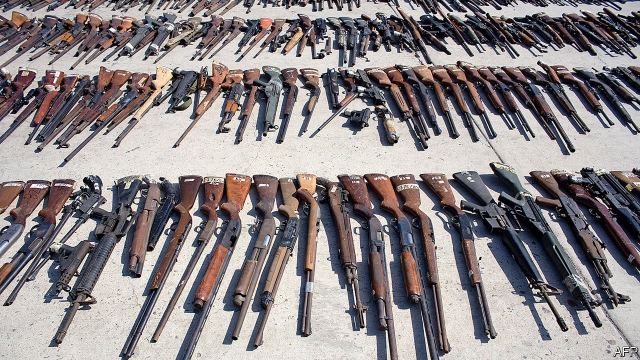
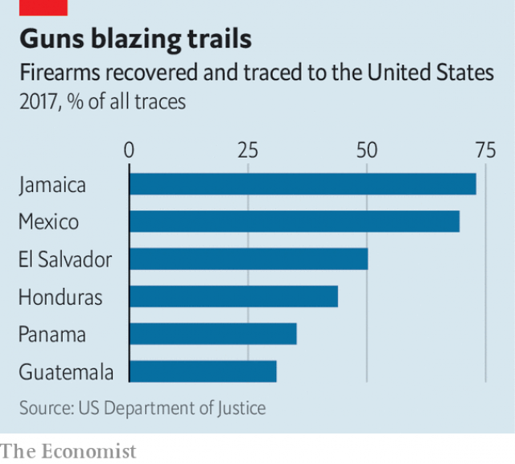

###### Law and ordnance

# Guns from the United States are flooding Latin America 

##### A US-made gun is more likely to murder a Mexican than an American 

 

> May 23rd 2019 

LIKE A CRIMINAL and his fingerprints, every gun leaves its mark on the ammunition it uses. Such traces are what Sergio Sandoval de la Peña pores over daily in Mexico City’s ballistics lab. A series of dark-green circles, like the sub-woofer of a speaker, appear on his computer screen. It is a digitised three-dimensional model of a cartridge, found at the scene of a robbery this year and placed under a microscope. Checking the marks against hundreds of thousands of potential matches, Mr de la Peña concludes that the gun that ejected it was also used in a murder last year. 

The ballistics technology employed to work such wonders comes courtesy of the United States. Alas, so does the gun, according to Mr de la Peña’s database. A study of weapons found at crime scenes suggests that 70% of gun crimes in Mexico involve American-bought weapons. The share of homicides in Mexico involving a firearm grew from 16% in 1997 to 66% in 2017. That suggests around half of Mexico’s 33,000 murder victims last year were killed by a gun manufactured in the United States, which had 14,542 gun homicides in 2017. An American-made gun is more likely to be used in a murder in Mexico than at home. 

Mexico is far from alone. Across Latin America, the share of murders involving guns is creeping upwards. Many countries already beset by organised crime and weak states have their troubles compounded by their proximity to America, the country with the rich world’s most permissive gun laws. Changes signed by President Donald Trump may only worsen the situation. 

Most guns enter Mexico after being legally bought in the United States. Criminal groups typically use associates to buy them, smuggling guns in the opposite direction to drugs. Beyond Mexico, American guns often arrive through ports from Florida, hidden among other imported goods. In Honduras, where half of all unregistered weapons come from America, smugglers have been known to wrap guns in foil and submerge them in paint to avoid detection from X-ray machines. Less creative, bigger groups simply pay off customs officers. 

 

Does the availability of American guns boost murder rates? The expiration in 2004 of an assault-weapons ban in the United States provided a real-world experiment. A study found that in Mexican municipalities bordering Arizona, New Mexico and Texas, where the guns were put back on sale, the murder rate shot up soon after. Murder rates adjacent to California, which maintained a ban, stayed flat. 

But even in the unlikely event that the United States were to repeal the second amendment, Latin America’s gun problem would not abate. Many national armies and police forces have a habit of losing their weapons. In Guerrero, a state in Mexico, one weapon in five belonging to the state police ends up “lost or stolen”. Central American police forces are notorious for selling seized weapons they should destroy, says Mark Ungar of Brooklyn College. 

In Honduras the profits from gun sales to private individuals, over which the army has a monopoly, are the second-biggest contributor to soldiers’ pensions. Many American weapons used in crime in Brazil are trafficked through Paraguay, which has loose gun controls. Between 2013 and mid-2018 Paraguayan companies legally imported 648,000 guns and 331m rounds of ammunition, a large share from the United States. Last year America briefly banned commercial arms sales to Paraguay to reduce the smuggling, prompting the country to impose its own controls. 

Jair Bolsonaro, Brazil’s president, has signed two decrees this year making it easier for Brazilians to own and carry guns. Shares of Brazil’s large gun firms have soared. Mr Bolsonaro has said he will legalise imports of American guns too. Legal weapons can become illegal ones with ease through theft or corruption, observes An Vranckx of Catalystas, a consultancy. Brazil’s murder rate dipped after 2003 when new rules made it harder to buy a gun. 

One place American guns are turning up less is Venezuela, largely because there is a ban on their export there. A ready supply of weapons from elsewhere has helped push the country’s murder rate to the world’s highest. Lately the economic crisis may have stemmed the flow: the import of weapons, like all other imports, has probably dropped. A decline in productivity at the state-owned factories which make bullets may explain why the murder rate has slipped back of late. 

What can be done to stop the flow of weapons? One idea floated in Mexico was to ban American steel firms and other businesses that supply gun manufacturers from Mexican government contracts, and to make workers from any firms that sell guns apply for visas if they want to visit Mexico. But that idea lost steam when Mr Trump became president. Indeed since his election things have got worse. In January Mr Trump said responsibility for approving arms exports would shift from the State Department to the Department of Commerce, which applies looser rules. 

So Latin American countries will have to do more themselves. National, interlinked databases of registered weapons can help police keep hold of their guns. Purging the dirtiest cops, as Colombia has done, helps to keep weapons out of criminal hands. Rather than waiting for the United States, Latin America will have to place its own institutions under the microscope. 

