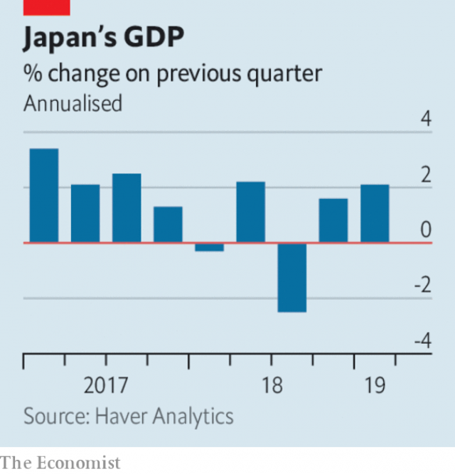

###### Brexit chaos

# Business this week 

> May 25th 2019 

America’s Commerce Department issued three-month licences to allow American firms to keep doing limited business with Huawei, which has been placed on a security blacklist by the Trump administration. The ripples of the ban are spreading. Google is suspending the provision of Android software and technical services to Huawei, which runs its mobile phones on the operating system. Arm, a chip designer, may stop licensing its technology to Huawei. And in Japan and Britain some mobile-service providers said they would halt sales of new Huawei phones. See article. 

Qualcomm’s share price plunged by 11% after a judge in California ruled that it had illegally crushed competition in the market for phone chips by charging “unreasonably high” royalty rates. The decision is a blow for the chip firm, coming soon after it had reached a settlement with Apple. The judge ordered the company to change its practices and subjected it to seven years of monitoring. Championed by Donald Trump, Qualcomm is the leading provider of 5G chips in America. 

Ajit Pai, the chairman of America’s Federal Communications Commission, gave his approval to the planned merger of T-Mobile and Sprint, after they offered assurances to expand their 5G network to rural areas (the full FCC still has to vote). The merger, announced more than a year ago, also has to get the nod from the Justice Department. 

Canada and Mexico lifted levies on a range of American goods in response to Mr Trump’s decision to rescind tariffs on steel and aluminium imports from both countries. The tariffs were an obstacle to getting approval in Congress for the US-Mexico-Canada Agreement, which will replace NAFTA. That new trade agreement faces a rough ride in the House, where Democrats want tougher protections for workers and the environment. Separately, Mr Trump postponed a decision on whether to impose tariffs on car imports. See article. 

British Steel was declared insolvent after talks with the government to secure another bail-out broke down. Among its many woes, the company was hit by uncertainty over Brexit, which led to a slump in orders from mainland Europe. See article. 

Ford announced 7,000 white-collar job cuts, the latest round of lay-offs in the carmaker’s effort to become more nimble in a fast-changing industry. It has now shrunk its management structure by 20% in its “goal to reduce bureaucracy”. 

Pinterest’s share price struggled to recover from the battering it took after the company reported a bigger-than-expected quarterly loss and a sales forecast below estimates. The social network is one of a number of tech unicorns to float on the stockmarket this year, completing a successful IPO by comparison with some of its peers. 

A sale of shares valued TransferWise at $3.5bn, making it Europe’s most valuable fintech startup. Founded in London by two Estonians, the firm reduces transaction costs through a peer-to-peer money transfer service. See article. 

 

There was some head-scratching this week, as data showed Japan’s economy growing by 2.1% in the first quarter at an annualised rate, defying expectations of a slight contraction. Most of the growth was explained by a huge drop in imports. Because they fell at a faster rate than exports, GDP rose. Like exports, private consumption and business investment also declined, adding to worries about the health of the economy ahead of a planned increase to the consumption tax in October. 

Pret A Manger, a British food and coffee chain, agreed to buy Eat, a smaller rival. It will sell vegetarian fare in most of its newly acquired outlets. Meanwhile, the death knell sounded for Britain’s casual-dining revolution with the collapse of the restaurant group founded by Jamie Oliver, a consistently chirpy celebrity chef. 

Brazil’s foreign ministry bemoaned a decision by the international organisation that rules on internet addresses to award the .amazon domain name to Amazon. The mighty retailer first requested the use of the domain in 2012, but had to battle stiff opposition from a coalition of eight governments in the Amazon region that wanted the internet name for themselves. 

Urban Outfitters joined the fashion for renting clothes by launching a service for female customers, who will be able to rent up to six items a month. Hiring clothes has been in vogue at the high end of the market for some time, but cheap-end retailers face falling sales and a rise in “wardrobing”—customers returning clothes after wearing them. The online market for renting clothes was worth $1bn in 2017 and is forecast to double by 2023. Urban Outfitters thinks its new service will assist in “a millennial’s quest for constant fashion newness”. 

