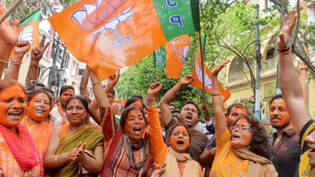

###### Brexit chaos

# Politics this week 

 

> May 25th 2019 

Early results from India’s election, which was carried out in seven stages from mid-April, showed that the Bharatiya Janata Party led by Narendra Modi would remain in power. During the campaign, Mr Modi had stressed Hindu nationalism more than economic development. See article. 

Pollsters swooned after Australia’s centre-right Liberal Party narrowly won another term in office at a general election. For months the polls had predicted a comfortable win for the opposition Labour Party over the hapless government of Scott Morrison, who is opposed to doing much to tackle climate change in a country scorched by drought and wildfires. Mr Morrison called his win a “miracle victory” for “quiet Australians”. See article. 

Deadly riots broke out in Jakarta after Indonesia’s election commission confirmed that Joko Widodo had won re-election as president. The loser, Prabowo Subianto, has refused to accept the result of April’s ballot, alleging widespread fraud. That claim has brought his supporters out on the streets, though independent observers have said the election was free and fair. 

Taiwan became the first country in Asia to legalise gay marriage, when its parliament passed a bill ahead of a court-imposed deadline. Last November, two-thirds of voters in a referendum said they wanted marriage to be restricted to straight couples. See article. 

Chinese courts sentenced three Japanese men for spying. One of them, the head of a Japan-China youth group, was reportedly given a six-year prison term. The other two were colleagues who had been investigating possible sites for hot-springs resorts. Since 2015 five other Japanese have been convicted of espionage in China. 

Cristina Fernández de Kirchner surprised pundits in Argentina by announcing that she would run for vice-president on a ticket headed by Alberto Fernández, her former chief of staff (and no relation). Ms Fernández, a spendthrift former president, had been widely expected to run for the presidency again, a prospect that frightened investors. She went on trial this week accused of taking bribes for government contracts when in power. She denies the claims. See article. 

Fourteen governors in Brazil wrote a letter asking Jair Bolsonaro, the president, to retract a decree he signed this month that would make it easier for people to carry guns in public. In a partial nod to critics, Mr Bolsonaro banned the carrying of assault weapons. 

Initial data for the first half of May showed 6,880 hectares of forest had been chopped down in the Amazon, nearly as much as the total for the preceding nine months. 

Theresa May’s grip on power looked increasingly shaky, as even her erstwhile supporters abandoned her and her rivals in the Tory party sought to oust her. The catalyst was the British prime minister’s attempt to rejig Britain’s EU withdrawal bill. Mrs May set out changes, including new guarantees on workers’ rights, and promised Parliament that if it passed her bill she would allow MPs a vote on whether to hold a second referendum. But that pleased no one. See article. 

Austria’s government collapsed, after the leader of the junior member of the ruling coalition, Heinz-Christian Strache of the hard-right Freedom Party, was forced to resign. A video had surfaced, apparently showing Mr Strache discussing the exchange of public contracts for favourable media coverage with a woman who claimed to be the niece of a Russian oligarch. Austria’s chancellor, Sebastian Kurz, said he would call early elections. See article. 

Volodymyr Zelensky, a TV comedian turned politician, was inaugurated as president of Ukraine. He immediately dismissed parliament and announced early elections, hoping that his Servant of the People party will secure a majority in the Rada. 

Several South African politicians, including its deputy president, David Mabuza, and former finance minister, Malusi Gigaba, declined to take up their seats in a newly elected parliament. Cyril Ramaphosa, the country’s president, is trying to clean up corruption within the ranks of the ruling African National Congress. Mr Mabuza was named in a report by the party’s integrity commission. Mr Gigaba had previously been found to have lied in court. 

A UN envoy warned that Libya was “descending into a civil war which could lead to the permanent division of the country.” Despite an arms embargo, weapons are flowing into the north African state. 

America and Iran continued to exchange threats. Donald Trump tweeted: “If Iran wants to fight, that will be the official end of Iran.” But his acting defence secretary, Patrick Shanahan, said: “This is about deterrence, not about war.” Hassan Rouhani, Iran’s president, rejected holding talks with America. “Today’s situation is not suitable for talks and our choice is resistance only,” he said. 

In Washington, the State Department claimed there were signs that the regime of Bashar al-Assad in Syria used chemical weapons while trying to retake Idlib province from rebels. America and its allies would respond “quickly” if this were proven, said officials. 

America is to unveil the economic component of its peace plan for Israel and the Palestinians at a conference in Bahrain in late June. Saudi Arabia and the United Arab Emirates said they would participate. The Palestinians called for a boycott of the meeting. 

The graduating class at Morehouse College in Atlanta sat up and paid attention during a commencement speech when the speaker announced a pledge to pay off their student loans. Robert Smith, a technology investor and former banker said by Forbes to be the richest black person in America, made his gift to “ensure we have all the opportunities of the American dream”. College debt has ballooned over the past two decades in America, and is an issue on the campaign trail. 

