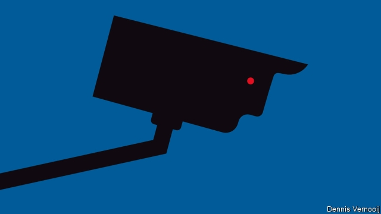

###### Policing and technology

# America is turning against facial-recognition software 

##### But that isn’t the most promising use of technology 

 

> May 23rd 2019 

THE SALESMEN and women at the International Association of Chiefs of Police technology conference last week were as enthusiastic as ever. This in-car tablet had a tougher coating and less intrusive bezel; that radar gun had a clearer display and a faster processor. But conference veterans noted the lack of truly ground-breaking gear. Attitudes to police technology are changing—not only among American civilians but among the cops themselves. 

Until recently Americans seemed willing to let police deploy new technologies in the name of public safety as they saw fit. But crime is much rarer than it was in the 1990s, and technological scepticism is growing. On May 14th San Francisco became the first American city to ban its agencies from using facial-recognition systems. That decision was profoundly unpopular at the police conference. Jack Marks, who manages Panasonic’s public-safety products, called it “short-sighted and reactive”. The technology exists, he said; “the best thing you can do is help shape it.” Other cities, including Somerville in Massachusetts, may soon follow San Francisco’s lead all the same. 

Companies are under scrutiny, too. On May 22nd Amazon saw off two challenges by activist shareholders. They wanted the board to commission an independent study to determine whether Rekognition, its facial-recognition platform, imperils civil, human and privacy rights. The activists also wanted to ban the firm from selling Rekognition to governments until the company’s board concludes, “after an evaluation using independent evidence”, that it does not erode those rights. 

Senior police officers argue that the technology is a useful crime-fighting tool. Daniel Steeves, chief information officer for the Ottawa Police Service, says that a robbery-investigation unit spent six months testing a facial-recognition system. It lowered the average time required for an officer to identify a subject from an image from 30 days to three minutes. The officers could simply run an image through a database of 50,000 mugshot photos rather than leafing through them manually or sending a picture to the entire department and asking if anybody recognised the suspect. Other officers stress that a facial-recognition match never establishes guilt. It is just a lead to be investigated. 

Yet officers sense that the technology is in bad odour. A deputy police chief from an American suburb with a security system that uses facial recognition around the local high school says: “We knew that facial recognition wasn’t going to fly, so we called it an Early Warning Detection System.” 

Many distinguish between the sort of facial-recognition software that Mr Steeves’s department used, which matches suspects to mugshots already in a police database, to the more widely feared version—used in China, for instance—that blankets cities with cameras that employ facial recognition and monitors citizens accused of no crime.  

Others think the distinction less clear-cut. Matt Cagle, a lawyer with the American Civil Liberties Union of Northern California, fears that “facial recognition is vulnerable to mission-creep and growth”. Even a system like the one in Ottawa requires building a database that could be used for less ethical purposes. Testifying before Congress on May 22nd, Clare Garvie—a facial-recognition expert at Georgetown Law’s Centre on Privacy and Technology—argued that because facial recognition can subject people to persistent secret surveillance, it presents “a unique threat to our civil rights and liberties”. Ms Garvie’s research has found that, conservatively, half of all Americans have their faces in databases to which the police can get access. Often the image is a drivers’ licence photo. She also noted that the technology is bad at identifying non-white faces. 

Sometimes scepticism about technology comes from the cops. Earlier this year the Washington Post reported that many small police departments were abandoning body-worn-camera programmes because of the cost. Although the cameras are cheap, officers can generate 15 gigabytes of video per shift; storage costs mount. Police unions often oppose body-worn cameras, fearing they imperil their members by giving superior officers licence to search them for punishable behaviour. Other officers complain about the amount of time required to review and redact footage in response to public-information requests. They also seem not to work. A study from George Mason University released in March found that body-worn cameras had no “statistically significant or consistent effects” on people’s views on police, or on police or civilian behaviour. 

None of this means that policing will become less technologically sophisticated, however. Even as the public and the police turn against some visible technologies, other ones are quietly being deployed. The most important innovations are invisible to most citizens. 

Police have long gathered immense amounts of data, but have not always organised them well. Police complain about the amount of time they spend doing paperwork; others lament how hard it is to get accurate data from police departments. Several firms fishing for business at the conference in Jacksonville offered tools designed to organise the huge amounts of information that police take in, rather than gadgets that generate more of it. Such tools are supposed to present officers with as much information as possible as soon as they need it, and make data taken from disparate sources easily accessible and searchable. They are also supposed to organise data in such a way that the cops can see where they need to improve. 

Chris Fisher, executive director of strategic initiatives for the Seattle Police Department, recently oversaw the building of a data system linking previously siloed streams of information, such as emergency-call records, stops based on reasonable suspicion, and police use of force. This let the department know precisely where disparities occur. Before, says Mr Fisher, they often relied on guesswork and anecdotal evidence to fill in the blanks. “Now we can know: in how many of our dispatches did it end up that a person was in crisis, and in that subset, how often did we use force?” 

Axon, which makes body-worn cameras and Tasers (the police weapon that gave the firm its former name) is building a system for managing records. Jenner Holden, the firm’s chief information-security officer, says that “what we can do to help officers improve most isn’t the sexy stuff. It’s helping them be more efficient and spend more time on the street.”  

